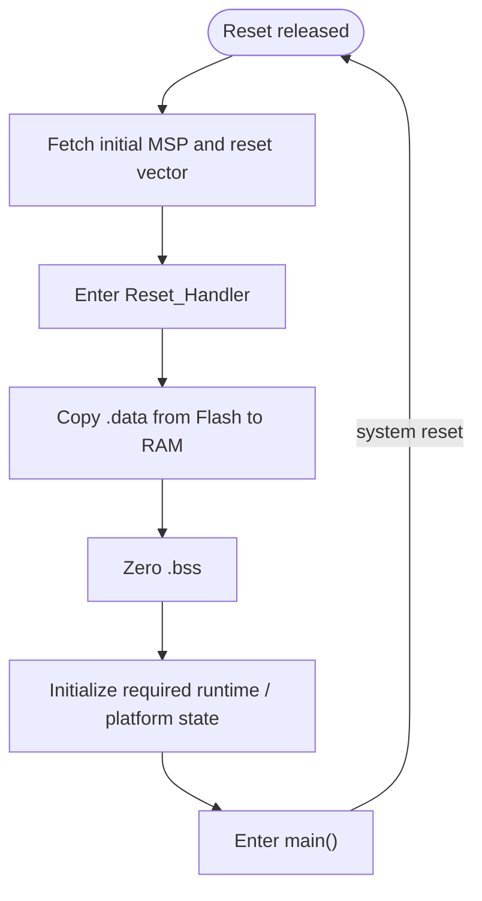

# Chủ đề 1 — Kiến thức nền tảng trong Embedded System Programming
> **Phạm vi:** Computer Architecture, Memory, Toolchain và Bare-Metal Runtime

> Tài liệu này trình bày **thuần lý thuyết** các nền tảng cần có trước khi học Event-Driven Programming trên vi điều khiển. Trọng tâm là hiểu CPU nhìn chương trình như thế nào, dữ liệu tồn tại ở đâu, phần mềm truy cập phần cứng ra sao, và một firmware bare-metal hình thành từ reset đến `main()` như thế nào.

> **Điều hướng:** [← Root README](../README.md) · [↑ Back to Track](README.md) · [Chủ đề 2 — Asynchronous & Event-Driven →](README-02-asynchronous-event-driven.md)

---

## Mục lục

> Mục lục rút gọn theo **cụm kiến thức**. Các mục đánh số chi tiết vẫn được giữ nguyên trong nội dung.

- **Kiến trúc hệ thống**
  - [Sơ đồ tổng quan](#sơ-đồ-tổng-quan)
  - [1. Embedded system nhìn từ góc độ phần mềm](#1-embedded-system-nhìn-từ-góc-độ-phần-mềm)
  - [3. Address space và memory map](#3-address-space-và-memory-map)
- **Memory, C và phần cứng**
  - [4. C memory model trong firmware](#4-c-memory-model-trong-firmware)
  - [6. Memory-mapped I/O và peripheral register](#6-memory-mapped-io-và-peripheral-register)
- **Startup và toolchain**
  - [8. Reset sequence và startup runtime](#8-reset-sequence-và-startup-runtime)
  - [10. Linker script: hợp đồng giữa executable và memory map](#10-linker-script-hợp-đồng-giữa-executable-và-memory-map)
- **Runtime correctness**
  - [12. Stack, call frame và nguy cơ corruption](#12-stack-call-frame-và-nguy-cơ-corruption)
  - [14. Determinism và bounded behavior](#14-determinism-và-bounded-behavior)
  - [15. Debug model: source không phải sự thật duy nhất](#15-debug-model-source-không-phải-sự-thật-duy-nhất)
- **Liên hệ Event-Driven**
  - [16. Tại sao nền tảng này cần cho Event-Driven Programming?](#16-tại-sao-nền-tảng-này-cần-cho-event-driven-programming)
  - [17. Các nguyên tắc cốt lõi](#17-các-nguyên-tắc-cốt-lõi)
- **Tra cứu**
  - [Tài liệu tham khảo](#tài-liệu-tham-khảo)

---

## Sơ đồ tổng quan

Toàn bộ nền tảng của một firmware bare-metal có thể nhìn như một chuỗi chuyển đổi từ source code đến trạng thái phần cứng:

```text
C / Assembly source
       |
       v
+---------------+      +----------------+
| Compiler / Asm| ---> | object files   |
+---------------+      +-------+--------+
                              |
                    linker script + ABI
                              |
                              v
                       +-------------+
                       |     ELF     |
                       +------+------+ 
                              |
                   startup/vector table
                              |
                              v
Reset --> CPU --> memory map --> runtime C --> main/event runtime
                    |
                    +--> Flash : .text/.rodata
                    +--> RAM   : .data/.bss/stack/heap
                    +--> MMIO  : peripheral registers
```

Một cách reasoning quan trọng khác là tách **địa chỉ trong source** khỏi **vật thể vật lý mà địa chỉ đó đại diện**:

```text
C expression / pointer
        |
        v
CPU load/store instruction
        |
        v
address on system bus
        |
        +--> Flash/RAM
        +--> peripheral MMIO
        +--> invalid/reserved region -> fault/undefined behavior by platform
```

---

## 1. Embedded system nhìn từ góc độ phần mềm

Một hệ thống nhúng là một hệ thống tính toán được thiết kế để thực hiện một tập chức năng tương đối xác định, thường gắn trực tiếp với phần cứng vật lý. Khác với máy tính đa dụng, firmware thường phải làm việc dưới các ràng buộc đồng thời về bộ nhớ, năng lượng, thời gian đáp ứng, độ tin cậy và khả năng quan sát lỗi.

Về bản chất, phần mềm nhúng luôn nằm trên một chuỗi phụ thuộc:

```text
Application logic
      ↓
Software architecture
      ↓
Drivers / platform abstraction
      ↓
CPU + memory + peripherals
      ↓
Electrical hardware
```

Một lỗi ở tầng dưới có thể biểu hiện như lỗi ở tầng trên. Vì vậy người làm firmware cần hiểu không chỉ cú pháp C mà còn phải hiểu cách chương trình được ánh xạ xuống kiến trúc máy.

---

## 2. Mô hình CPU — Memory — Peripheral

Một vi điều khiển điển hình có thể được mô hình hóa bởi bốn nhóm thành phần chính:

- **CPU core**: thực thi instruction, giữ register, xử lý exception và interrupt.
- **Memory**: Flash/ROM chứa code và dữ liệu bất biến; SRAM chứa dữ liệu thay đổi trong runtime.
- **Peripheral**: GPIO, UART, SPI, I2C, timer, ADC, DMA, watchdog…
- **Interconnect/bus**: nối CPU, memory và peripheral trong một không gian truy cập thống nhất.

CPU không “hiểu” khái niệm biến C, object hay driver. CPU chỉ thao tác trên register, địa chỉ và instruction. Compiler biến khái niệm bậc cao của C thành chuỗi instruction; linker quyết định mỗi phần của chương trình nằm ở địa chỉ nào.

### 2.1 Register

Register là vùng lưu trữ tốc độ cao nằm trong CPU. Trên ARM Cortex-M, các register tổng quát giữ toán hạng và kết quả tạm thời; một số register có vai trò kiến trúc đặc biệt:

- **PC — Program Counter**: địa chỉ instruction đang/chuẩn bị được thực thi.
- **SP — Stack Pointer**: chỉ vị trí đỉnh stack hiện tại.
- **LR — Link Register**: thường lưu return address khi gọi hàm; trong exception còn mang giá trị đặc biệt mô tả cách exception return.
- **xPSR**: chứa condition flags và trạng thái kiến trúc.

Khả năng hiểu PC, SP và LR là nền tảng để đọc call stack, phân tích crash và hiểu context switch sau này.

### 2.2 Bus và memory transaction

Khi CPU đọc một biến, điều xảy ra vật lý không phải là “đọc biến” mà là tạo một memory transaction tới địa chỉ tương ứng. Interconnect giải mã địa chỉ và chuyển transaction tới Flash, SRAM hoặc peripheral phù hợp.

Do đó hai câu lệnh C giống nhau về hình thức có thể có bản chất rất khác nhau:

- đọc SRAM: lấy dữ liệu bình thường;
- đọc peripheral register: có thể làm thay đổi trạng thái phần cứng;
- đọc vùng không tồn tại: có thể tạo BusFault/HardFault.

---

## 3. Address space và memory map

**Address space** là tập hợp các địa chỉ mà CPU có khả năng phát sinh. **Memory map** mô tả vùng địa chỉ nào được ánh xạ tới tài nguyên nào.

Trên vi điều khiển, “memory” theo nghĩa lập trình không chỉ là RAM. Peripheral register cũng thường nằm trong address space. Đây là cơ sở của **memory-mapped I/O**.

Một memory map có thể được hình dung như:

```text
0x0000_0000  ─┐
              │ Code / Flash aliases
              │
0x2000_0000  ─┤ SRAM
              │
0x4000_0000  ─┤ Peripheral registers
              │
0xE000_0000  ─┤ Cortex-M system control space
              │
0xFFFF_FFFF  ─┘
```

Địa chỉ cụ thể phụ thuộc MCU, nhưng tư duy không đổi: địa chỉ là một phần của giao diện phần cứng.

### 3.1 Alignment

Nhiều kiến trúc ưu tiên hoặc yêu cầu dữ liệu được căn chỉnh theo kích thước tự nhiên. Ví dụ word 32-bit thường thuận lợi nhất khi địa chỉ chia hết cho 4. Compiler có thể chèn padding vào `struct` để đảm bảo alignment.

Alignment ảnh hưởng tới:

- kích thước cấu trúc dữ liệu;
- hiệu năng memory access;
- tính hợp lệ của một số instruction;
- ABI giữa C và assembly;
- layout của TCB hoặc message trong kernel.

### 3.2 Endianness

Endianness mô tả thứ tự byte của một giá trị nhiều byte trong bộ nhớ. Với little-endian, byte ít quan trọng nhất nằm ở địa chỉ thấp hơn. Endianness đặc biệt quan trọng khi:

- đọc raw memory;
- xử lý network/protocol frame;
- serialize dữ liệu;
- đọc register nhiều byte từ peripheral;
- phân tích dump/debugger.

---

## 4. C memory model trong firmware

Ở mức executable, chương trình thường được chia thành nhiều **section**. Những section quan trọng nhất gồm:

### 4.1 `.text`

Chứa machine code và thường nằm trong Flash. Tính chất quan trọng là code cần có địa chỉ ổn định để vector table, function pointer và call instruction hoạt động chính xác.

### 4.2 `.rodata`

Chứa dữ liệu chỉ đọc như string literal hoặc bảng hằng. Việc đặt dữ liệu bất biến trong Flash giúp tiết kiệm SRAM.

### 4.3 `.data`

Chứa biến global/static có giá trị khởi tạo khác 0. Giá trị ban đầu phải tồn tại trong image ở Flash nhưng biến runtime phải ở RAM. Vì vậy startup code cần **copy initialization image từ Flash sang RAM**.

### 4.4 `.bss`

Chứa biến global/static có giá trị khởi tạo bằng 0 hoặc không khai báo initializer. Không cần lưu hàng nghìn byte số 0 trong firmware image; linker chỉ lưu kích thước và startup code zero-fill vùng tương ứng trong RAM.

### 4.5 Stack

Stack phục vụ call frame, biến local, saved register và exception frame. Stack tăng/giảm theo ABI của kiến trúc. Trên hệ embedded, stack overflow nguy hiểm vì thường không có MMU bảo vệ giữa các vùng bộ nhớ.

### 4.6 Heap

Heap là vùng cấp phát động. Heap không tự tồn tại chỉ vì dùng C; runtime/allocator phải quản lý nó. Trong firmware thời gian thực, heap gây các câu hỏi về fragmentation, bounded execution time, allocation failure và ownership.

### 4.7 Lifetime và storage duration

Cần phân biệt:

- automatic storage: thường gắn với stack frame;
- static storage: tồn tại suốt runtime;
- dynamic storage: tồn tại từ allocation đến free;
- register/temporary value: có thể chỉ tồn tại trong register do compiler quyết định.

Đây là nền tảng để hiểu vì sao gửi pointer tới biến local qua event queue có thể tạo dangling pointer.

---

## 5. Pointer: cầu nối giữa C và phần cứng

Pointer biểu diễn một địa chỉ có kiểu. Trong embedded, pointer được dùng không chỉ cho cấu trúc dữ liệu mà còn để truy cập memory-mapped peripheral.

Ba thuộc tính cần luôn tách biệt:

1. **Giá trị địa chỉ** — pointer đang trỏ tới đâu.
2. **Kiểu dữ liệu** — compiler hiểu kích thước và cách diễn giải dữ liệu như thế nào.
3. **Quyền truy cập/lifetime** — địa chỉ đó có hợp lệ để đọc/ghi tại thời điểm hiện tại hay không.

### 5.1 `volatile`

`volatile` nói với compiler rằng giá trị có thể thay đổi bởi tác nhân mà compiler không nhìn thấy trong luồng C bình thường, ví dụ peripheral hoặc ISR. Nó ngăn một số tối ưu hóa đọc/ghi, nhưng **không tạo atomicity, mutual exclusion hay memory ownership**.

Đây là nhầm lẫn rất phổ biến: `volatile` không làm một biến trở nên thread-safe.

### 5.2 `const`

`const` thể hiện contract không sửa dữ liệu qua một access path. Nó giúp API rõ ownership và ý định hơn, nhưng không nhất thiết có nghĩa dữ liệu vật lý nằm trong ROM.

### 5.3 Pointer aliasing

Khi nhiều pointer có thể trỏ cùng một vùng nhớ, reasoning về state trở nên khó hơn. Trong firmware lớn, aliasing không kiểm soát là nguồn gây coupling và race condition. Kiến trúc event-driven thường cố giảm shared mutable state để giảm vấn đề này.

---

## 6. Memory-mapped I/O và peripheral register

Trong memory-mapped I/O, peripheral register được ánh xạ vào address space của CPU. Đọc/ghi địa chỉ tương ứng tạo bus transaction tới peripheral.

Một register thường có các bit field điều khiển chức năng độc lập. Do đó thao tác phổ biến là:

- đọc register;
- mask bit cần thay đổi;
- tạo giá trị mới;
- ghi lại register.

Đây gọi là **read-modify-write**. Nó có thể không an toàn nếu register đồng thời bị thay đổi bởi ISR hoặc phần cứng. Một số MCU cung cấp set/reset register riêng để tránh race của read-modify-write.

### 6.1 Register side effects

Không phải register nào cũng là một biến RAM. Một lần đọc có thể clear flag; một lần ghi `1` có thể clear interrupt status; một số bit là write-only hoặc reserved. Vì vậy datasheet/reference manual là một phần của contract phần mềm.

### 6.2 Clock gating

Nhiều peripheral chỉ hoạt động khi clock tương ứng được enable. Nếu phần mềm truy cập register đúng địa chỉ nhưng peripheral chưa có clock, hành vi có thể không như dự kiến. Điều này cho thấy cấu hình peripheral là một state machine phần cứng, không chỉ là các câu lệnh rời rạc.

---

## 7. Exception và interrupt trên Cortex-M

Exception là cơ chế CPU tạm dừng luồng hiện tại để xử lý một sự kiện có mức ưu tiên. Interrupt từ peripheral là một lớp exception.

Khi exception xảy ra, Cortex-M tự động lưu một phần context lên stack, sau đó lấy handler address từ vector table. Cơ chế này làm giảm chi phí software entry nhưng tạo ra những quy tắc quan trọng về stack, priority và reentrancy.

### 7.1 Interrupt latency

Interrupt latency là thời gian từ khi interrupt đủ điều kiện được nhận tới khi handler bắt đầu thực thi. Nó bị ảnh hưởng bởi:

- interrupt masking;
- exception priority;
- instruction đang thực thi;
- nested interrupt;
- bus/memory latency.

### 7.2 ISR design

ISR nên ngắn vì ISR chạy trong exception context và có thể trì hoãn các công việc khác. Trong Event-Driven Programming, ISR thường chỉ:

1. xác nhận nguồn interrupt;
2. thu dữ liệu tối thiểu;
3. biến hardware occurrence thành event;
4. rời ISR nhanh.

Phần xử lý dài được deferred sang event handler ở thread/main context.

---

## 8. Reset sequence và startup runtime



Khi MCU reset, CPU chưa biết khái niệm C runtime. Firmware phải tự tạo môi trường để C hoạt động đúng.

Luồng khái niệm:

```text
Reset
  ↓
Đọc initial stack pointer
  ↓
Đọc Reset_Handler từ vector table
  ↓
Thiết lập runtime memory
  ├─ copy .data Flash → RAM
  └─ zero .bss
  ↓
Khởi tạo clock/runtime cần thiết
  ↓
Gọi main()
```

### 8.1 Vector table

Vector table chứa initial stack pointer và địa chỉ các exception handler. Vị trí của vector table phải phù hợp với cách CPU boot và linker script.

### 8.2 Reset handler

Reset handler là cầu nối giữa trạng thái phần cứng sau reset và môi trường ngôn ngữ C. Nếu `.data` không được copy hoặc `.bss` không được zero, semantics mà C programmer giả định sẽ bị phá vỡ.

### 8.3 Constructor/runtime library

Với C++ hoặc một số runtime, startup còn có thể phải chạy static constructors, setup libc hoặc initialize floating-point support. Bare-metal nghĩa là không có hệ điều hành đứng dưới làm thay những việc đó.

---

## 9. Compiler, assembler, linker và binary image

Quy trình tạo firmware thường gồm:

```text
Source C/C++
   ↓ compiler
Assembly / object code
   ↓ assembler
Object files (.o)
   ↓ linker + linker script
ELF executable
   ↓ objcopy / image tool
BIN / HEX / firmware image
```

### 9.1 Compiler

Compiler chuyển source sang machine code nhưng chưa quyết định địa chỉ cuối cùng cho mọi symbol. Mỗi object file có section và relocation information.

### 9.2 Linker

Linker hợp nhất object files, resolve symbol, áp dụng relocation và đặt section vào memory region. Đây là bước biến “các module riêng lẻ” thành một address space thống nhất.

### 9.3 ELF

ELF không chỉ chứa machine code mà còn có symbol table, section, relocation/debug info và program headers. Vì vậy ELF rất hữu ích cho debugger và phân tích firmware, dù thiết bị cuối có thể chỉ flash BIN/HEX.

---

## 10. Linker script: hợp đồng giữa executable và memory map

Linker script mô tả:

- Flash bắt đầu ở đâu và dài bao nhiêu;
- RAM bắt đầu ở đâu và dài bao nhiêu;
- section nào đặt ở vùng nào;
- symbol biên của `.data`, `.bss`, stack, heap;
- section nào phải giữ lại dù linker garbage collection.

Có hai địa chỉ quan trọng đối với một section như `.data`:

- **VMA — Virtual Memory Address**: nơi section tồn tại khi chương trình chạy;
- **LMA — Load Memory Address**: nơi dữ liệu khởi tạo được lưu trong image.

Với `.data`, VMA thường ở RAM còn LMA ở Flash. Startup code copy từ LMA tới VMA.

### 10.1 Symbol linker

Linker có thể tạo symbol không phải biến C thật, ví dụ `_sdata`, `_edata`, `_sbss`, `_ebss`. C/assembly dùng địa chỉ của các symbol này để biết biên vùng cần khởi tạo.

### 10.2 Garbage collection

Khi linker loại bỏ section không được tham chiếu, vector table hoặc metadata có thể vô tình bị xóa nếu không được đánh dấu giữ lại. Điều này thể hiện một nguyên tắc: những thứ được phần cứng tham chiếu bằng địa chỉ không nhất thiết xuất hiện trong call graph mà linker nhìn thấy.

---

## 11. ABI và function call

**ABI — Application Binary Interface** quy định cách binary tương tác:

- argument đi qua register nào;
- return value nằm ở đâu;
- register nào caller/callee phải bảo toàn;
- stack alignment;
- layout một số kiểu dữ liệu.

Hiểu ABI là điều kiện để:

- đọc disassembly;
- viết startup/assembly;
- hiểu exception frame;
- tự làm context switch;
- debug stack corruption.

Trong RTOS, context switch thực chất là bảo toàn đủ trạng thái theo ABI/architecture để một task có thể tiếp tục như thể chưa từng bị tạm dừng.

---

## 12. Stack, call frame và nguy cơ corruption

Mỗi lần gọi hàm có thể cần lưu return address, local variables hoặc callee-saved registers. Compiler quyết định chi tiết frame theo optimization và ABI.

Stack corruption có thể đến từ:

- buffer overflow;
- recursion sâu;
- ISR nesting;
- stack sizing sai;
- ghi pointer sai vùng;
- DMA ghi vượt buffer.

Triệu chứng thường không xuất hiện ngay tại điểm gây lỗi. Một byte ghi sai có thể phá LR hoặc saved register và chỉ crash khi function return.

Đây là lý do stack watermark, guard pattern và fault dump quan trọng trong hệ embedded.

---

## 13. Concurrency bắt đầu từ đâu?

Ngay cả firmware “single-thread” vẫn có concurrency nếu có interrupt. Main context và ISR có thể truy cập cùng dữ liệu tại các thời điểm xen kẽ.

Một phép toán C tưởng như đơn giản có thể gồm nhiều instruction:

```text
load → modify → store
```

Nếu ISR chen giữa, có thể xảy ra lost update. Vì vậy cần phân biệt:

- **atomic operation**: không thể quan sát trạng thái trung gian theo model đang xét;
- **critical section**: vùng tạm ngăn concurrent access;
- **volatile access**: chỉ ràng buộc compiler optimization;
- **memory ordering**: thứ tự quan sát load/store.

Những khái niệm này sẽ trở thành nền tảng cho event queue, scheduler và synchronization.

---

## 14. Determinism và bounded behavior

Firmware thời gian thực không chỉ cần “nhanh”, mà cần khả năng dự đoán thời gian trong giới hạn có thể phân tích.

Một thiết kế có tính deterministic tốt thường ưu tiên:

- thời gian xử lý handler có giới hạn;
- cấu trúc dữ liệu có complexity rõ;
- tránh allocation không kiểm soát trong đường thời gian quan trọng;
- tránh blocking vô hạn;
- giới hạn kích thước queue/buffer;
- biết rõ worst plausible path.

Determinism là sợi dây nối từ bare-metal foundation sang Event-Driven Programming và RTOS.

---

## 15. Debug model: source không phải sự thật duy nhất

Khi firmware sai, cần nhìn hệ thống ở nhiều mức:

```text
Source code
Assembly
Registers
Memory
Peripheral state
Interrupt state
Timing
Electrical signal
```

Source cho biết ý định; machine state mới cho biết điều CPU đang thực sự làm. Các công cụ như debugger, disassembler, map file, logic analyzer và trace đều cung cấp góc nhìn khác nhau lên cùng một hệ thống.

### 15.1 Symbol và map

Symbol map giúp trả lời:

- function/variable nằm ở địa chỉ nào;
- module nào chiếm Flash/RAM;
- section nào lớn bất thường;
- symbol nào không được link vào.

### 15.2 Disassembly

Disassembly hữu ích khi cần xác minh:

- compiler đã tối ưu như thế nào;
- một access có thực sự được phát sinh;
- ISR prologue/epilogue;
- stack usage;
- branch path;
- ABI contract giữa C và assembly.

---

## 16. Tại sao nền tảng này cần cho Event-Driven Programming?

Event-Driven Programming không xóa bỏ phần cứng; nó chỉ tổ chức phần mềm theo abstraction cao hơn. Mọi event queue cuối cùng vẫn nằm trong RAM, mọi timer event cuối cùng vẫn dựa trên hardware time source, mọi ISR vẫn tuân theo Cortex-M exception model.

Các mối liên hệ trực tiếp:

- hiểu **memory/lifetime** → hiểu payload ownership;
- hiểu **interrupt** → hiểu event source và deferred processing;
- hiểu **stack** → hiểu giới hạn handler và callback;
- hiểu **memory-mapped I/O** → thiết kế driver tách biệt application;
- hiểu **linker/startup** → hiểu toàn bộ runtime trước khi framework chạy;
- hiểu **determinism** → thiết kế run-to-completion handler và bounded queue.

---

## 17. Các nguyên tắc cốt lõi

1. CPU chỉ thực thi instruction và thao tác trên register/địa chỉ; “biến”, “object”, “task” là abstraction phần mềm.
2. Memory map là hợp đồng giữa địa chỉ CPU và tài nguyên phần cứng.
3. Peripheral register không phải RAM thông thường và có thể có side effect.
4. `volatile` không thay thế atomicity hay synchronization.
5. `.data` cần copy từ Flash sang RAM; `.bss` cần zero trước khi C runtime được coi là hợp lệ.
6. Linker script quyết định executable tồn tại ở đâu trong memory map.
7. Vector table và startup code là phần của runtime, không phải chi tiết phụ.
8. Stack corruption thường biểu hiện muộn hơn điểm gây lỗi.
9. Interrupt tạo concurrency ngay cả khi không có RTOS.
10. Bounded execution và ownership rõ ràng là nền tảng của firmware có thể kiểm soát.

---

## 18. Tài liệu tham khảo theo chương trình gốc

- Stanford CS107 — Programming Paradigms.
- AK Embedded Base Kit — Getting Started.
- Application Startup Code của AK Embedded.
- *Building Bare-Metal ARM Systems with GNU*.
- ARM Cortex-M Architecture documentation.
- Datasheet và Reference Manual của MCU đang sử dụng.

---

## Tài liệu tham khảo

- [ARM Cortex-M3 Technical Reference Manual](https://developer.arm.com/documentation/ddi0337/latest/)
- [Building Bare-Metal ARM Systems with GNU](https://www.state-machine.com/doc/Building_bare-metal_ARM_with_GNU.pdf)
- [GNU ld — Linker Scripts](https://sourceware.org/binutils/docs/ld/Scripts.html)
- [Arm ABI specifications (abi-aa)](https://github.com/ARM-software/abi-aa)

---

> **Điều hướng:** [← Root README](../README.md) · [↑ Back to Track](README.md) · [Chủ đề 2 — Asynchronous & Event-Driven →](README-02-asynchronous-event-driven.md)
