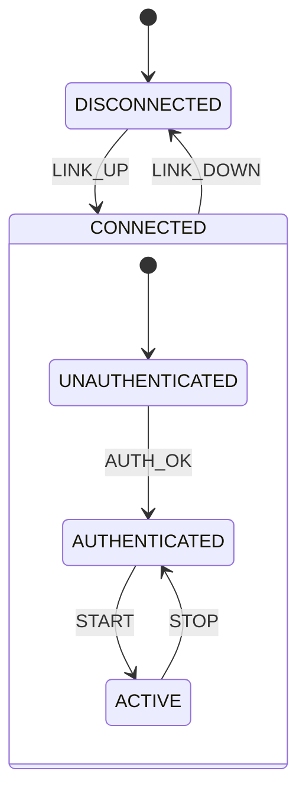

# Chủ đề 2 — Lập trình bất đồng bộ và hướng sự kiện
## Asynchronous & Event-Driven Programming

> Tài liệu này tập trung vào bản chất của lập trình bất đồng bộ trong firmware: vì sao blocking và polling không mở rộng tốt, event là gì, event queue hoạt động như thế nào, state machine giúp quản lý trạng thái ra sao và những điều kiện nào làm một kiến trúc Event-Driven trở nên xác định, dễ kiểm thử và dễ bảo trì.

---

## Mục lục

- [Sơ đồ tổng quan](#sơ-đồ-tổng-quan)
- [1. Vấn đề cốt lõi: firmware phải phản ứng với nhiều dòng thời gian](#1-vấn-đề-cốt-lõi-firmware-phải-phản-ứng-với-nhiều-dòng-thời-gian)
- [2. Synchronous và asynchronous](#2-synchronous-và-asynchronous)
- [3. Blocking, polling và chi phí kiến trúc](#3-blocking-polling-và-chi-phí-kiến-trúc)
- [4. Event là gì?](#4-event-là-gì)
- [5. Event source](#5-event-source)
- [6. Event queue](#6-event-queue)
- [7. Mailbox và active-object boundary](#7-mailbox-và-active-object-boundary)
- [8. Dispatcher](#8-dispatcher)
- [9. Event handler và run-to-completion](#9-event-handler-và-run-to-completion)
- [10. State machine: mô hình hóa hành vi theo thời gian](#10-state-machine-mô-hình-hóa-hành-vi-theo-thời-gian)
- [11. Timer event và thời gian như một nguồn sự kiện](#11-timer-event-và-thời-gian-như-một-nguồn-sự-kiện)
- [12. Interrupt và deferred processing](#12-interrupt-và-deferred-processing)
- [13. Ownership và lifetime của event payload](#13-ownership-và-lifetime-của-event-payload)
- [14. Event ordering](#14-event-ordering)
- [15. Backpressure và overload](#15-backpressure-và-overload)
- [16. Reentrancy](#16-reentrancy)
- [17. Event-driven architecture và modularity](#17-event-driven-architecture-và-modularity)
- [18. Publish–Subscribe](#18-publishsubscribe)
- [19. Determinism trong Event-Driven Programming](#19-determinism-trong-event-driven-programming)
- [20. Traceability](#20-traceability)
- [21. Event-Driven và RTOS khác nhau thế nào?](#21-event-driven-và-rtos-khác-nhau-thế-nào)
- [22. Những anti-pattern kiến trúc thường gặp](#22-những-anti-pattern-kiến-trúc-thường-gặp)
- [23. Mô hình tư duy tổng hợp](#23-mô-hình-tư-duy-tổng-hợp)
- [24. Quy trình thiết kế Event-Driven System ở mức kiến trúc](#24-quy-trình-thiết-kế-event-driven-system-ở-mức-kiến-trúc)
- [25. Kết luận](#25-kết-luận)
- [Tài liệu tham khảo chuyên sâu](#tài-liệu-tham-khảo-chuyên-sâu)

---

## Sơ đồ tổng quan

Event-driven firmware biến nhiều dòng thời gian bất đồng bộ thành một luồng xử lý có trật tự tại các event handler:

```text
 GPIO IRQ ----+
 UART RX -----+
 Timer -------+--> event producers --> queues/mailboxes --> dispatcher
 DMA done ----+                                      |
 Network -----+                                      v
                                             +---------------+
                                             | event handler |
                                             | run-to-       |
                                             | completion    |
                                             +-------+-------+
                                                     |
                                                     v
                                               state update
                                                     |
                                          post new event/timer
```

Đặc biệt, ISR và application handler nên tách về execution context:

```text
hardware IRQ
    |
    v
short ISR: capture/acknowledge
    |
    | post/defer
    v
queue ---------------------> application event handler
                                  |
                                  v
                           longer stateful work
```

Bản chất của mô hình là **serialize state mutation tại owner**, thay vì cho mọi callback/ISR cùng sửa shared state tùy thời điểm.

---

## 1. Vấn đề cốt lõi: firmware phải phản ứng với nhiều dòng thời gian

Một firmware thực tế hiếm khi chỉ có một chuỗi công việc tuyến tính. Cùng lúc hệ thống có thể phải quan tâm tới:

- byte vừa đến từ UART;
- cạnh tín hiệu từ GPIO;
- thời điểm timeout;
- ADC conversion hoàn tất;
- packet từ network;
- trạng thái UI thay đổi;
- command từ subsystem khác;
- lỗi phần cứng.

Các sự kiện này xuất hiện ở các thời điểm không đồng bộ với luồng chương trình. Nếu firmware cố mô hình hóa chúng bằng một chuỗi blocking dài, cấu trúc source sẽ nhanh chóng không còn phản ánh đúng bản chất hệ thống.

Event-Driven Programming bắt đầu từ một thay đổi tư duy: thay vì hỏi “chương trình tiếp theo chạy câu lệnh nào?”, ta hỏi “khi một sự kiện có ý nghĩa xảy ra, thành phần nào chịu trách nhiệm phản ứng?”.

---

## 2. Synchronous và asynchronous

### 2.1 Synchronous operation

Một operation đồng bộ thường không trả quyền điều khiển cho caller cho tới khi kết quả hoàn tất. Điều này đơn giản về reasoning nhưng có thể giữ CPU trong trạng thái chờ.

### 2.2 Asynchronous operation

Một operation bất đồng bộ tách **thời điểm yêu cầu** khỏi **thời điểm hoàn thành**. Completion được báo lại qua interrupt, callback, event, future hoặc cơ chế tương đương.

Điểm quan trọng: asynchronous không đồng nghĩa với multithreading. Một hệ single-thread vẫn có thể hoàn toàn bất đồng bộ nếu mỗi handler chạy ngắn và trả quyền điều khiển về event loop.

### 2.3 Concurrency và parallelism

- **Concurrency**: nhiều hoạt động có lifetime chồng lấp về logic.
- **Parallelism**: nhiều hoạt động thực sự chạy cùng lúc trên nhiều execution unit.

Event-driven firmware trên một Cortex-M đơn core có concurrency mạnh nhưng thường không có parallelism ở application level.

---

## 3. Blocking, polling và chi phí kiến trúc

### 3.1 Blocking

Blocking giữ luồng xử lý trong một operation cho tới khi điều kiện nào đó xảy ra. Nếu blocking trong main loop, các nguồn sự kiện khác bị trì hoãn.

Vấn đề không chỉ là lãng phí CPU. Blocking còn làm khó xác định response time vì latency của một event phụ thuộc vào vị trí firmware đang bị giữ lại.

### 3.2 Polling

Polling liên tục kiểm tra một điều kiện. Polling có thể phù hợp với hệ rất nhỏ hoặc vòng lặp có chu kỳ cố định, nhưng khi số nguồn trạng thái tăng, main loop trở thành tập hợp của các điều kiện phụ thuộc lẫn nhau.

### 3.3 Hidden state

Khi logic bất đồng bộ được mô phỏng bằng nhiều biến global như `busy`, `done`, `step`, `retry`, `timeout`, hệ thống thực chất đã có state machine nhưng state machine đó bị phân tán. Đây là nguyên nhân tạo ra **implicit state** — trạng thái tồn tại nhưng không được mô hình hóa rõ ràng.

Event-driven architecture cố biến implicit state thành explicit state.

---

## 4. Event là gì?

**Event** là biểu diễn phần mềm của một điều đã xảy ra hoặc một điều kiện có ý nghĩa vừa trở nên đúng.

Một event thường gồm:

```text
Event = identity/type + optional payload + optional metadata
```

Ví dụ về ý nghĩa:

- button pressed;
- UART frame received;
- sensor data ready;
- timeout expired;
- network disconnected;
- command accepted.

Event nên mô tả **sự thật hoặc occurrence**, không nên biến thành một tên hàm từ xa. `BUTTON_PRESSED` biểu diễn điều đã xảy ra; `TURN_LED_ON_NOW` gần với imperative command hơn.

### 4.1 Signal và event object

**Signal** là identity của event. Một event object có thể chỉ chứa signal hoặc thêm payload.

Tách signal khỏi payload giúp:

- dispatcher route theo signal;
- state machine transition theo signal;
- payload được quản lý bằng policy riêng.

### 4.2 Semantic granularity

Event quá chi tiết làm hệ thống nhiều message và coupling; event quá thô làm handler phải tự suy đoán ngữ cảnh. Granularity tốt phản ánh boundary nghiệp vụ hoặc state transition có ý nghĩa.

---

## 5. Event source

Event source là nơi biến một thay đổi của thế giới hoặc subsystem thành event. Nguồn có thể là:

- ISR;
- hardware driver;
- software timer;
- parser;
- state machine khác;
- communication transport;
- diagnostic subsystem.

Thiết kế tốt tách **detection** khỏi **reaction**. Driver phát hiện dữ liệu đã đến; application quyết định dữ liệu đó có ý nghĩa gì.

---

## 6. Event queue

Event queue là buffer lưu các event đang chờ xử lý. Nó tạo ra sự tách biệt theo thời gian giữa producer và consumer.

### 6.1 Vai trò của queue

Queue cung cấp ba thuộc tính kiến trúc quan trọng:

1. **Temporal decoupling** — producer không cần consumer xử lý ngay.
2. **Serialization** — nhiều nguồn concurrent có thể được đưa về một luồng xử lý tuần tự.
3. **Backpressure boundary** — capacity của queue làm lộ giới hạn tải của hệ thống.

### 6.2 FIFO không phải lựa chọn duy nhất

Queue thường FIFO, nhưng hệ thống có thể dùng priority queue, mailbox riêng theo active object, coalescing queue hoặc latest-value storage. Policy phải dựa trên semantics event.

### 6.3 Queue capacity và stability

Một queue hữu hạn sẽ overflow nếu tốc độ arrival trung bình hoặc burst vượt khả năng xử lý. Nếu ký hiệu:

- λ: tốc độ event đến;
- μ: tốc độ xử lý;

thì về trực giác, hệ ổn định dài hạn cần khả năng phục vụ đủ lớn so với tải. Nhưng ngay cả khi μ > λ trung bình, burst vẫn có thể làm đầy queue. Vì vậy capacity là một phần của timing/resource design chứ không chỉ là con số kỹ thuật.

### 6.4 Overflow policy

Khi queue đầy, hệ thống phải có policy rõ:

- drop newest;
- drop oldest;
- coalesce;
- overwrite latest;
- raise diagnostic/fatal;
- apply flow control ở upstream.

Không có policy nghĩa là hệ thống đang phụ thuộc vào một giả định chưa được kiểm chứng.

---

## 7. Mailbox và active-object boundary

Mailbox là queue gắn với một consumer logic cụ thể. Trong active-object architecture, mỗi active object sở hữu state riêng và mailbox riêng.

Điều này tạo ra một rule mạnh:

> State của một active object chỉ được thay đổi trong handler của chính active object đó.

Khi rule này được giữ, shared mutable state giảm mạnh. Communication giữa các object diễn ra qua event thay vì gọi trực tiếp vào internals của nhau.

---

## 8. Dispatcher

Dispatcher quyết định event nào được đưa tới handler nào. Có nhiều mô hình:

- dispatch theo destination ID;
- dispatch theo signal;
- routing table;
- publish–subscribe;
- mỗi active object tự dequeue mailbox của mình.

Dispatcher không nên chứa business logic. Nó chỉ chịu trách nhiệm **routing và scheduling policy ở mức event**.

### 8.1 Direct dispatch và queued dispatch

- **Direct dispatch**: gọi handler ngay; latency thấp nhưng producer và consumer dính chặt về call stack và timing.
- **Queued dispatch**: post event vào queue; decouple tốt hơn nhưng có queueing latency và capacity limit.

Một kiến trúc có thể dùng cả hai, nhưng boundary phải rõ.

---

## 9. Event handler và run-to-completion

Một handler theo mô hình **run-to-completion (RTC)** nhận một event, xử lý trong thời gian hữu hạn và trả quyền điều khiển trước khi event khác của cùng execution context được xử lý.

RTC không có nghĩa handler phải “cực ngắn” theo số dòng code; nó có nghĩa handler không được giữ execution context trong trạng thái chờ bất định.

### 9.1 Lợi ích của RTC

Trong một active object đơn luồng:

- state không bị event khác chen ngang giữa handler;
- không cần mutex để bảo vệ state nội bộ;
- transition trở nên atomic ở mức event;
- trace dễ đọc;
- bug dễ tái hiện hơn.

### 9.2 Những thứ phá RTC

- blocking delay;
- chờ peripheral bằng polling lâu;
- chờ semaphore/thread khác;
- thao tác file/network không bounded;
- callback tái nhập vào cùng object;
- xử lý thuật toán không có giới hạn thời gian hợp lý.

---

## 10. State machine: mô hình hóa hành vi theo thời gian



State machine mô tả hành vi bằng ba yếu tố:

```text
Current state + Event → Action + Next state
```

State là thông tin tối thiểu cần biết từ quá khứ để phản ứng đúng với event hiện tại.

### 10.1 Tại sao state machine quan trọng?

Không có state machine rõ ràng, logic temporal thường bị rải ra nhiều `if`, flag và timer. State machine gom dependency theo thời gian thành mô hình explicit.

### 10.2 Transition

Transition nên được xem là thay đổi trạng thái logic, không chỉ là gán một enum. Transition có thể đi kèm:

- exit action;
- transition action;
- entry action;
- timer arm/cancel;
- emission của event khác.

### 10.3 Guard

Guard là điều kiện bổ sung quyết định transition có hợp lệ khi event đến. Guard nên dựa trên state rõ ràng, tránh truy cập shared mutable data không kiểm soát.

### 10.4 Flat State Machine

FSM phẳng dễ hiểu khi số state nhỏ. Khi nhiều state chia sẻ hành vi, duplication tăng.

### 10.5 Hierarchical State Machine

HSM cho phép state con kế thừa behavior từ state cha. Điều này phù hợp với hệ có cấu trúc như `CONNECTED → AUTHENTICATED → ACTIVE`, nơi nhiều event có xử lý chung ở mức cao hơn.

HSM làm giảm state explosion nhưng yêu cầu semantics dispatch rõ: event được thử ở state hiện tại, nếu không xử lý thì bubble lên superstate.

---

## 11. Timer event và thời gian như một nguồn sự kiện

Blocking delay biến thời gian thành “CPU chờ”. Event-driven system biến thời gian thành một event tương lai.

Mô hình:

```text
arm timer(T)
   ↓
CPU làm việc khác / idle
   ↓
T hết hạn
   ↓
TIMEOUT event được post
   ↓
state machine xử lý
```

### 11.1 One-shot và periodic timer

- **One-shot**: hết hạn một lần.
- **Periodic**: tạo event lặp lại theo chu kỳ.

Periodic timer cần định nghĩa drift policy: reschedule từ “now” hay từ deadline trước. Hai cách cho đặc tính khác nhau khi handler bị trễ.

### 11.2 Tick wrap-around

Nếu time base là counter hữu hạn, counter sẽ wrap. So sánh timestamp không thể luôn dùng phép `now >= deadline` đơn giản. Thiết kế timer phải dựa trên arithmetic modulo với giới hạn timeout hợp lệ.

---

## 12. Interrupt và deferred processing

ISR là nơi phần cứng đẩy execution vào firmware. Event-driven architecture thường dùng ISR như **event adapter**.

Luồng điển hình:

```text
Hardware occurrence
      ↓
ISR
  - acknowledge
  - capture minimal data
  - post event
      ↓
Event queue
      ↓
Application handler
```

### 12.1 Tại sao deferred processing tốt?

- giảm interrupt latency cho nguồn khác;
- giảm thời gian interrupt bị mask/nested;
- application logic chạy ở context dễ kiểm soát hơn;
- tránh gọi API không ISR-safe;
- tập trung state mutation vào handler.

### 12.2 Data handoff từ ISR

Dữ liệu chuyển từ ISR sang handler cần policy về lifetime và atomicity. Nếu ISR ghi vào buffer mà handler đọc, phải xác định rõ ai sở hữu từng slot và lúc nào slot được tái sử dụng.

---

## 13. Ownership và lifetime của event payload

Event identity thường nhỏ; payload mới là nơi các bug memory xuất hiện.

Có ba mô hình phổ biến:

### 13.1 Copy-by-value

Payload được copy vào event/queue. Ưu điểm là ownership đơn giản; nhược điểm là copy cost và kích thước queue tăng.

### 13.2 Pointer/reference

Event mang pointer tới object dữ liệu. Nhanh hơn cho payload lớn nhưng phải xác định:

- ai cấp phát;
- ai đang sở hữu;
- có bao nhiêu consumer;
- lúc nào dữ liệu được release;
- producer có được tái sử dụng buffer không.

### 13.3 Memory pool

Pool dùng các block có kích thước cố định, thường phù hợp firmware vì bounded allocation time và không có external fragmentation theo kiểu heap tổng quát.

Ownership rule cần là một phần của interface, không phải kiến thức ngầm của programmer.

---

## 14. Event ordering

Hai event được tạo gần nhau không có nghĩa thứ tự xử lý luôn đúng theo trực giác. Ordering phụ thuộc:

- interrupt priority;
- queue implementation;
- nhiều producer;
- dispatcher priority;
- timer expiry;
- transport/network reordering.

Nếu business logic phụ thuộc thứ tự, contract phải nói rõ thứ tự nào được đảm bảo.

### 14.1 Causal ordering

Nếu event B chỉ có thể được tạo sau khi A đã xử lý, có quan hệ nhân quả rõ. Nếu A và B đến từ nguồn độc lập, không nên giả định một thứ tự toàn cục trừ khi framework tạo ra nó.

---

## 15. Backpressure và overload

Một event-driven system tốt không chỉ hoạt động khi tải bình thường mà còn phải có semantics khi quá tải.

Overload có thể biểu hiện qua:

- queue depth tăng liên tục;
- event latency tăng;
- timer expiration trễ;
- pool cạn;
- event bị drop;
- watchdog reset.

Cách xử lý gồm rate limiting, coalescing, sampling, drop policy, flow control hoặc phân cấp ưu tiên. Điều quan trọng là overload phải trở thành **trạng thái được quan sát**, không phải lỗi im lặng.

---

## 16. Reentrancy

Reentrancy xảy ra khi cùng một logic có thể được gọi lại trước khi lần gọi trước hoàn tất. Event loop RTC thường cố tránh reentrancy với state object.

Nguồn tạo reentrancy gồm:

- callback gọi ngược trực tiếp;
- nested interrupt;
- synchronous publish trong handler;
- function dùng static mutable temporary state.

Một rule thiết kế hữu ích là phân biệt rõ **post** và **call**. `post` tạo công việc tương lai; `call` thực thi ngay trên call stack hiện tại.

---

## 17. Event-driven architecture và modularity

Một module event-driven tốt thường có:

- state private;
- event input rõ;
- event output rõ;
- không phụ thuộc trực tiếp vào state private của module khác;
- timing contract cho handler;
- ownership contract cho payload.

Điều này tạo ra coupling theo protocol thay vì coupling theo memory layout hoặc call graph.

### 17.1 Interface theo event

Interface event giúp module được thay thế dễ hơn vì caller không cần biết internal sequence. Tuy nhiên event protocol cũng phải được version hóa và tài liệu hóa như bất kỳ API nào.

---

## 18. Publish–Subscribe

Publish–subscribe cho phép producer phát event theo topic/signal mà không biết consumer cụ thể. Đây là spatial decoupling mạnh.

Nhưng pub-sub có trade-off:

- khó nhìn call path tĩnh;
- khó biết có bao nhiêu subscriber;
- payload lifetime phức tạp nếu broadcast bằng pointer;
- fan-out có thể tạo burst tải.

Vì vậy pub-sub cần registry, trace và ownership policy tốt.

---

## 19. Determinism trong Event-Driven Programming

Response time của một event có thể được phân tích theo các thành phần:

```text
Event response latency
≈ source latency
+ queueing delay
+ scheduling delay
+ handler execution time
```

Để giữ bounded response:

- queue phải hữu hạn;
- handler phải bounded;
- priority/routing phải rõ;
- ISR phải ngắn;
- không để một handler monopolize event loop;
- overload policy phải xác định.

Event-driven không tự động tạo realtime behavior. Nó chỉ cung cấp cấu trúc thuận lợi để reasoning về realtime behavior.

---

## 20. Traceability

Một lợi thế lớn của event-driven system là mọi thay đổi state quan trọng có thể gắn với event. Nếu ghi lại:

```text
timestamp, source, destination, signal, state_before, state_after
```

thì trace có thể tái dựng causal chain của hệ thống mà không cần log prose dày đặc.

Trace event hữu ích hơn log tùy ý vì nó phản ánh chính mô hình kiến trúc.

---

## 21. Event-Driven và RTOS khác nhau thế nào?

Event-driven là **programming/architecture model**; RTOS là **execution/scheduling infrastructure**.

Có thể có:

- event-driven firmware không RTOS;
- RTOS firmware viết theo shared-state + blocking;
- event-driven active objects chạy trên RTOS threads;
- cooperative event kernel không có preemptive task scheduling.

Do đó không nên đồng nhất event queue với RTOS queue hay active object với thread.

---

## 22. Những anti-pattern kiến trúc thường gặp

### 22.1 Event như remote procedure call

Nếu mọi event chỉ là tên khác của “hãy gọi hành động X”, hệ thống mất lợi ích semantic của event.

### 22.2 Global state + event façade

Nếu handler vẫn đọc/ghi hàng loạt global mutable variable, queue chỉ che đi coupling chứ không loại bỏ nó.

### 22.3 Handler blocking

Một handler blocking phá giả định RTC và làm queue latency tăng không kiểm soát.

### 22.4 Pointer payload không có ownership

Đây là nguồn dangling pointer, double free và data race.

### 22.5 Không có overflow policy

Queue hữu hạn nhưng không đo queue high-watermark hoặc không định nghĩa drop behavior là một lỗi thiết kế.

### 22.6 State machine “ẩn” trong flags

Nhiều flag phối hợp tạo ra số tổ hợp trạng thái lớn hơn nhiều so với programmer tưởng tượng.

---

## 23. Mô hình tư duy tổng hợp

Một event-driven firmware có thể được nhìn như mạng các state machine giao tiếp bằng event:

```text
External world
    ↓
Event Sources
    ↓
Queues / Mailboxes
    ↓
Dispatcher / Active Objects
    ↓
Run-to-Completion Handlers
    ↓
State Machines
    ↓
Commands to drivers / emitted events
```

Chất lượng của hệ thống phụ thuộc vào năm contract chính:

1. **Event semantics** — event có nghĩa gì.
2. **Ordering semantics** — thứ tự nào được đảm bảo.
3. **Ownership semantics** — ai sở hữu payload.
4. **Timing semantics** — handler và queue latency có giới hạn gì.
5. **Failure semantics** — overflow, timeout và resource exhaustion được xử lý ra sao.

---

## 24. Quy trình thiết kế Event-Driven System ở mức kiến trúc

Một quy trình tốt không bắt đầu bằng việc tạo thật nhiều signal. Nó bắt đầu từ **responsibility, state và temporal behavior**.

```text
Product behavior / use cases
          |
          v
identify independent responsibilities
          |
          v
define state owner / Active Object boundary
          |
          v
identify external + internal events
          |
          v
define state machines and invariants
          |
          v
define queue/ownership/overflow/time semantics
          |
          v
map ISR and drivers into event adapters
          |
          v
add trace/test observability
```

### 24.1 Bắt đầu từ responsibility thay vì thread/task

Một thành phần nên tồn tại vì nó sở hữu một responsibility và state có cohesive lifecycle. Nếu boundary được chọn chỉ vì “cần thêm task”, hệ dễ trở thành thread-centric thay vì model-centric.

### 24.2 Liệt kê event theo ý nghĩa miền bài toán

Event tốt biểu diễn fact có ý nghĩa như `CONNECTION_LOST`, `MEASUREMENT_READY`, `TIMEOUT_EXPIRED`, thay vì chỉ phản ánh implementation detail kiểu “function X đã được gọi”. Semantic event giúp producer và consumer ít coupling hơn.

### 24.3 Xác định state owner

Mỗi mutable state quan trọng nên có owner rõ. Nếu nhiều handler/ISR cùng sửa một state mà không có protocol, event-driven façade không loại bỏ race và hidden coupling.

### 24.4 Định nghĩa time và failure semantics trước

Queue full, timeout, duplicate event, retry, stale event và pool exhaustion phải có policy. Đây là behavior của system khi chịu tải/lỗi, không phải edge case để thêm sau.

### 24.5 Observability là một phần của design

Signal ID, source/destination, timestamp, state transition và resource counters nên có model từ đầu. Khi architecture chỉ debug được bằng breakpoint, temporal bug ngoài hiện trường sẽ rất khó tái dựng.

Quy trình này giữ đúng tinh thần của Event-Driven Programming: **architecture được suy ra từ behavior và ownership**, không phụ thuộc vào một framework cụ thể.

---

## 25. Kết luận

Bản chất của Event-Driven Programming không nằm ở một framework cụ thể. Nó nằm ở việc biến một firmware có nhiều dòng thời gian thành một hệ thống gồm các event có nghĩa, state machine rõ ràng và các handler run-to-completion với ownership/timing contract xác định.

Khi các nguyên tắc này được hiểu đúng, Active Kernel chỉ còn là một hiện thực cụ thể của các ý tưởng: mailbox, dispatcher, event pool, timer và active object.

---

## Tài liệu tham khảo chuyên sâu

- [QP/C Conceptual Model — Active Objects and event queues](https://www.state-machine.com/qpc/conc-qp.html)
- [QP — Active Object key concept](https://www.state-machine.com/active-object)
- [QP/C Event Delivery Mechanisms](https://www.state-machine.com/qpc/srs-qp_edm.html)
- [AK Embedded — Event-Driven Task & Signal](https://epcb.vn/blogs/ak-embedded-software/ak-embedded-base-kit-stm32l151-event-driven-task-signal)
- [AK Embedded — Event-Driven Timer](https://epcb.vn/blogs/ak-embedded-software/ak-embedded-base-kit-stm32l151-event-driven-timer)
