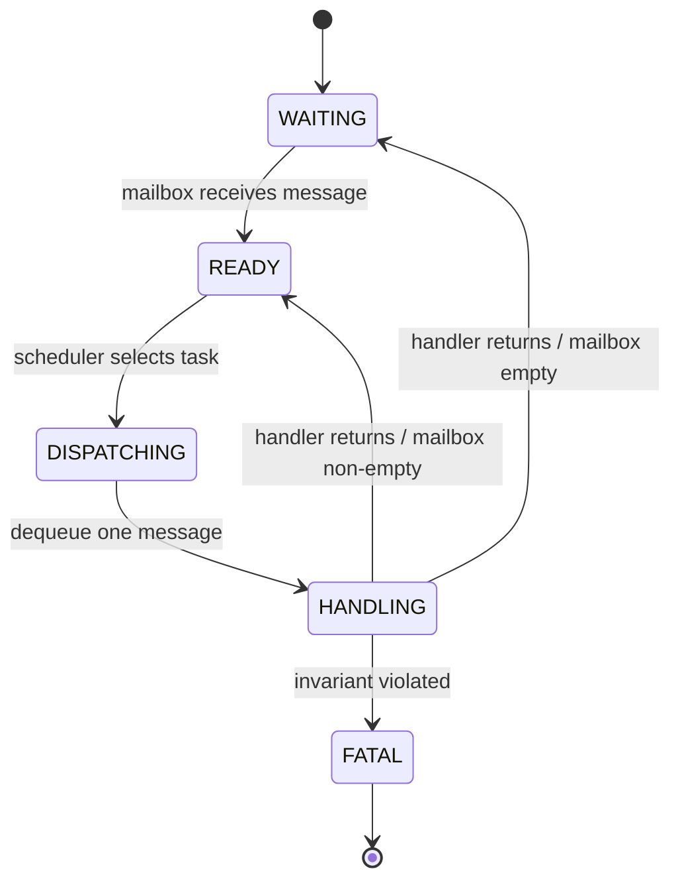

# Chủ đề 3 — Active Kernel (AK)
## Khái niệm, mô hình thực thi, message, timer, state machine và diagnostic

> Tài liệu này giải thích Active Kernel như một **mô hình tổ chức firmware hướng sự kiện**, không phải như một tập API cần học thuộc. Mục tiêu là hiểu cơ chế để có thể tự xây dựng hoặc thay thế framework mà vẫn giữ nguyên các nguyên lý kiến trúc.

---

## Mục lục

- [Sơ đồ tổng quan](#sơ-đồ-tổng-quan)
- [1. Active Kernel là gì?](#1-active-kernel-là-gì)
- [2. Active Kernel khác preemptive RTOS ở đâu?](#2-active-kernel-khác-preemptive-rtos-ở-đâu)
- [3. Kiến trúc lớp](#3-kiến-trúc-lớp)
- [4. Task trong Active Kernel](#4-task-trong-active-kernel)
- [5. Scheduler/dispatcher trong AK](#5-schedulerdispatcher-trong-ak)
- [6. Signal và message](#6-signal-và-message)
- [7. Pure message](#7-pure-message)
- [8. Common message](#8-common-message)
- [9. Dynamic message](#9-dynamic-message)
- [10. Message pool](#10-message-pool)
- [11. Mailbox](#11-mailbox)
- [12. Message routing](#12-message-routing)
- [13. Run-to-completion trong AK](#13-run-to-completion-trong-ak)
- [14. Polling task trong Active Kernel](#14-polling-task-trong-active-kernel)
- [15. Timer subsystem](#15-timer-subsystem)
- [16. State machine trong AK](#16-state-machine-trong-ak)
- [17. Interrupt integration](#17-interrupt-integration)
- [18. Log](#18-log)
- [19. Fatal error](#19-fatal-error)
- [20. Command-line interface qua UART](#20-command-line-interface-qua-uart)
- [21. Realtime event trace](#21-realtime-event-trace)
- [22. Record event / flight recorder](#22-record-event-flight-recorder)
- [23. Resource accounting](#23-resource-accounting)
- [24. Failure containment](#24-failure-containment)
- [25. Active Kernel như một protocol runtime](#25-active-kernel-như-một-protocol-runtime)
- [26. Quan hệ giữa Active Kernel và hệ thống Event-Driven tổng quát](#26-quan-hệ-giữa-active-kernel-và-hệ-thống-event-driven-tổng-quát)
- [27. Các nguyên tắc cốt lõi](#27-các-nguyên-tắc-cốt-lõi)
- [Tài liệu tham khảo chuyên sâu](#tài-liệu-tham-khảo-chuyên-sâu)

---

## Sơ đồ tổng quan

Active Kernel có thể được xem như một runtime thực thi các Active Object/Task thông qua mailbox và event dispatch:

```text
               +----------------------+
ISR ---------->|                      |
Timer -------->| Message/Event Runtime|<------ other task
CLI ---------->|  pool + routing      |
               +----------+-----------+
                          |
              +-----------+-----------+
              |           |           |
              v           v           v
         +---------+  +---------+  +---------+
         | Task A  |  | Task B  |  | Task C  |
         | mailbox |  | mailbox |  | mailbox |
         +----+----+  +----+----+  +----+----+
              |           |           |
              v           v           v
          handler/SM   handler/SM   handler/SM
              \           |           /
               +----------+----------+
                          |
                    dispatcher/kernel
```

Run-to-completion tạo ra một invariant rất mạnh:

```text
dequeue one event -> dispatch -> state transition/actions -> return
       ^                                                |
       +---------------- next event --------------------+
```

Không có event thứ hai chen vào giữa một RTC step của cùng Active Object.

---

## 1. Active Kernel là gì?

Active Kernel có thể được hiểu là một kernel/framework nhẹ dành cho firmware event-driven, trong đó logic ứng dụng được tổ chức thành các **active task/object** nhận message từ mailbox và xử lý theo nguyên tắc run-to-completion.

Một abstraction tối thiểu gồm:

```text
Task identity
+ Mailbox / event queue
+ Event handler
+ Priority
+ Timer integration
+ Message storage
+ Dispatcher/scheduler
```

Từ góc nhìn này, AK không phải “một thư viện chứa các hàm gửi message”. Nó là một runtime thực thi protocol giữa các stateful component.

---

## 2. Active Kernel khác preemptive RTOS ở đâu?

Một preemptive RTOS truyền thống thường cấp cho mỗi task một execution context riêng với stack riêng. Task có thể block giữa hàm và tiếp tục sau đó.

Active-kernel event loop thường theo mô hình khác:

- task logic được kích hoạt bởi event;
- handler chạy tới completion;
- state dài hạn nằm trong object/module, không nằm trong call stack đang block;
- scheduling thường dựa trên event readiness hơn là thread readiness.

### 2.1 Consequence về memory

Nếu không có stack riêng lớn cho mỗi task, memory footprint có thể thấp hơn. Nhưng đổi lại logic phải được viết dưới dạng state machine/event handler chứ không thể tùy ý block.

### 2.2 Consequence về concurrency

Nếu mỗi active task không bị preempt trong lúc xử lý event ở cùng execution context, state nội bộ có tính serial tự nhiên. Điều này giảm nhu cầu mutex nhưng yêu cầu handler bounded.

### 2.3 AK không đồng nghĩa cooperative scheduler đơn giản

Cooperative scheduling chỉ nói rằng execution không bị preempt tại điểm tùy ý. Active Kernel còn thêm message-driven activation, mailbox, timer và state-machine semantics.

---

## 3. Kiến trúc lớp

Một cách tổ chức điển hình:

```text
Application
  ├─ State machines
  ├─ Domain events
  └─ Active tasks
        ↓
Active Kernel
  ├─ Task registry
  ├─ Mailboxes
  ├─ Message pool
  ├─ Dispatcher
  ├─ Timers
  └─ Trace/diagnostics
        ↓
Platform
  ├─ Interrupt adapters
  ├─ Drivers
  ├─ Tick source
  └─ UART/debug transport
```

Ranh giới quan trọng là application không nên phụ thuộc vào chi tiết register; platform không nên quyết định business transition.

---

## 4. Task trong Active Kernel

“Task” trong AK nên được hiểu là **đơn vị sở hữu event handler và mailbox**, không nhất thiết là CPU thread.

Một task có thể có:

- unique ID;
- priority;
- mailbox capacity;
- handler function;
- optional state-machine object;
- statistics/diagnostic counters.

### 4.1 Task identity

Task ID là phần của routing protocol. Nếu ID bị dùng rải rác như magic number, coupling tăng. Hệ thống tốt coi task identity là namespace có tài liệu rõ.

### 4.2 Task ownership

Task nên sở hữu state của mình. Các task khác giao tiếp bằng message thay vì sửa trực tiếp state private.

### 4.3 Priority

Priority trong active kernel quyết định thứ tự phục vụ khi nhiều mailbox cùng có event. Priority phải phản ánh urgency/timing requirement, không phải “task nào quan trọng hơn về business”.

Nếu priority được chọn sai, event latency có thể tăng hoặc task thấp có thể starve.

---

## 5. Scheduler/dispatcher trong AK

Scheduler của active kernel có thể được hình dung như:

1. xác định task nào có mailbox non-empty;
2. chọn task phù hợp theo priority/policy;
3. lấy một event;
4. gọi handler;
5. handler chạy tới completion;
6. quay lại scheduler.

Khác RTOS thread scheduler, scheduler này không cần lưu toàn bộ CPU context của từng task nếu task không có stack riêng.

### 5.1 Fairness

Nếu task priority cao liên tục nhận event, task thấp có thể không được chạy. Có thể cần policy như:

- quota;
- round-robin cùng priority;
- rate limiting;
- event coalescing.

### 5.2 Dispatch one-event-at-a-time

Xử lý một event rồi trả scheduler giúp giữ bounded latency giữa các task. Nếu một task drain toàn bộ mailbox trong một lần activation, nó có thể monopolize CPU.

---

## 6. Signal và message

Signal là identity logic của một occurrence; message là object vận chuyển signal và có thể mang dữ liệu.

Một model chung:

```text
Message
├─ signal
├─ source
├─ destination
├─ payload metadata
└─ payload / reference
```

Không phải framework nào cũng có đủ các field này, nhưng chúng giúp reasoning về routing và diagnostics.

---

## 7. Pure message

**Pure message** chỉ mang signal, không có payload. Nó phù hợp khi event chỉ cần biểu diễn occurrence như timeout, start, stop, button press.

Ưu điểm:

- object nhỏ;
- copy rẻ;
- ownership đơn giản;
- pool hiệu quả.

Hạn chế: nếu handler phải đọc thêm global state để biết event thực sự chứa dữ liệu gì, coupling có thể quay trở lại. Pure message tốt nhất khi signal tự đủ nghĩa.

---

## 8. Common message

Common message là message có payload nhỏ theo một layout dùng chung. Nó thuận tiện cho số nguyên, trạng thái, ID hoặc cấu trúc nhỏ.

Trade-off chính:

- API đơn giản;
- storage predictable;
- nhưng type safety có thể yếu nếu một union chung chứa nhiều kiểu payload.

Cần đảm bảo signal xác định chính xác cách diễn giải payload.

---

## 9. Dynamic message

Dynamic message dùng object có kích thước hoặc layout linh hoạt hơn. Nó phù hợp khi payload lớn/khác loại, nhưng kéo theo bài toán allocation và ownership.

Trong firmware nhỏ, “dynamic” không nhất thiết phải là general-purpose heap. Có thể dùng fixed-size pools theo class kích thước.

Các câu hỏi bắt buộc:

- allocation có bounded time không?
- khi pool cạn thì sao?
- ai free?
- broadcast nhiều receiver thì quản lý lifetime thế nào?

---

## 10. Message pool

Message pool là vùng chứa hữu hạn các message object có thể tái sử dụng.

### 10.1 Tại sao pool phù hợp embedded?

- memory footprint biết trước;
- allocation/deallocation có thể O(1);
- không external fragmentation;
- dễ đo high-watermark;
- dễ phát hiện leak theo số block outstanding.

### 10.2 Pool exhaustion

Pool cạn không phải tình huống “không thể xảy ra”. Nó là một failure mode cần semantics rõ. Có thể drop, reject, retry ở layer khác hoặc chuyển hệ thống sang degraded/fatal state.

### 10.3 Reference count

Nếu một message được broadcast hoặc giữ bởi nhiều consumer, reference count cho phép release object khi reference cuối cùng biến mất.

Reference count cần atomicity nếu tăng/giảm ở nhiều context. Ngoài ra phải tránh:

- underflow;
- double release;
- reference cycle nếu object graph phức tạp.

---

## 11. Mailbox

Mailbox là queue nhận message của task. Mailbox là resource hữu hạn và là một phần của scheduling behavior.

Thông số quan trọng:

- capacity;
- element representation;
- enqueue atomicity;
- overflow policy;
- priority/fairness;
- high-watermark.

### 11.1 Mailbox depth và latency

Mailbox sâu giảm nguy cơ drop burst nhưng có thể che overload và làm latency tăng. Depth không nên chỉ tăng để “hết lỗi queue full”; cần hiểu arrival rate và handler service time.

---

## 12. Message routing

Có nhiều kiểu routing:

### 12.1 Unicast

Một sender → một destination. Ownership đơn giản nhất.

### 12.2 Broadcast

Một message tới nhiều destination. Cần copy hoặc shared immutable payload/reference count.

### 12.3 Publish–Subscribe

Sender không biết consumer; kernel duy trì subscription mapping. Decoupling mạnh nhưng trace/capacity phức tạp hơn.

### 12.4 Self-post

Task post event cho chính nó để chia một quy trình dài thành nhiều bước RTC. Đây là kỹ thuật hữu ích để tránh handler dài và tạo cooperative continuation.

---

## 13. Run-to-completion trong AK

RTC là contract trung tâm. Trong thời gian một handler chạy, handler nên hoàn tất một reaction logic nhỏ và trả về scheduler.

Điều này làm state transition của task gần như atomic so với các event khác của chính task.

### 13.1 Continuation bằng state + event

Thay vì block giữa một workflow, task lưu state và chờ event tiếp theo. Call stack không phải nơi giữ workflow state; object state mới là nơi giữ.

### 13.2 Handler execution budget

Dù framework không bắt buộc, một hệ realtime nên có execution budget hoặc ít nhất đo WCET thực nghiệm của handler quan trọng. Handler dài ảnh hưởng trực tiếp tới event latency của toàn hệ thống.

---

## 14. Polling task trong Active Kernel

Polling không hoàn toàn bị cấm. Một polling task có thể phù hợp khi hardware không có interrupt hoặc sampling cần chu kỳ đều.

Điểm khác biệt là polling phải được **bounded và scheduled có chủ đích**, ví dụ bởi periodic timer, thay vì vòng `while` chiếm CPU.

Polling task cần xác định:

- sample period;
- worst execution time;
- dữ liệu nào được coi là change event;
- có coalesce nhiều sample không.

---

## 15. Timer subsystem

Timer biến deadline thành message trong tương lai. Một timer object thường có:

- expiry time;
- period;
- destination task;
- signal/message template;
- state: inactive/armed/expired/cancelled.

### 15.1 One-shot timer

Phát message một lần rồi trở về inactive state.

### 15.2 Periodic timer

Tự re-arm. Cần định nghĩa drift semantics:

- next = now + period → tránh catch-up nhưng drift theo latency;
- next = previous_deadline + period → giữ phase tốt hơn nhưng có thể cần xử lý missed periods.

### 15.3 Timer callback hay timer message?

Event-driven kernel thường ưu tiên timer **post message** hơn chạy application callback trực tiếp trong tick/ISR. Điều này giữ application reaction trong cùng mailbox/RTC model.

---

## 16. State machine trong AK



AK cung cấp execution environment; state machine mô tả behavior của từng task.

Có thể dùng:

- function-based FSM;
- table-driven FSM;
- hierarchical state machine.

### 16.1 Function-based FSM

Dễ viết, dễ debug bằng call stack, phù hợp logic vừa phải. Nhược điểm là transition graph không luôn nhìn thấy trực tiếp từ source.

### 16.2 Table-driven FSM

Transition được mô tả thành dữ liệu. Thuận lợi cho inspection, generation và coverage, nhưng action phức tạp có thể làm table khó đọc.

### 16.3 Hierarchical model

Giúp gom behavior chung của nhiều state, giảm duplication và state explosion.

---

## 17. Interrupt integration

ISR không nên trở thành một “task thứ hai” có business logic riêng. Vai trò tốt nhất của ISR là adapter từ hardware domain sang event domain.

ISR thường:

- clear/acknowledge interrupt;
- snapshot status/data cần thiết;
- post message bằng API ISR-safe;
- yêu cầu scheduler reaction nếu cần;
- exit.

### 17.1 ISR-safe API

API ISR-safe phải không block, có critical section phù hợp và có execution time nhỏ, bounded. Nếu message pool allocation được dùng trong ISR, pool operation cũng phải có contract riêng.

---

## 18. Log

Log là thông tin ngữ nghĩa dành cho con người, ví dụ trạng thái, lỗi, tham số. Log hữu ích nhưng không nên được xem là trace chính xác thời gian nếu backend UART chậm hoặc asynchronous.

Các level thường có:

- debug;
- info;
- warning;
- error;
- fatal.

Level nên phản ánh severity/operational meaning, không chỉ độ dài message.

---

## 19. Fatal error

Fatal biểu diễn điều kiện mà invariant cốt lõi đã bị phá vỡ và hệ thống không thể tiếp tục một cách đáng tin cậy.

Ví dụ về lớp lỗi fatal:

- corrupt kernel structure;
- impossible state transition;
- memory pool metadata corruption;
- stack guard violation;
- impossible interrupt/context usage.

Fatal handler tốt cố bảo toàn bằng chứng tối thiểu trước reset/halt: reason code, PC/LR/SP, current task, last events, reset cause.

---

## 20. Command-line interface qua UART

CLI trong firmware không chỉ là tiện ích demo. Nó là một **diagnostic control plane** cho phép quan sát và điều khiển có giới hạn.

Một CLI kiến trúc tốt:

- parser tách khỏi command execution;
- command không sửa state private trực tiếp;
- command chuyển yêu cầu thành event hoặc query qua interface chính thức;
- output có cấu trúc ổn định nếu dùng cho automation.

CLI không nên trở thành backdoor phá abstraction của application.

---

## 21. Realtime event trace

Realtime event trace ghi lại event khi hệ thống đang chạy. Một record tối thiểu có thể gồm:

```text
Timestamp | Source | Destination | Signal | State | Result
```

Trace event cho phép phân tích:

- latency;
- unexpected ordering;
- queue congestion;
- state transition;
- causal chain trước lỗi.

### 21.1 Binary trace

Binary record thường hiệu quả hơn text vì compact và ít overhead. Host tool có thể decode symbol ID thành tên human-readable.

---

## 22. Record event / flight recorder

Flight recorder giữ một ring buffer các event gần nhất trong RAM. Khi fatal/reset xảy ra, snapshot này có thể được dump sau boot hoặc gửi qua diagnostic channel.

Tư duy quan trọng là **không cần lưu mọi thứ mãi mãi**. Chỉ cần đủ context gần thời điểm lỗi để tái dựng chuỗi nguyên nhân.

---

## 23. Resource accounting

Active Kernel sử dụng nhiều resource hữu hạn:

- mailbox slots;
- message blocks;
- timer slots;
- task registry entries;
- trace buffer;
- stack của execution context.

Mỗi resource nên có:

- capacity;
- current usage;
- high-watermark;
- failure counter.

Resource accounting biến “có vẻ chạy ổn” thành dữ liệu có thể đánh giá.

---

## 24. Failure containment

Khi một task gửi event quá nhanh hoặc handler bị lỗi, ảnh hưởng có thể lan toàn hệ thống. Có thể tăng containment bằng:

- mailbox riêng;
- capacity riêng;
- rate limiting;
- immutable message;
- strict ownership;
- fatal invariant checks;
- watchdog supervision.

Active-object boundary vừa là boundary kiến trúc vừa có thể là boundary chẩn đoán.

---

## 25. Active Kernel như một protocol runtime

Có thể nhìn toàn bộ AK qua bốn protocol:

### 25.1 Scheduling protocol

Task nào được phục vụ trước, một activation xử lý bao nhiêu event, fairness ra sao.

### 25.2 Messaging protocol

Message được tạo, route, sở hữu và release như thế nào.

### 25.3 Time protocol

Timer được arm, cancel, expire và chuyển thành event như thế nào.

### 25.4 Diagnostic protocol

Event/log/fatal được ghi nhận và truy xuất như thế nào.

Hiểu bốn protocol này quan trọng hơn nhớ tên API cụ thể.

---

## 26. Quan hệ giữa Active Kernel và hệ thống Event-Driven tổng quát

Active Kernel là một hiện thực của các khái niệm đã học ở chủ đề trước:

```text
Event source   → ISR / driver / timer
Event          → signal + message
Queue          → mailbox
Dispatcher     → active-kernel scheduler
Handler        → task event handler
State machine  → application behavior
Ownership      → message pool/refcount policy
Trace          → realtime/record event subsystem
```

Nếu abstraction được hiểu đúng, có thể thay AK bằng một framework khác hoặc tự viết runtime riêng mà application architecture vẫn giữ được tinh thần tương tự.

---

## 27. Các nguyên tắc cốt lõi

1. Task trong active kernel không nhất thiết là thread.
2. Mailbox tạo temporal decoupling và serializes state mutation của task.
3. Handler phải run-to-completion và có execution time bounded.
4. Priority quyết định event latency, không phải business importance.
5. Message type, payload và ownership là ba contract khác nhau.
6. Pool exhaustion phải có semantics rõ.
7. Timer nên tạo event thay vì chạy application logic trong tick ISR.
8. ISR là adapter từ hardware occurrence sang event domain.
9. Trace event là công cụ quan sát đúng với kiến trúc event-driven.
10. Fatal error phải bảo toàn bằng chứng và bảo vệ invariant của hệ thống.

---

## Tài liệu tham khảo chuyên sâu

- [AK Embedded Base Kit STM32L151 repository](https://github.com/ak-embedded-software/ak-base-kit-stm32l151)
- [QP/C Conceptual Model](https://www.state-machine.com/qpc/conc-qp.html)
- [QP/C++ Active Object requirements — run-to-completion](https://www.state-machine.com/qpcpp/srs-qp_ao.html)
