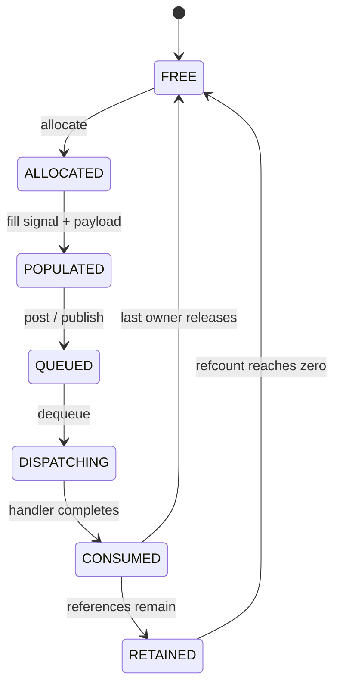

# Chủ đề 4 — Các thành phần chính của hệ thống Event-Driven trong Embedded
> **Phạm vi:** Active Object, Mailbox, State Machine, Event Pool và Data-Link Layer

> Tài liệu này đi sâu vào các building block tạo nên một hệ Event-Driven hoàn chỉnh. Trọng tâm không phải API của một framework cụ thể mà là các contract về state ownership, event transport, memory, timing và mở rộng communication từ một MCU tới nhiều process hoặc nhiều node.

> **Điều hướng:** [← Root README](../README.md) · [↑ Back to Track](README.md) · [← Chủ đề 3 — Active Kernel](README-03-active-kernel.md) · [Chủ đề 5 — Test & Debug →](README-05-embedded-test-debug.md)

---

## Mục lục

> Mục lục rút gọn theo **cụm kiến thức**. Các mục đánh số chi tiết vẫn được giữ nguyên trong nội dung.

- **Active Object & State Machine**
  - [Sơ đồ tổng quan](#sơ-đồ-tổng-quan)
  - [1. Active Object là đơn vị kiến trúc](#1-active-object-là-đơn-vị-kiến-trúc)
  - [3. Mailbox như boundary của concurrency](#3-mailbox-như-boundary-của-concurrency)
  - [6. Các loại State Machine](#6-các-loại-state-machine)
- **Event memory model**
  - [8. Event object model](#8-event-object-model)
  - [9. Event Pool — xương sống của memory model](#9-event-pool-xương-sống-của-memory-model)
  - [10. Event lifetime](#10-event-lifetime)
- **Transport & Data-Link**
  - [15. Data-Link Layer trong Event-Driven System](#15-data-link-layer-trong-event-driven-system)
  - [16. Serialization](#16-serialization)
  - [19. Addressing và routing giữa nhiều node](#19-addressing-và-routing-giữa-nhiều-node)
- **Distributed reliability**
  - [21. Reliability semantics](#21-reliability-semantics)
  - [23. Timeout và retry trong hệ phân tán](#23-timeout-và-retry-trong-hệ-phân-tán)
  - [24. Flow control và backpressure qua link](#24-flow-control-và-backpressure-qua-link)
  - [26. Versioning protocol](#26-versioning-protocol)
- **Boundary & observability**
  - [27. Event security boundary](#27-event-security-boundary)
  - [28. Observability của distributed event flow](#28-observability-của-distributed-event-flow)
  - [30. Mô hình kiến trúc tổng hợp](#30-mô-hình-kiến-trúc-tổng-hợp)
  - [31. Các nguyên tắc cốt lõi](#31-các-nguyên-tắc-cốt-lõi)
- **Tra cứu**
  - [Tài liệu tham khảo](#tài-liệu-tham-khảo)

---

## Sơ đồ tổng quan

Khi mở rộng Event-Driven System từ một MCU sang nhiều execution domain, kiến trúc có thể nhìn thành hai lớp: **local event runtime** và **data-link transport**.

```text
 MCU / Process A                              MCU / Process B
+------------------+                        +------------------+
| Active Object A1 |                        | Active Object B1 |
| Active Object A2 |                        | Active Object B2 |
+---------+--------+                        +---------+--------+
          | mailbox/event pool                        ^
          v                                           |
+------------------+                        +----------+-------+
| local dispatcher |                        | local dispatcher |
+---------+--------+                        +----------+-------+
          | serialize/frame                           ^ decode
          v                                           |
+------------------+   UART/CAN/TCP/...     +----------+-------+
| Data-Link Layer  |=======================>| Data-Link Layer  |
+------------------+                        +------------------+
```

Event lifetime phải được hiểu như một ownership graph:

```text
allocate event
     |
     +--> one consumer ----------> consume ----------> release
     |
     +--> N subscribers -> refcount=N -> each release -> free at 0
```

Đây là chỗ event pool, mailbox, routing và distributed transport gặp nhau.

---

## 1. Active Object là đơn vị kiến trúc

**Active Object (AO)** là một object có:

- state riêng;
- event queue/mailbox riêng;
- event handler/state machine riêng;
- execution/scheduling policy riêng hoặc được kernel quản lý.

Ý tưởng cốt lõi là **encapsulated concurrency**: state mutable của object không được sửa trực tiếp từ bên ngoài; interaction xảy ra bằng asynchronous event.

Mô hình:

```text
        events
          ↓
+-----------------------+
| Active Object         |
|  Mailbox              |
|      ↓                |
|  Event Handler        |
|      ↓                |
|  State Machine        |
|      ↓                |
|  Private State        |
+-----------------------+
          ↓
     emitted events
```

---

## 2. Active Object và thread không đồng nghĩa

Một AO có thể chạy:

- trong cooperative event loop;
- trên một RTOS thread riêng;
- cùng thread với nhiều AO khác;
- trong process khác qua transport.

Do đó AO là abstraction về **ownership + message-driven execution**, còn thread là abstraction về execution context.

Tách hai khái niệm cho phép architecture giữ nguyên khi thay runtime.

---

## 3. Mailbox như boundary của concurrency

Mailbox không chỉ là queue lưu message. Nó là biên giữa producer concurrency và consumer serialization.

Khi nhiều ISR/task post vào cùng mailbox, enqueue side có thể concurrent; nhưng dequeue/handler side thường serial. Nhờ vậy AO có thể xử lý state nội bộ mà không cần mutex nếu runtime đảm bảo một handler tại một thời điểm.

### 3.1 Mailbox contract

Một mailbox cần định nghĩa:

- capacity;
- ordering;
- priority semantics;
- enqueue từ ISR có hợp lệ không;
- overflow policy;
- payload ownership;
- behavior khi destination chưa sẵn sàng.

### 3.2 Head-of-line blocking

Nếu một mailbox chứa event có chi phí xử lý rất khác nhau, một event dài ở đầu queue có thể trì hoãn event khẩn cấp phía sau. Có thể giải quyết bằng priority class, tách AO hoặc giảm handler execution time.

---

## 4. State ownership

Quy tắc mạnh nhất của AO:

> Chỉ active object sở hữu state mới được sửa state đó.

Các component khác có thể yêu cầu thay đổi bằng event, nhưng không lấy pointer rồi sửa trực tiếp.

Lợi ích:

- giảm data race;
- giảm aliasing;
- tăng traceability;
- làm invariant cục bộ;
- dễ unit reasoning.

Nếu state bị chia sẻ không kiểm soát, architecture “có mailbox” nhưng chưa thực sự message-driven.

---

## 5. Invariant của Active Object

Invariant là điều phải luôn đúng ở boundary quan sát được của object. Ví dụ:

- state enum luôn thuộc tập hợp hợp lệ;
- timer chỉ active ở một số state;
- resource handle chỉ tồn tại khi connection active;
- queue counter không vượt capacity.

Handler nên được xem như một transaction nhỏ:

```text
Invariant đúng trước event
      ↓
Process event
      ↓
Invariant đúng sau event
```

Đây là cách tư duy rất mạnh để debug state machine.

---

## 6. Các loại State Machine

### 6.1 Flat Finite State Machine

Mỗi state ngang hàng. Dễ hiểu, phù hợp logic nhỏ.

Nhược điểm là transition tăng nhanh theo số state × số event.

### 6.2 Hierarchical State Machine

State có thể lồng nhau. Behavior chung đặt ở superstate.

HSM giải quyết duplication và cho phép mô hình hóa cấu trúc domain tự nhiên hơn.

### 6.3 Orthogonal/Concurrent regions

Một object logic có thể có nhiều chiều trạng thái độc lập tương đối, ví dụ connection state và UI state. Mô hình orthogonal region biểu diễn chúng riêng thay vì tạo Cartesian product của mọi combination.

### 6.4 Table-driven State Machine

Transition được biểu diễn bằng data table. Thuận lợi cho validation, visualization và generation.

### 6.5 Function-based State Machine

Mỗi state là function/handler. Linh hoạt và dễ viết code hành động phức tạp.

---

## 7. State explosion

Nếu có N boolean flags độc lập, số combination lý thuyết là `2^N`. Đây là lý do “nhiều flag đơn giản” có thể khó hơn một state machine explicit.

State explosion được giảm bằng:

- hierarchy;
- orthogonal regions;
- tách trách nhiệm thành nhiều AO;
- loại bỏ state không thực sự cần nhớ;
- biến occurrence ngắn hạn thành event thay vì flag persistent.

---

## 8. Event object model

Event có thể được mô hình như một object immutable sau khi publish. Immutability rất hữu ích vì consumer không thể thay đổi dữ liệu mà consumer khác đang quan sát.

Metadata có thể gồm:

- signal/type;
- source;
- destination/topic;
- timestamp;
- correlation ID;
- payload length/type;
- flags về ownership hoặc priority.

Không phải hệ nhỏ nào cũng cần tất cả, nhưng mỗi field phản ánh một nhu cầu protocol thật.

---

## 9. Event Pool — xương sống của memory model

Event pool là allocator chuyên dụng cho event/message object.

### 9.1 Fixed-block pool

Mỗi block cùng kích thước. Allocation/deallocation đơn giản và deterministic.

Nếu event có nhiều kích thước, có thể dùng nhiều pool class:

```text
Small pool   → tiny payload
Medium pool  → common messages
Large pool   → exceptional payload
```

### 9.2 Internal fragmentation

Fixed block tránh external fragmentation nhưng có thể lãng phí phần dư trong block. Đây là trade-off có thể tính toán trước, thường chấp nhận được để đổi lấy determinism.

### 9.3 Pool metadata

Allocator cần biết block free/used. Metadata có thể nằm trong block tự do (free list) hoặc bitmap riêng. Thiết kế phải tránh metadata corruption làm hỏng toàn pool.

---

## 10. Event lifetime



Một event có vòng đời:

```text
allocate/create
   ↓
populate
   ↓
publish/post
   ↓
queued
   ↓
dispatched
   ↓
consumed
   ↓
release/recycle
```

Mỗi transition cần ownership rõ. Đặc biệt, producer không được sửa event sau khi transfer ownership nếu consumer có thể đang dùng.

### 10.1 Single-consumer ownership

Dễ nhất: sender transfer ownership cho receiver; receiver release sau xử lý.

### 10.2 Multi-consumer ownership

Có thể:

- copy event cho từng receiver;
- shared immutable event + refcount;
- static payload với lifetime dài hơn mọi consumer.

---

## 11. Reference counting

Reference count lưu số owner/reference hợp lệ của event. Khi giảm về 0, object được trả pool.

Điểm khó:

- increment phải xảy ra trước khi publish tới consumer mới;
- decrement đúng một lần cho mỗi ownership token;
- lỗi duplicate release gây underflow;
- mất release gây leak/pool exhaustion.

Refcount là protocol ownership, không chỉ là một counter.

---

## 12. Event priority

Không phải event nào cũng có urgency giống nhau. Có thể xử lý priority ở:

- task/AO priority;
- mailbox priority;
- event priority;
- separate urgent queue.

Mỗi cách có trade-off. Event priority quá chi tiết làm scheduling khó phân tích; chỉ dùng khi timing requirement thực sự cần.

---

## 13. Event coalescing

Một số event không cần giữ mọi occurrence. Ví dụ “giá trị sensor mới nhất” có thể chỉ cần latest sample. Coalescing giúp giảm queue pressure.

Cần phân biệt:

- **edge event**: mỗi occurrence đều có ý nghĩa, không được mất;
- **level/state update**: chỉ trạng thái mới nhất quan trọng;
- **counter event**: có thể gộp nhiều occurrence thành count.

Chọn representation đúng có thể giảm memory và latency đáng kể.

---

## 14. Dispatcher topology

### 14.1 Central dispatcher

Một dispatcher route tất cả event. Dễ trace nhưng có thể thành bottleneck hoặc single point of failure.

### 14.2 Distributed mailbox scheduling

Mỗi AO có mailbox; scheduler chỉ chọn AO ready. Decoupling tốt hơn và scale tự nhiên.

### 14.3 Pub-sub broker

Broker quản lý topic → subscriber. Phù hợp event fan-out nhưng tăng metadata và routing cost.

---

## 15. Data-Link Layer trong Event-Driven System

Khi source và destination không còn nằm trong cùng address space, event không thể chỉ là pointer trong RAM. Cần **Data-Link Layer** biến event object thành frame có thể truyền qua UART, CAN, SPI, TCP, radio…

Mô hình:

```text
Local event
   ↓ serialization
Protocol frame
   ↓ transport/link
Remote node
   ↓ parsing + validation
Remote event
```

Data-link layer giữ application event semantics trong khi thay đổi physical transport.

---

## 16. Serialization

Serialization chuyển cấu trúc dữ liệu nội bộ thành chuỗi byte có format ổn định.

Một wire format cần xác định:

- field order;
- field width;
- endianness;
- version;
- payload length;
- checksum/CRC nếu cần;
- optional sequence number.

Không nên truyền raw C `struct` trực tiếp qua wire nếu phụ thuộc padding, ABI hoặc endianness.

---

## 17. Framing

Byte stream như UART không có khái niệm packet tự nhiên. Data-link layer cần nhận biết frame boundary bằng:

- fixed length;
- length prefix;
- delimiter + escaping;
- COBS/SLIP-like encoding;
- protocol-specific frame format.

Framing phải phục hồi được sau byte lỗi hoặc mất đồng bộ.

---

## 18. Integrity và CRC

CRC giúp phát hiện corruption trên link nhưng không cung cấp authentication/security. CRC polynomial, coverage region và initial/final value phải là một phần của protocol spec.

Nếu protocol cần chống giả mạo, cần cryptographic authentication riêng.

---

## 19. Addressing và routing giữa nhiều node

Khi có nhiều MCU/node, event cần logical addressing:

- node ID;
- service ID;
- task/AO ID;
- topic;
- endpoint.

Addressing nên độc lập tối đa với địa chỉ vật lý của transport để application không bị khóa vào UART/CAN/IP cụ thể.

---

## 20. Request/response và correlation

Event-driven system có thể cần request/response nhưng không nên quay lại synchronous blocking. Một request có thể mang **correlation ID**; response trả cùng ID.

State machine giữ pending request state và timeout. Đây là asynchronous RPC về mặt protocol nhưng không block execution context.

---

## 21. Reliability semantics

Khi event qua network, cần trả lời:

- best effort hay reliable?
- có retry không?
- duplicate có thể xảy ra không?
- ordering có được đảm bảo không?
- acknowledgement ở link hay application level?

### 21.1 At-most-once

Cố tránh duplicate, nhưng message có thể mất.

### 21.2 At-least-once

Retry tới khi được xác nhận; duplicate có thể xuất hiện. Consumer cần idempotency hoặc duplicate detection.

### 21.3 Exactly-once

Rất khó trong hệ phân tán; thường là property được xây dựng bằng transaction/deduplication, không phải đặc tính tự nhiên của transport.

---

## 22. Sequence number

Sequence number giúp phát hiện:

- duplicate;
- missing frame;
- reordering;
- reset/restart nếu kết hợp session/epoch.

Counter finite sẽ wrap, vì vậy comparison cần modular arithmetic tương tự timer counter.

---

## 23. Timeout và retry trong hệ phân tán

Timeout không chứng minh remote side thất bại; nó chỉ chứng minh local side chưa nhận response trong thời gian quy định.

Retry có thể làm một command được thực thi nhiều lần. Vì vậy command không idempotent cần transaction ID hoặc deduplication policy.

---

## 24. Flow control và backpressure qua link

Nếu receiver xử lý chậm hơn sender, buffer sẽ đầy. Data-link có thể dùng:

- hardware flow control;
- credit-based flow control;
- window;
- ACK pacing;
- application-level rate limit.

Backpressure phải được truyền ngược đủ xa tới nguồn tải, nếu không chỉ chuyển overflow từ queue này sang queue khác.

---

## 25. Multi-process event-driven system

Giữa process trên Linux, event có thể đi qua:

- Unix domain socket;
- pipe;
- shared memory + notification;
- message broker;
- network socket.

Dù transport khác MCU, các contract giống nhau vẫn tồn tại: identity, ordering, ownership, serialization, timeout và failure semantics.

---

## 26. Versioning protocol

Khi nhiều firmware version cùng tồn tại, event format phải có backward/forward compatibility strategy.

Các cách thường dùng:

- version field;
- length-delimited fields;
- reserved field;
- feature negotiation;
- unknown-field ignore policy.

Protocol không version hóa là technical debt có xu hướng xuất hiện muộn, khi sản phẩm đã deploy.

---

## 27. Event security boundary

Event nhận từ external link là input không tin cậy hơn event nội bộ. Parser cần kiểm tra:

- frame length;
- enum range;
- index/bounds;
- authentication nếu cần;
- replay protection nếu threat model yêu cầu.

Không nên deserialize trực tiếp rồi tin rằng remote payload luôn hợp lệ.

---

## 28. Observability của distributed event flow

Trace tốt nên có correlation qua node:

```text
node, timestamp, event_id, source, destination, sequence, correlation_id
```

Clock của các node có thể không đồng bộ tuyệt đối; vì vậy causal identifiers đôi khi đáng tin hơn timestamp để dựng chuỗi sự kiện.

---

## 29. Fault containment giữa các node

Một node lỗi không nên khiến toàn hệ bị kẹt vô hạn. Cần state machine cho:

- link down;
- remote reset;
- version mismatch;
- retry exhausted;
- malformed frame;
- resource exhaustion.

Communication failure phải được coi là một state bình thường có thể xảy ra, không phải “exception hiếm”.

---

## 30. Mô hình kiến trúc tổng hợp

Một hệ Event-Driven nhiều node có thể được nhìn như:

```text
[AO A] --event--> [Local Mailbox]
   |
   +--event--> [Serializer] → [Data Link] → [Parser] → [Remote Mailbox] → [AO B]
```

Cùng một event semantics có thể đi qua hai phạm vi:

- local: transfer object/reference;
- remote: serialize/deserialize thành frame.

Ranh giới transport không nên làm thay đổi business meaning của event.

---

## 31. Các nguyên tắc cốt lõi

1. Active Object là boundary của state ownership, không phải chỉ là một function handler.
2. Mailbox serializes event processing và tạo backpressure boundary.
3. State machine explicit giảm implicit state và state explosion.
4. Event pool cung cấp memory allocation bounded cho message-driven runtime.
5. Event lifetime phải có ownership protocol rõ ràng.
6. Multi-consumer message cần copy, immutable sharing hoặc reference counting.
7. Data-link layer là cầu nối giữa event semantics và byte transport.
8. Wire format phải độc lập với raw C struct/ABI.
9. Reliable delivery, ordering và duplicate semantics phải được định nghĩa riêng.
10. Timeout không đồng nghĩa remote failure; retry có thể tạo duplicate.
11. Protocol versioning và observability là phần của architecture, không phải phần bổ sung sau cùng.
12. Hệ nhiều node vẫn tuân cùng nguyên tắc event-driven: explicit state, message ownership, bounded queues và traceable causality.

---

## Tài liệu tham khảo

- [QP/C Conceptual Model — Active Objects](https://www.state-machine.com/qpc/conc-qp.html)
- [QP/C Event Delivery Mechanisms](https://www.state-machine.com/qpc/srs-qp_edm.html)
- [QP/C++ QActive — event queue and state machine model](https://www.state-machine.com/qpcpp/class_q_p_1_1_q_active.html)
- [AK Embedded Base Kit STM32L151 repository](https://github.com/ak-embedded-software/ak-base-kit-stm32l151)

---

> **Điều hướng:** [← Root README](../README.md) · [↑ Back to Track](README.md) · [← Chủ đề 3 — Active Kernel](README-03-active-kernel.md) · [Chủ đề 5 — Test & Debug →](README-05-embedded-test-debug.md)
