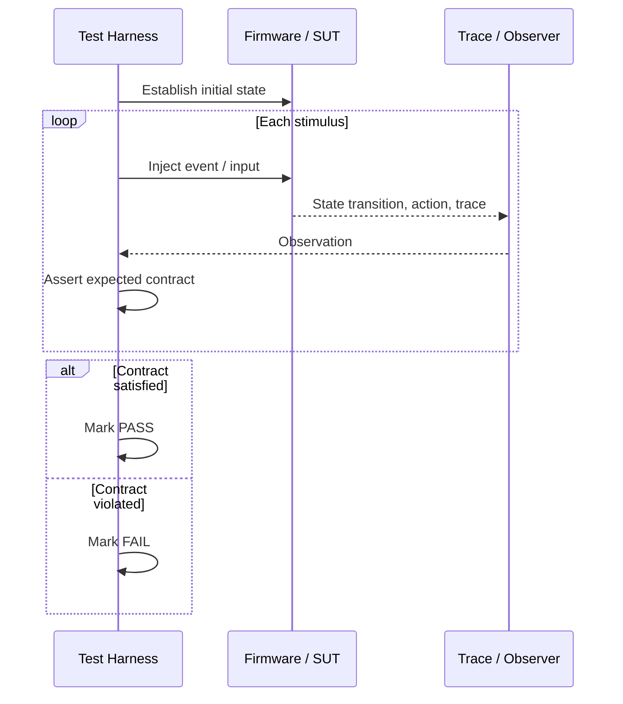

# Chủ đề 5 — Kiểm thử và gỡ lỗi cho Embedded Programming
> **Phạm vi:** Test, Debug, Trace, Record Event và Automated Validation trong hệ Event-Driven

> Tài liệu này trình bày lý thuyết về khả năng kiểm thử và quan sát firmware trong toàn vòng đời. Trọng tâm là phân biệt test, debug, log và trace; hiểu cách thiết kế observability ngay từ kiến trúc; và lý giải vì sao event-driven firmware đặc biệt phù hợp với deterministic test và replay.

> **Điều hướng:** [← Root README](../README.md) · [↑ Back to Track](README.md) · [← Chủ đề 4 — Event-Driven Components](README-04-event-driven-system-components.md)

---

## Mục lục

> Mục lục rút gọn theo **cụm kiến thức**. Các mục đánh số chi tiết vẫn được giữ nguyên trong nội dung.

- **Testability & deterministic test**
  - [Sơ đồ tổng quan](#sơ-đồ-tổng-quan)
  - [1. Test và debug là hai hoạt động khác nhau](#1-test-và-debug-là-hai-hoạt-động-khác-nhau)
  - [3. Testability là thuộc tính kiến trúc](#3-testability-là-thuộc-tính-kiến-trúc)
  - [5. Deterministic test](#5-deterministic-test)
  - [6. Test state machine](#6-test-state-machine)
- **Time & test interface**
  - [7. Temporal test](#7-temporal-test)
  - [9. Command-line interface như test interface](#9-command-line-interface-như-test-interface)
- **Log, trace & fault evidence**
  - [10. Log](#10-log)
  - [12. Event trace](#12-event-trace)
  - [16. Fault và assertion](#16-fault-và-assertion)
- **Measurement & automation**
  - [21. Latency measurement](#21-latency-measurement)
  - [23. Automated test architecture](#23-automated-test-architecture)
  - [26. Fault injection](#26-fault-injection)
- **CI & production diagnostics**
  - [28. CI cho embedded](#28-ci-cho-embedded)
  - [30. Debugging theo causal chain](#30-debugging-theo-causal-chain)
  - [32. Production diagnostics](#32-production-diagnostics)
  - [34. Các nguyên tắc cốt lõi](#34-các-nguyên-tắc-cốt-lõi)
- **Tra cứu**
  - [Tài liệu tham khảo](#tài-liệu-tham-khảo)

---

## Sơ đồ tổng quan

Observability của firmware nên được thiết kế theo nhiều lớp, từ assertion cục bộ đến trace toàn hệ thống:

```text
              Product/use-case validation
                       /\
                      /  \
             event/state trace
                    /------\
             structured logging
                  /----------\
             metrics/counters/time
                /--------------\
        assertions + fault registers
              /------------------\
      GPIO/logic-analyzer instrumentation
```

Một failure nên được tái dựng theo causal chain thay vì chỉ đọc dòng log cuối:

```text
external input
     |
     v
ISR/input adapter
     |
     v
EVENT_X posted --timestamp--> queue
     |
     v
handler A: S1 -> S2
     |
     +--> EVENT_Y
             |
             v
         handler B
             |
             v
       invariant fails
             |
             v
   assertion/fault + recorder snapshot
```

---

## 1. Test và debug là hai hoạt động khác nhau

**Testing** trả lời: hệ thống có thỏa contract hay không?

**Debugging** trả lời: nếu không thỏa, nguyên nhân ở đâu?

Một test tốt tạo ra bằng chứng có thể lặp lại. Một debug session tốt thu hẹp causal chain từ symptom về root cause.

Trong embedded, hai hoạt động khó hơn desktop vì phần mềm phụ thuộc:

- timing;
- interrupt;
- peripheral state;
- electrical signal;
- reset cause;
- resource hữu hạn;
- hardware/environment không hoàn toàn deterministic.

---

## 2. Pyramid quan sát firmware

Có thể chia observability thành nhiều lớp:

```text
Application assertions / invariants
Event trace
Structured log
Runtime metrics
CPU fault state
Peripheral registers
GPIO/timing trace
Electrical measurement
```

Không có một công cụ nào thay thế tất cả. Log cho semantics; debugger cho machine state; logic analyzer cho timing ngoài chip.

---

## 3. Testability là thuộc tính kiến trúc

Firmware dễ test khi:

- state được encapsulate;
- input đi qua interface rõ;
- output quan sát được;
- time source có thể abstract;
- hardware dependency tách khỏi logic;
- event semantics ổn định;
- side effect được đặt ở boundary.

Event-driven architecture hỗ trợ testability vì handler thường có dạng:

```text
(state, event) → (new state, emitted effects/events)
```

Đây gần với một state transition function có thể kiểm tra độc lập.

---

## 4. Unit test trong embedded

Unit test kiểm tra một đơn vị logic với dependency được kiểm soát. Không nhất thiết unit phải là một C function; unit có thể là parser, state machine, queue, allocator hoặc protocol encoder.

### 4.1 Host-based test

Logic portable chạy trên PC giúp test nhanh, dùng sanitizer và CI dễ dàng. Nhưng host test không chứng minh behavior phụ thuộc MCU timing/register.

### 4.2 Target-based test

Chạy trên MCU thật kiểm tra ABI, compiler target, interrupt, peripheral và timing. Chi phí setup cao hơn và failure diagnostics khó hơn.

Hai loại test bổ sung nhau, không thay thế nhau.

---

## 5. Deterministic test

Một test deterministic cho cùng initial state và input sẽ cho cùng result quan sát được.

Nguồn phá determinism gồm:

- real clock;
- interrupt timing;
- random seed;
- network timing;
- uninitialized memory;
- race condition;
- hidden global state.

Event-driven system có thể tăng determinism bằng cách đưa external occurrence thành explicit event và inject event theo thứ tự kiểm soát.

---

## 6. Test state machine



State machine có thể được kiểm tra theo transition:

```text
Given current state
When event arrives
Then next state + emitted action must satisfy contract
```

Các coverage hữu ích:

- state coverage;
- transition coverage;
- event × state coverage;
- guard true/false coverage;
- invalid-event behavior.

Transition coverage thường có ý nghĩa kiến trúc hơn line coverage vì nó phản ánh behavior model.

---

## 7. Temporal test

Nhiều bug embedded nằm ở thời gian, không phải giá trị đơn lẻ. Temporal property có dạng:

- sau event A, event B phải xuất hiện trong Δt;
- khi state X, event Y không được xảy ra;
- nếu request không có response trong T, timeout phải xuất hiện;
- một output không được toggle nhanh hơn giới hạn.

Để test temporal property cần timestamp, controllable time source hoặc trace đủ chính xác.

---

## 8. Fake time và virtual time

Thay vì test phải chờ thời gian thật, timer layer có thể dựa trên abstract clock. Test advance virtual time tới deadline và quan sát timeout event.

Lợi ích:

- test nhanh;
- deterministic;
- dễ kiểm tra wrap-around;
- dễ mô phỏng timeout dài;
- không phụ thuộc host scheduling jitter.

Virtual time là một trong những kỹ thuật mạnh nhất để test event-driven state machine.

---

## 9. Command-line interface như test interface

UART CLI có thể đóng vai trò test control plane nếu command map vào interface chính thức của system.

Một CLI dùng cho automation cần:

- syntax ổn định;
- response machine-parseable;
- timeout rõ;
- error code rõ;
- không phụ thuộc delay tùy ý;
- command idempotent khi có thể.

CLI nên inject event/query state, không bypass architecture bằng cách sửa global variable trực tiếp.

---

## 10. Log

Log là record có ngữ nghĩa cho người đọc. Một log tốt trả lời:

- điều gì xảy ra;
- ở subsystem nào;
- severity;
- context định danh;
- timestamp tương đối/absolute nếu có.

### 10.1 Structured log

Structured log dùng field ổn định thay vì chỉ prose. Ví dụ conceptually:

```text
level, module, code, arg0, arg1, timestamp
```

Host side mới render thành text. Cách này giảm firmware footprint và giúp automation parse dễ hơn.

---

## 11. Logging overhead

Log có chi phí:

- format string;
- CPU conversion;
- UART bandwidth;
- lock/critical section;
- buffer RAM;
- Flash chứa strings.

Nếu log đồng bộ qua UART trong đường realtime, log có thể thay đổi chính timing đang cố quan sát — **observer effect**.

Giải pháp thường là binary log buffered và flush ở context thấp ưu tiên.

---

## 12. Event trace

Event trace khác log ở chỗ trace biểu diễn các primitive kiến trúc có format nhỏ, nhất quán.

Một event trace record có thể chứa:

```text
timestamp | event_type | source | destination | state_before | state_after
```

Trace hỗ trợ:

- dựng timeline;
- đo queueing latency;
- tìm event missing/duplicate;
- xác minh state transition;
- correlation nhiều subsystem.

---

## 13. Realtime trace và record event

### 13.1 Realtime trace

Stream trace ra host trong lúc chạy. Ưu điểm là xem trực tiếp và lưu dài; nhược điểm phụ thuộc bandwidth.

### 13.2 Record event / flight recorder

Giữ ring buffer trong RAM, chỉ lấy ra khi cần. Ưu điểm overhead nhỏ và có lịch sử ngay trước crash.

Một flight recorder nên ưu tiên event quan trọng hơn prose dài.

---

## 14. Ring buffer cho trace

Ring buffer có semantics overwrite-oldest tự nhiên. Khi đầy, record mới ghi đè record cũ. Đây thường là policy đúng cho “last N events before failure”.

Cần biết:

- record size;
- capacity;
- atomicity giữa writer contexts;
- wrap sequence;
- overflow counter.

Nếu ISR và task cùng ghi trace, implementation phải tránh corrupt head/index.

---

## 15. Timestamp

Timestamp quality quyết định khả năng phân tích timing.

Có thể dùng:

- system tick: resolution thấp hơn nhưng đơn giản;
- hardware free-running timer;
- CPU cycle counter;
- external logic analyzer.

Timestamp cần xét:

- resolution;
- wrap period;
- synchronization giữa node;
- read overhead;
- monotonicity.

---

## 16. Fault và assertion

Assertion kiểm tra invariant mà programmer cho rằng luôn đúng. Trong embedded, assertion failure nên được coi là **diagnostic event nghiêm trọng**, không chỉ in một dòng rồi tiếp tục.

Thông tin hữu ích cần giữ:

- assertion ID;
- file/line hoặc compact code;
- current task/AO;
- state machine state;
- SP/LR/PC nếu phù hợp;
- recent event records.

---

## 17. Cortex-M fault analysis

Cortex-M có exception fault chứa thông tin về lỗi instruction, bus, memory hoặc usage tùy core.

Khi fault, điều quan trọng là capture exception frame trước khi state bị thay đổi quá nhiều. PC cho biết instruction faulting/return location; LR, SP và fault status registers giúp xác định nguyên nhân.

HardFault thường là “fault escalation” chứ không tự nói root cause. Cần đọc status register cụ thể nếu core hỗ trợ.

---

## 18. Reset cause

Một reboot không nên bị coi là “system start bình thường” nếu nguyên nhân là watchdog, brownout hoặc fault.

Reset cause giúp phân biệt:

- power-on;
- software reset;
- watchdog;
- brownout;
- external reset.

Kết hợp reset cause với retained crash record tạo ra khả năng post-mortem tốt hơn.

---

## 19. Watchdog và diagnosability

Watchdog phát hiện hệ thống không còn tiến triển trong giới hạn thời gian. Nhưng “feed watchdog ở mọi nơi” làm mất ý nghĩa.

Supervision tốt dựa trên **progress evidence**:

- event loop heartbeat;
- critical task checkpoint;
- subsystem deadline.

Khi watchdog sắp reset hoặc sau reset, diagnostic nên cho biết subsystem nào không progress.

---

## 20. Metrics

Metrics là số đo aggregate thay vì từng record. Ví dụ:

- queue high-watermark;
- event drop count;
- pool minimum-free;
- handler max execution time;
- number of resets;
- retry count;
- CRC error count.

Metrics có overhead thấp và rất hữu ích để phát hiện hệ thống dần tiến gần giới hạn trước khi bug xảy ra.

---

## 21. Latency measurement

Một latency chỉ có nghĩa nếu định nghĩa hai measurement points.

Ví dụ event latency có thể là:

```text
T_handler_start − T_event_post
```

Hoặc end-to-end:

```text
T_output_effect − T_physical_input
```

Hai số đo khác nhau hoàn toàn. Benchmark/test report phải nói rõ boundary.

---

## 22. GPIO instrumentation

Toggle GPIO quanh đoạn code cho phép logic analyzer/oscilloscope đo thời gian bên ngoài firmware.

Ưu điểm:

- không phụ thuộc UART;
- resolution cao;
- xác minh được timing thực tế;
- quan sát interrupt jitter.

Nhược điểm là chỉ cho vài channel và cần mapping signal → semantic.

---

## 23. Automated test architecture

Một hệ automation embedded thường gồm:

```text
Test controller on host
   ↓ commands/stimulus
Target firmware
   ↓ observable outputs/log/trace
Host validator
   ↓
Pass / fail + artifacts
```

Có thể thêm simulator board, relay, programmable supply, logic analyzer hoặc network peer.

Điểm quan trọng là test harness điều khiển **input vật lý hoặc protocol thực**, không chỉ gọi function nội bộ nếu mục tiêu là integration/system test.

---

## 24. Test oracle

**Oracle** là cơ chế quyết định output đúng hay sai. Oracle có thể là:

- exact expected value;
- state transition rule;
- timing window;
- protocol invariant;
- reference model.

Nếu test chỉ “chạy rồi nhìn log thấy có vẻ đúng”, test chưa có oracle rõ.

---

## 25. Black-box, gray-box và white-box

### Black-box

Chỉ kích input công khai và quan sát output công khai. Gần sản phẩm thật nhất nhưng khó debug.

### Gray-box

Dùng thêm diagnostic/trace internal. Đây thường là lựa chọn hiệu quả cho embedded integration test.

### White-box

Quan sát hoặc inject internals sâu. Phù hợp unit/kernel test nhưng dễ phụ thuộc implementation.

---

## 26. Fault injection

Fault injection kiểm tra response khi dependency sai, ví dụ:

- packet corrupt;
- timeout;
- queue full;
- pool exhausted;
- sensor disconnected;
- reset giữa transaction;
- duplicate message.

Mục tiêu không phải tạo lỗi ngẫu nhiên mà là kiểm chứng failure semantics đã thiết kế.

---

## 27. Reproducibility

Một bug có thể debug hiệu quả khi có đủ dữ liệu để tái tạo:

- firmware version/hash;
- build configuration;
- hardware revision;
- test input;
- timing parameters;
- reset cause;
- trace window;
- environment quan trọng.

Nếu log không ghi version, một trace đẹp vẫn có thể không còn giá trị sau khi source thay đổi.

---

## 28. CI cho embedded

CI có thể chia thành tầng:

- static analysis/format;
- host unit tests;
- build nhiều configuration;
- emulator/simulator tests;
- hardware-in-the-loop tests.

Hardware test nên được coi là resource hữu hạn, vì vậy test nhanh và deterministic chạy host trước sẽ giảm tải cho HIL.

---

## 29. Test flakiness

Flaky test đôi khi pass, đôi khi fail mà code không đổi. Trong embedded nguyên nhân thường là:

- sleep-based synchronization;
- race;
- non-deterministic external timing;
- state không reset sạch;
- serial buffer leftovers;
- power-cycle chưa đủ;
- shared test equipment.

Flaky test làm mất niềm tin vào hệ thống test, vì vậy phải được xem như bug của test infrastructure hoặc product timing contract.

---

## 30. Debugging theo causal chain

Một quy trình reasoning tốt đi từ symptom về layer thấp hơn:

```text
Observed failure
   ↓
Which contract failed?
   ↓
Which event/state transition led there?
   ↓
Which input/timing/resource condition caused it?
   ↓
Which machine/peripheral state proves the cause?
```

Không nên bắt đầu bằng cách thêm hàng loạt `printf` ngẫu nhiên vì có thể thay đổi timing và che race.

---

## 31. Observability budget

Trace/log không miễn phí. Cần phân bổ budget:

- bytes/s;
- RAM buffer;
- CPU cycles;
- Flash strings;
- worst-case ISR overhead.

Thiết kế tốt dùng event ID compact trên target và decode tên ở host.

---

## 32. Production diagnostics

Thiết bị ngoài hiện trường cần diagnostic khác lab vì không có debugger cắm sẵn. Những dữ liệu có giá trị cao gồm:

- firmware version;
- reset/fault reason;
- uptime;
- last event records;
- resource high-watermark;
- communication error counters;
- watchdog evidence.

Mục tiêu là trả lời “điều gì xảy ra trước khi thiết bị hỏng?” với lượng dữ liệu nhỏ nhất nhưng đủ causal context.

---

## 33. Tại sao Event-Driven đặc biệt thuận lợi cho debug?

Vì behavior đã được phân rã thành discrete events và transitions. Nếu hệ thống ghi lại event stream, có thể dựng lại lịch sử logic gần giống replay.

Ba đối tượng cần quan sát nhất là:

1. **event** nào đến;
2. **state** trước/sau;
3. **resource/timing** tại thời điểm đó.

Đây là mô hình diagnostic rất mạnh và độc lập với framework cụ thể.

---

## 34. Các nguyên tắc cốt lõi

1. Test kiểm chứng contract; debug tìm root cause khi contract bị phá.
2. Testability phải được thiết kế từ architecture, không thêm sau cùng.
3. State machine và explicit events làm behavior dễ test deterministic hơn.
4. Log, trace, metrics và debugger cung cấp các lớp thông tin khác nhau.
5. Binary event trace thường phù hợp hơn text log cho đường realtime.
6. Assertion kiểm tra invariant và nên giữ crash evidence.
7. Reset cause + flight recorder là cặp dữ liệu post-mortem rất giá trị.
8. Automated test cần test oracle rõ, không dựa vào “nhìn log thấy đúng”.
9. Fault injection kiểm chứng failure semantics, không chỉ happy path.
10. Timing measurement phải định nghĩa chính xác start/end point và observer overhead.
11. Flaky test là một vấn đề kỹ thuật cần xử lý, không phải chuyện bình thường.
12. Production firmware cần observability đủ để debug khi không có debugger trực tiếp.

---

## Tài liệu tham khảo

- [Arm Cortex-M3 Technical Reference Manual — exception model](https://developer.arm.com/documentation/ddi0337/latest/)
- [Zephyr Documentation — Tracing](https://docs.zephyrproject.org/latest/services/tracing/index.html)
- [QP/C documentation — framework and tracing ecosystem](https://www.state-machine.com/qpc/)
- [AK Embedded Base Kit STM32L151 repository](https://github.com/ak-embedded-software/ak-base-kit-stm32l151)

---

> **Điều hướng:** [← Root README](../README.md) · [↑ Back to Track](README.md) · [← Chủ đề 4 — Event-Driven Components](README-04-event-driven-system-components.md)
