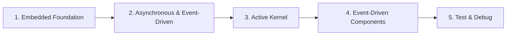

# 02 — Event-Driven Programming

> **Phạm vi:** Từ nền tảng embedded đến kiến trúc event-driven, Active Kernel, các building block và khả năng test/debug.

[← Root README](../README.md)

## Nội dung

| # | Chương | Trọng tâm |
|---:|---|---|
| 1 | [Chủ đề 1 — Embedded Foundation](README-01-embedded-foundation.md) | Computer architecture, memory, MMIO, startup, toolchain, linker và runtime. |
| 2 | [Chủ đề 2 — Asynchronous & Event-Driven](README-02-asynchronous-event-driven.md) | Event, queue/mailbox, dispatcher, state machine, ownership, timing và backpressure. |
| 3 | [Chủ đề 3 — Active Kernel](README-03-active-kernel.md) | Execution model, task/message, timer, state machine, trace và diagnostic. |
| 4 | [Chủ đề 4 — Event-Driven Components](README-04-event-driven-system-components.md) | Active Object, mailbox, event pool, state machine và distributed event transport. |
| 5 | [Chủ đề 5 — Test & Debug](README-05-embedded-test-debug.md) | Deterministic test, trace, observability, fault analysis và automated validation. |

## Lộ trình đọc

## Cách sử dụng bộ tài liệu

Các chapter được viết như tài liệu lý thuyết độc lập nhưng có thứ tự học khuyến nghị như sơ đồ trên. Mỗi chapter có mục lục rút gọn, liên kết Previous/Next/Back to Track, sơ đồ ASCII và Mermaid ở những phần phù hợp với semantic của nội dung.

---

[← Root README](../README.md)
