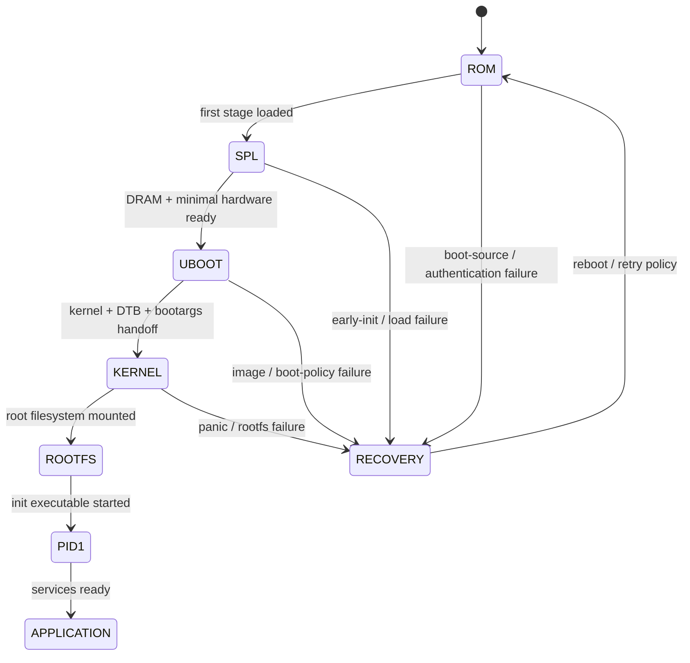

# Chủ đề 1 — Kiến trúc và Boot Flow của Linux Embedded
## Từ reset vector của SoC đến PID 1 và application

> Chương này mô tả **bản chất của một hệ Embedded Linux** và toàn bộ chuỗi khởi động từ phần cứng đến userspace. Mục tiêu không phải ghi nhớ tên từng bootloader hay từng lệnh U-Boot, mà là hiểu **mỗi tầng chịu trách nhiệm điều gì, dữ liệu nào được truyền qua biên giữa các tầng, và một lỗi boot thuộc về tầng nào**.

---

## Mục lục

- [1. Embedded Linux là gì?](#1-embedded-linux-là-gì)
- [2. Embedded Linux khác MCU bare-metal/RTOS ở đâu?](#2-embedded-linux-khác-mcu-bare-metalrtos-ở-đâu)
- [3. Kiến trúc phần cứng điển hình của một SoC Linux](#3-kiến-trúc-phần-cứng-điển-hình-của-một-soc-linux)
- [4. Các tầng phần mềm của Embedded Linux](#4-các-tầng-phần-mềm-của-embedded-linux)
- [5. Boot là một chuỗi chuyển giao quyền kiểm soát](#5-boot-là-một-chuỗi-chuyển-giao-quyền-kiểm-soát)
- [6. Boot ROM / ROM Code](#6-boot-rom-rom-code)
- [7. SPL/TPL và early boot stage](#7-spltpl-và-early-boot-stage)
- [8. U-Boot và bootloader đầy đủ](#8-u-boot-và-bootloader-đầy-đủ)
- [9. Kernel image, DTB và initramfs](#9-kernel-image-dtb-và-initramfs)
- [10. Kernel early boot](#10-kernel-early-boot)
- [11. Memory management được thiết lập trong boot](#11-memory-management-được-thiết-lập-trong-boot)
- [12. Driver probing trong boot](#12-driver-probing-trong-boot)
- [13. Root filesystem và chuyển sang userspace](#13-root-filesystem-và-chuyển-sang-userspace)
- [14. PID 1 và init system](#14-pid-1-và-init-system)
- [15. Application startup](#15-application-startup)
- [16. Boot arguments và contract giữa bootloader với kernel](#16-boot-arguments-và-contract-giữa-bootloader-với-kernel)
- [17. UART console và giá trị của boot log](#17-uart-console-và-giá-trị-của-boot-log)
- [18. Cách đọc boot log theo causal chain](#18-cách-đọc-boot-log-theo-causal-chain)
- [19. Phân loại lỗi boot theo tầng](#19-phân-loại-lỗi-boot-theo-tầng)
- [20. Boot time và critical path](#20-boot-time-và-critical-path)
- [21. Boot reliability và recovery](#21-boot-reliability-và-recovery)
- [22. Secure/verified boot nhìn ở mức kiến trúc](#22-secureverified-boot-nhìn-ở-mức-kiến-trúc)
- [23. Mô hình tư duy tổng hợp](#23-mô-hình-tư-duy-tổng-hợp)
- [24. Các nguyên tắc cốt lõi](#24-các-nguyên-tắc-cốt-lõi)
- [25. Tài liệu tham khảo chính](#25-tài-liệu-tham-khảo-chính)

---

## 1. Embedded Linux là gì?

Embedded Linux là một hệ thống nhúng trong đó Linux kernel đóng vai trò kernel của hệ điều hành, còn userspace được chọn và cấu hình riêng cho sản phẩm. Một hệ như vậy thường không phải “Ubuntu thu nhỏ”, mà là một **software stack được xây có chủ đích** cho một board và một product requirement cụ thể.

### 1.1 Embedded Linux khác Linux PC/Server ở đâu?

Linux kernel vẫn là Linux, nhưng **product assumptions** khác đáng kể. PC/server thường có phần cứng tương đối discoverable, storage/RAM dồi dào, distribution userspace đa mục đích và khả năng người dùng thay đổi package linh hoạt. Embedded Linux thường bị ràng buộc bởi board cụ thể, boot time, power, flash endurance, image size, recovery và vòng đời sản phẩm dài.

```text
PC / Server Linux                         Embedded Linux
----------------                         --------------
general-purpose                          product-specific
large/replaceable storage                bounded flash/eMMC/NAND
many self-enumerating devices            many fixed non-enumerable devices
distro package management common         image-based release common
interactive administration expected      unattended boot/recovery important
board details hidden by standards         board/SoC DT + BSP often essential
```

Khác biệt này giải thích vì sao embedded engineer phải quan tâm sâu đến bootloader, Device Tree, RootFS construction, cross-toolchain và update/rollback — những phần có thể ít lộ ra với người chỉ sử dụng desktop/server Linux.

Một image Embedded Linux tối thiểu thường cần các khối sau:

```text
+--------------------------------------------------+
| Application / Product Services                   |
+--------------------------------------------------+
| User-space libraries, daemons, shell, utilities  |
+--------------------------------------------------+
| init / service manager / PID 1                   |
+--------------------------------------------------+
| Root Filesystem                                  |
+--------------------------------------------------+
| Linux Kernel + Device Drivers                    |
+--------------------------------------------------+
| Device Tree / firmware description               |
+--------------------------------------------------+
| Bootloader                                       |
+--------------------------------------------------+
| SoC ROM code / hardware boot logic               |
+--------------------------------------------------+
| MPU/CPU, RAM, Flash/eMMC/SD, peripherals         |
+--------------------------------------------------+
```

Điểm quan trọng là Linux kernel chỉ là **một thành phần**. Kernel không tự tạo ra toàn bộ hệ điều hành usable nếu thiếu root filesystem, init process, libraries và application.

---

## 2. Embedded Linux khác MCU bare-metal/RTOS ở đâu?

Ở MCU bare-metal, firmware thường sở hữu trực tiếp address space và peripheral. Ở RTOS nhỏ, kernel cung cấp scheduler, synchronization và IPC nhưng thường vẫn chạy trong một address space duy nhất, không có process isolation đầy đủ.

Embedded Linux thay đổi mô hình ở ba điểm lớn:

1. **Virtual memory và process model**: mỗi process có virtual address space riêng; kernel kiểm soát translation và permission.
2. **Kernel/user privilege separation**: application thông thường không đọc/ghi trực tiếp register vật lý; phải đi qua driver/system call/mapping được kernel cho phép.
3. **Rich userspace**: filesystem, process, networking stack, dynamic linker, package/image build, logging và service management trở thành phần quan trọng của sản phẩm.

Có thể nhìn theo mức độ abstraction:

```text
MCU bare-metal:
Application -> Register -> Peripheral

RTOS MCU:
Tasks -> RTOS API -> Driver/Register -> Peripheral

Embedded Linux:
Process -> libc/syscall -> Kernel subsystem -> Driver -> Bus -> Peripheral
```

Linux đổi lại footprint và complexity lớn hơn để lấy khả năng isolation, reuse driver, networking, process lifecycle và ecosystem rất mạnh.

---

## 3. Kiến trúc phần cứng điển hình của một SoC Linux

Một SoC chạy Linux thường có:

- một hoặc nhiều CPU core có MMU;
- interrupt controller;
- DRAM controller;
- SRAM nội;
- boot ROM;
- clock/reset controller;
- storage controller cho eMMC/SD/NAND/NOR;
- DMA;
- UART, I2C, SPI, GPIO, USB, Ethernet;
- đôi khi có GPU/NPU/DSP, security engine và management core.

Sơ đồ khái niệm:

```text
                     +----------------------+
                     |      CPU / MPU       |
                     |  MMU + caches + IRQ  |
                     +----------+-----------+
                                |
                      interconnect / bus
           +--------------------+--------------------+
           |                    |                    |
     +-----v------+       +-----v------+       +-----v------+
     |   DRAM     |       | Boot Media |       | Peripheral |
     | Controller |       | eMMC/SD/NOR|       | I2C/SPI/...|
     +-----+------+       +------------+       +------------+
           |
        DDR RAM
```

CPU thường không thể sử dụng DRAM ngay sau reset. DRAM controller cần được cấu hình timing, topology và PHY training trước. Đây là lý do nhiều SoC cần một **early boot stage** nhỏ chạy từ SRAM trước khi bootloader đầy đủ có thể chạy trong DRAM.

---

## 4. Các tầng phần mềm của Embedded Linux

Một cách chia hữu ích là:

```text
Stage 0 : SoC ROM / immutable boot code
Stage 1 : TPL/SPL/FSBL - minimum hardware bring-up
Stage 2 : Full bootloader - U-Boot or equivalent
Stage 3 : Linux kernel early boot
Stage 4 : Linux kernel subsystems + drivers
Stage 5 : RootFS mounted, /init or /sbin/init executed
Stage 6 : Services and application
```

Tên stage thay đổi giữa vendor, nhưng **trách nhiệm logic** tương đối ổn định.

Mỗi stage phải thiết lập đủ điều kiện để stage sau tồn tại. Vì vậy boot là một chuỗi dependency, không phải một tập các binary độc lập.

---

## 5. Boot là một chuỗi chuyển giao quyền kiểm soát



Luồng tổng quát trong root README có thể mở rộng thành:

```text
Power-on / Reset
      |
      v
+-------------+
| SoC ROM Code|
+------+------+  chọn boot source, xác thực sơ bộ, load stage đầu
       |
       v
+-------------+
| SPL / FSBL  |
+------+------+  clock, pinmux tối thiểu, DRAM init
       |
       v
+-------------+
|   U-Boot    |
+------+------+  storage/network, env, load kernel/DTB/initramfs
       |
       | kernel image + DTB + bootargs
       v
+-------------+
| Linux Kernel|
+------+------+  MMU, scheduler, memory, drivers, VFS
       |
       | mount rootfs
       v
+-------------+
|    PID 1    |
+------+------+  userspace initialization
       |
       v
+-------------+
| Application |
+-------------+
```

Tại mỗi mũi tên có một **handoff contract**. Nếu contract sai, stage sau có thể fail dù binary của nó hoàn toàn đúng.

Ví dụ:

- bootloader load kernel vào sai địa chỉ;
- DTB không khớp board;
- kernel command line chỉ sai root partition;
- rootfs đúng nhưng thiếu executable init;
- init tồn tại nhưng dynamic loader/library cần thiết không có.

---

## 6. Boot ROM / ROM Code

Boot ROM là code do vendor đặt trong silicon, thường không thể sửa sau sản xuất. Nó chạy ngay sau reset và thiết lập boot chain ban đầu.

Trách nhiệm thường gồm:

- xác định reset/boot mode;
- đọc strap/fuse/OTP;
- chọn boot device;
- thiết lập clock tối thiểu;
- đọc header/image đầu tiên;
- có thể kiểm tra signature/hash trong secure boot;
- copy first-stage bootloader vào SRAM;
- nhảy tới entry point.

Boot ROM thường cực kỳ hạn chế: nó không phải một OS và thường không hiểu đầy đủ filesystem phức tạp.

### Boot source selection

SoC có thể chọn boot source theo:

```text
fuse / strap pins / boot config
        |
        +--> eMMC
        +--> SD
        +--> QSPI NOR
        +--> NAND
        +--> USB/UART recovery
```

Nếu không có log UART ở giai đoạn đầu, việc debug có thể phụ thuộc vào vendor ROM protocol, boot pins hoặc hardware probe.

---

## 7. SPL/TPL và early boot stage

U-Boot có khái niệm SPL/TPL cho các hệ không thể chạy full U-Boot ngay sau reset. Bản chất của stage này là **làm ít nhất có thể nhưng đủ để mở khóa tài nguyên cần cho stage tiếp theo**.

Các công việc điển hình:

- clock tree tối thiểu;
- pinmux cho boot storage/UART;
- DRAM training và initialization;
- watchdog policy ban đầu;
- load full bootloader vào DRAM.

Điểm cần hiểu: DDR init không chỉ là “set một register”. Nó phụ thuộc frequency, timing, memory topology, board routing và PHY training. Sai DDR có thể tạo lỗi ngẫu nhiên rất khó phân biệt với lỗi software về sau.

---

## 8. U-Boot và bootloader đầy đủ

Full U-Boot chạy khi hệ đã có môi trường đủ mạnh hơn: DRAM usable, stack/heap lớn hơn, driver model và nhiều boot device có thể hoạt động.

Vai trò kiến trúc của bootloader:

1. hoàn thiện hardware initialization cần trước kernel;
2. chọn boot target;
3. tìm và load OS artifacts;
4. chuẩn bị metadata cho kernel;
5. chuyển execution cho kernel.

Artifacts thường gồm:

```text
+-------------------+
| Kernel Image      |  Image / zImage / uImage / FIT component
+-------------------+
| Device Tree Blob  |  *.dtb
+-------------------+
| initramfs         |  optional
+-------------------+
| kernel cmdline    |  console=... root=... ro/rw ...
+-------------------+
```

Modern U-Boot Standard Boot mô hình hóa việc tìm OS bằng `bootdev`, `bootmeth` và `bootflow`; chi tiết cơ chế thay đổi theo version, nhưng bản chất vẫn là discovery → load → verify/prepare → execute.

### Bootloader không nên “sở hữu” phần cứng mãi mãi

Một peripheral được bootloader sử dụng không có nghĩa kernel sẽ tiếp tục dùng đúng state đó. Kernel driver thường reinitialize thiết bị theo model riêng. Các state mà kernel phụ thuộc phải được truyền rõ qua DT/firmware interface hoặc tuân theo platform contract.

---

## 9. Kernel image, DTB và initramfs

Ba artifact này phục vụ ba vai trò khác nhau:

### Kernel image

Chứa Linux kernel executable, built-in drivers và static kernel data.

### DTB

Chứa **mô tả phần cứng của board** dưới dạng binary Device Tree. Kernel dùng nó để discover topology phần cứng trên các platform không có self-enumerating bus cho mọi thiết bị.

### initramfs

Là một root filesystem tạm trong RAM, có thể cung cấp early userspace để:

- load module/firmware;
- unlock encrypted storage;
- assemble storage;
- tìm real root filesystem;
- chạy recovery logic.

Không phải mọi embedded system đều cần initramfs.

---

## 10. Kernel early boot

Khi bootloader branch vào kernel entry, kernel chưa ở trạng thái “Linux đầy đủ”. Early boot phải thiết lập hàng loạt invariant.

Tổng quát:

```text
Kernel entry
   |
   v
architecture-specific setup
   |
   +--> CPU mode / exception state
   +--> page tables / MMU
   +--> early console
   +--> parse DT + bootargs
   +--> memory regions
   |
   v
start_kernel()
   |
   +--> scheduler core
   +--> interrupts/timers
   +--> memory allocators
   +--> VFS
   +--> driver/core initcalls
   |
   v
mount rootfs / start init
```

Không nên hiểu từng bước là tuyệt đối tuần tự; nhiều subsystem có dependency và initcall level riêng. Nhưng sơ đồ giúp định vị lớp lỗi.

---

## 11. Memory management được thiết lập trong boot

Kernel phải biết:

- vùng RAM nào tồn tại;
- vùng nào reserved cho firmware, DMA, secure world hoặc device;
- kernel image nằm ở đâu;
- page table đặt ở đâu;
- physical → virtual mapping thế nào.

Sau đó kernel dựng các allocator và virtual memory subsystem.

Điểm khác MCU là application không làm việc với physical address trực tiếp theo mặc định. CPU + MMU dịch virtual address thành physical address và enforce permission.

```text
User virtual address
        |
        v
   +---------+
   |   MMU   | <--- page table controlled by kernel
   +----+----+
        |
        v
Physical RAM / mapped device
```

Nếu mapping hoặc permission vi phạm, CPU tạo fault và kernel quyết định signal/kill process hoặc xử lý theo context.

---

## 12. Driver probing trong boot

Khi core kernel và bus subsystem khởi tạo, driver được bind với device theo cơ chế phù hợp.

Ví dụ với platform device từ Device Tree:

```text
DT node
  |
  | compatible = "vendor,device"
  v
Kernel creates device representation
  |
  v
Driver match table
  |
  v
match ? ---- no ----> remains unbound
  |
 yes
  v
probe()
  |
  +--> map registers
  +--> get clock/reset/GPIO
  +--> request IRQ
  +--> allocate state
  +--> register subsystem interface
  v
Device usable
```

“Device không probe” vì vậy có thể bắt nguồn từ DT, driver match, dependency chưa sẵn sàng, resource conflict hoặc lỗi probe thực sự.

---

## 13. Root filesystem và chuyển sang userspace

Kernel cần một root filesystem để có userspace. RootFS có thể nằm trên:

- eMMC/SD partition;
- NAND/UBI;
- NOR;
- NFS;
- initramfs trong RAM;
- block device mapped qua storage stack khác.

Sau khi root filesystem usable, kernel tìm initial userspace program. Với initramfs, kernel có thể chạy `/init`; với real rootfs truyền thống, hệ thường tìm các init path chuẩn theo kernel/user configuration.

Một distinction rất quan trọng:

```text
Kernel boot success != System boot success
```

Kernel có thể đã chạy hoàn hảo nhưng userspace fail vì rootfs corrupt, thiếu init, sai architecture của executable, thiếu dynamic loader, mount dependency fail hoặc service critical crash.

---

## 14. PID 1 và init system

Process đầu tiên của userspace có PID 1. Nó có vai trò đặc biệt trong lifecycle của hệ.

Tùy distribution/rootfs, PID 1 có thể là:

- BusyBox `init`;
- systemd;
- SysV-style init;
- custom minimal init;
- một application chuyên dụng trong hệ appliance tối giản.

Trách nhiệm có thể gồm:

- mount pseudo filesystems;
- setup `/dev`;
- khởi động service;
- quản lý child process;
- network initialization;
- application startup;
- shutdown/reboot orchestration.

Từ góc nhìn boot flow:

```text
Kernel owns system  ---> exec(init) ---> userspace policy begins
```

Đây là một boundary quan trọng khi phân tích log.

---

## 15. Application startup

Application có thể chạy sau khi các dependency cần thiết đã sẵn sàng:

- device nodes;
- mounted data partition;
- network;
- IPC broker;
- configuration;
- hardware service daemon.

Application crash không nên bị nhầm với kernel boot failure. Trong sản phẩm tốt, boot health được chia thành nhiều phase:

```text
BOOTLOADER_OK
    -> KERNEL_OK
        -> ROOTFS_OK
            -> INIT_OK
                -> SERVICES_OK
                    -> PRODUCT_READY
```

Mỗi phase nên có observable evidence riêng.

---

## 16. Boot arguments và contract giữa bootloader với kernel

Kernel command line là một kênh cấu hình đầu vào cho kernel. Những tham số quan trọng thường liên quan:

- console;
- root device/root filesystem;
- early debug;
- memory reservation;
- log level;
- driver/subsystem options.

Bản chất:

```text
Bootloader policy/config
       |
       v
kernel command line
       |
       v
kernel parser/subsystems
```

Sai một string có thể làm kernel chạy nhưng không mount được rootfs. Vì vậy bootargs phải được xem như **configuration artifact có version**, không phải chuỗi tùy tiện.

---

## 17. UART console và giá trị của boot log

UART rất quan trọng trong embedded vì nó có thể hoạt động trước khi display, network, USB hoặc filesystem tồn tại.

Một boot log tốt cho phép xác định stage:

```text
[ROM/SPL]  rất sớm, có thể vendor-specific
[U-Boot]   DRAM/storage/network/boot selection
[Kernel]   decompression/earlycon/Linux version/initcalls/drivers
[Init]     mount/service/userspace
[App]      product-specific
```

UART không chỉ để “xem text”. Nó là một **timeline của state transition trong boot chain**.

---

## 18. Cách đọc boot log theo causal chain

Thay vì tìm một dòng có chữ `error`, cần tìm **điểm đầu tiên mà invariant bị phá**.

Ví dụ:

```text
mmc device detected
      |
      v
partition found
      |
      v
kernel loaded
      |
      v
DTB loaded
      |
      v
kernel starts
      |
      v
storage driver probes
      |
      v
root partition appears
      |
      v
filesystem mounts
```

Nếu cuối cùng có `unable to mount root fs`, nguyên nhân có thể nằm trước đó:

- storage controller không probe;
- regulator/clock trong DT sai;
- partition identifier sai;
- filesystem driver không built-in;
- root parameter sai.

Causal debugging đi ngược dependency thay vì xử lý symptom cuối cùng.

---

## 19. Phân loại lỗi boot theo tầng

### Không có dấu hiệu chạy

Khả năng: power/reset/boot strap/ROM/boot media/image header.

### Có SPL nhưng không có U-Boot

Khả năng: DRAM init, full image load, image location, corruption.

### Có U-Boot nhưng kernel không chạy

Khả năng: sai kernel format/address/architecture, DTB, boot command, image corruption.

### Kernel chạy rồi dừng ở driver

Khả năng: DT resource, clock/reset/IRQ dependency, driver probe, hardware issue.

### Kernel panic khi mount rootfs

Khả năng: storage chưa sẵn sàng, `root=`, filesystem support, partition/layout.

### Kernel lên nhưng không có login/application

Khả năng: init, rootfs userspace, dynamic linker/library, service configuration.

Sơ đồ phân tầng:

```text
Symptom
  |
  +-- no ROM/SPL evidence ----------> hardware / boot source
  |
  +-- SPL only ---------------------> DRAM / next-stage image
  |
  +-- U-Boot only ------------------> kernel/DTB/bootargs
  |
  +-- kernel early only ------------> arch/memory/DT
  |
  +-- kernel late, no rootfs -------> storage/filesystem/root=
  |
  +-- PID1/service failure ---------> userspace/rootfs
  |
  +-- app failure ------------------> product software
```

---

## 20. Boot time và critical path

Boot time không chỉ là tổng thời gian của tất cả công việc, mà chủ yếu bị chi phối bởi **critical path**: chuỗi dependency bắt buộc phải hoàn tất trước khi product ready.

Có thể mô hình hóa:

```text
T_ready = T_ROM + T_bootloader + T_kernel_critical
        + T_rootfs + T_init_critical + T_app_critical
```

Nhưng nhiều service có thể khởi động song song sau khi scheduler/userspace hỗ trợ. Vì vậy tối ưu boot time đúng cách là tìm dependency path, không đơn giản xóa log hay tăng clock.

Các nguồn latency phổ biến:

- timeout chờ device không tồn tại;
- probe retry/deferred probe;
- entropy/network wait;
- filesystem check;
- serial initialization;
- service dependency tuần tự không cần thiết.

---

## 21. Boot reliability và recovery

Một embedded product phải giả định boot có thể thất bại do:

- mất nguồn khi update;
- flash corruption;
- image mới lỗi;
- config không tương thích;
- watchdog reset;
- hardware degradation.

Một boot architecture robust thường có khái niệm:

```text
      +------------------+
      | Known-good image |
      +--------+---------+
               ^
               | rollback
               |
New image --> boot candidate --> health check --> mark good
                    |
                    +-- fail/timeout --> rollback
```

Bootloader, update agent và application health model phải thống nhất ai quyết định image “good”.

---

## 22. Secure/verified boot nhìn ở mức kiến trúc

Secure boot không chỉ là encrypt image. Bản chất là thiết lập **chain of trust** từ một root of trust bất biến đến code được thực thi.

```text
Hardware Root of Trust
        |
        | verifies
        v
Stage 1 Bootloader
        |
        | verifies
        v
Stage 2 / U-Boot
        |
        | verifies
        v
Kernel + DTB + initramfs
        |
        v
Userspace integrity/update policy
```

Mỗi stage chỉ chuyển execution nếu artifact tiếp theo thỏa chính sách authenticity/integrity. Nếu một stage có thể load code tùy ý mà không verify, chain of trust bị đứt tại đó.

Phần này chỉ là bối cảnh kiến trúc; root README của Linux Basic tập trung vào boot flow, không đi sâu triển khai secure boot.

---

## 23. Mô hình tư duy tổng hợp

Một boot chain có thể được hiểu bằng bốn câu hỏi lặp lại ở mỗi stage:

```text
+------------------+
| 1. Tôi đang chạy |
|    ở stage nào?  |
+--------+---------+
         |
         v
+------------------+
| 2. Stage này cần |
|    input gì?     |
+--------+---------+
         |
         v
+------------------+
| 3. Nó tạo state/ |
|    artifact gì?  |
+--------+---------+
         |
         v
+------------------+
| 4. Contract nào  |
|    giao stage sau|
+------------------+
```

Nếu trả lời được bốn câu này, phần lớn lỗi boot có thể được khoanh vùng có hệ thống.

---

## 24. Các nguyên tắc cốt lõi

1. **Linux kernel không phải toàn bộ Embedded Linux system.**
2. **Boot là dependency chain và handoff chain.**
3. **Mỗi stage chỉ cần làm đủ để stage sau chạy đúng.**
4. **DTB và bootargs là input quan trọng của kernel, không phải phụ kiện.**
5. **Kernel boot thành công chưa đồng nghĩa userspace/product boot thành công.**
6. **UART boot log là timeline để xác định stage và causal failure.**
7. **Debug boot theo invariant và dependency, không chỉ tìm dòng `error`.**
8. **Recovery/update policy phải được thiết kế cùng boot policy.**

---

## 25. Tài liệu tham khảo chính

- U-Boot Documentation — Standard Boot Overview: https://docs.u-boot.org/en/stable/develop/bootstd/overview.html
- Linux Kernel Documentation — Kernel parameters: https://docs.kernel.org/admin-guide/kernel-parameters.html
- Linux Kernel Documentation — ramfs, rootfs and initramfs: https://docs.kernel.org/filesystems/ramfs-rootfs-initramfs.html
- Linux Kernel Documentation — Using the initial RAM disk: https://docs.kernel.org/admin-guide/initrd.html
- Linux Kernel Documentation — Devicetree usage model: https://docs.kernel.org/devicetree/usage-model.html
- Buildroot User Manual: https://buildroot.org/downloads/manual/manual.html
- SWUpdate Documentation — best practices: https://sbabic.github.io/swupdate/swupdate-best-practise.html

