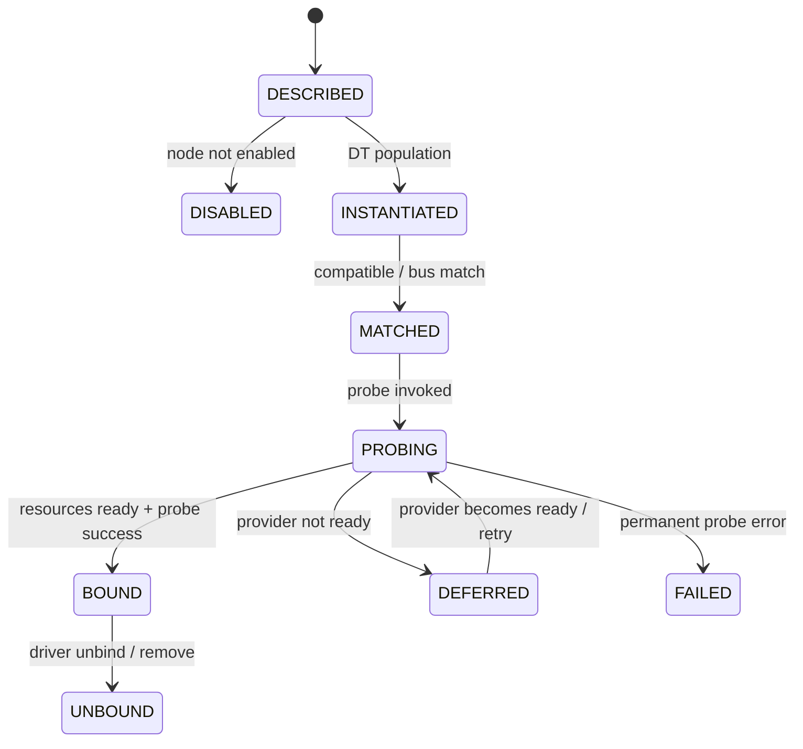

# Chủ đề 2 — Device Tree (DTS/DTB) và phần cứng
> **Phạm vi:** Hardware description, binding, resource graph và driver matching

> Device Tree không phải “file config để bật driver”. Nó là **một cấu trúc dữ liệu mô tả phần cứng** được truyền cho kernel, cho phép kernel hiểu topology và resource của board mà không hard-code toàn bộ board description vào source C. Chương này tập trung vào semantic của Device Tree: node, property, address translation, interrupt topology, phandle, binding và mối quan hệ từ DTS đến driver probe.

> **Điều hướng:** [← Root README](../README.md) · [↑ Back to Track](README.md) · [← Chủ đề 1 — Linux Architecture & Boot Flow](README-01-linux-architecture-boot-flow.md) · [Chủ đề 3 — Kernel, Driver & Isolation →](README-03-kernel-driver-isolation.md)

---

## Mục lục

> Mục lục rút gọn theo **cụm kiến thức**. Các mục đánh số chi tiết vẫn được giữ nguyên trong nội dung.

- **Device Tree model**
  - [1. Vấn đề Device Tree giải quyết](#1-vấn-đề-device-tree-giải-quyết)
  - [3. Device Tree là cây dữ liệu](#3-device-tree-là-cây-dữ-liệu)
  - [4. DTS, DTSI và DTB](#4-dts-dtsi-và-dtb)
- **Identity & addressing**
  - [7. `compatible` và driver matching](#7-compatible-và-driver-matching)
  - [9. `#address-cells`, `#size-cells` và `reg`](#9-address-cells-size-cells-và-reg)
  - [11. Phandle: liên kết giữa các node](#11-phandle-liên-kết-giữa-các-node)
- **Resource graph**
  - [12. Clock, reset, regulator và dependency graph](#12-clock-reset-regulator-và-dependency-graph)
  - [13. GPIO trong Device Tree](#13-gpio-trong-device-tree)
  - [17. Interrupt topology](#17-interrupt-topology)
- **Bindings & runtime probe**
  - [19. Device Tree Binding](#19-device-tree-binding)
  - [23. Driver probe chain](#23-driver-probe-chain)
  - [24. Deferred probe và dependency chưa sẵn sàng](#24-deferred-probe-và-dependency-chưa-sẵn-sàng)
- **Debug & design rules**
  - [27. Device không probe](#27-device-không-probe)
  - [30. Cách reasoning một node Device Tree](#30-cách-reasoning-một-node-device-tree)
  - [32. Các nguyên tắc cốt lõi](#32-các-nguyên-tắc-cốt-lõi)
- **Tra cứu**
  - [Tài liệu tham khảo](#tài-liệu-tham-khảo)

---

## 1. Vấn đề Device Tree giải quyết

Một SoC có thể được dùng trên nhiều board. Cùng một kernel driver cho UART/I2C/SPI controller có thể dùng lại, nhưng:

- base address có thể thuộc SoC family;
- interrupt line khác platform;
- pinmux khác board;
- sensor gắn trên I2C bus khác;
- regulator/clock khác;
- GPIO reset/enable khác.

Nếu toàn bộ board topology được hard-code vào driver C, code driver và board wiring bị coupling mạnh.

Device Tree tách:

```text
Driver behavior               Board/SoC description
-----------------             ----------------------
How device works              What device exists
How to program registers      Where registers are
How to handle IRQ             Which IRQ it uses
How to transfer data          Which clock/reset/GPIO supplies it
         |                                |
         +---------------+----------------+
                         |
                         v
                    Linux device
```

---

## 2. Hardware discovery: self-describing và non-self-describing

Một số bus có khả năng enumeration: USB hoặc PCI cho phép phần mềm discover device và identity khi runtime.

Nhiều embedded peripheral không có khả năng đó. Một I2C temperature sensor ở address `0x48` không tự nói với kernel: “tôi là model X, IRQ nối vào GPIO Y, nguồn cấp từ regulator Z”.

Device Tree cung cấp **out-of-band hardware description** cho những resource như vậy.

---

## 3. Device Tree là cây dữ liệu

DT có một root node và các child node mô tả hierarchy phần cứng.

```text
/
├── cpus
│   ├── cpu@0
│   └── cpu@1
├── memory@...
└── soc
    ├── interrupt-controller@...
    ├── gpio@...
    ├── serial@...
    ├── i2c@...
    │   └── sensor@48
    └── spi@...
        └── flash@0
```

Hierarchy không chỉ để đẹp. Parent node thường định nghĩa **addressing domain, bus semantics hoặc resource provider** cho child.

---

## 4. DTS, DTSI và DTB

- **DTS**: Device Tree Source, mô tả source-readable cho một board/tree.
- **DTSI**: include fragment thường dùng để chia sẻ SoC/package/common board description.
- **DTB**: Device Tree Blob, binary representation kernel/firmware đọc khi boot.

Pipeline:

```text
SoC .dtsi ----+
              |
Board .dtsi --+--> preprocessing/include --> DTC --> board.dtb
              |
Board .dts ---+
```

DTS/DTSI là source organization; kernel cuối cùng nhận một **flattened device tree blob**.

---

## 5. Node name và unit-address

DTS syntax khái niệm:

```text
node-name@unit-address {
    property = <value>;
};
```

`unit-address` thường phản ánh address trong address space của parent bus khi node có `reg`.

Ví dụ logic:

```text
i2c@40005400 {
    sensor@48 {
        reg = <0x48>;
    };
};
```

Ở đây `0x40005400` có thể là memory-mapped address của I2C controller; `0x48` là bus address của sensor. Hai `reg` cùng dùng từ “address” nhưng thuộc **hai address domain khác nhau**.

---

## 6. Property và kiểu dữ liệu

Property có thể biểu diễn:

- empty/boolean property;
- string;
- string list;
- cell array (32-bit cells trong encoding cơ bản);
- byte array;
- phandle reference.

Semantic không đến từ cú pháp riêng lẻ mà từ **Devicetree Specification + binding của node**.

Một property chỉ có nghĩa khi consumer biết contract của nó.

---

## 7. `compatible` và driver matching

`compatible` mô tả programming model/identity tương thích của device.

Ví dụ khái niệm:

```text
compatible = "vendor,specific-chip", "vendor,family-compatible";
```

Danh sách từ specific đến fallback cho phép driver match implementation phù hợp.

Driver thường có match table logic:

```text
DT compatible
      |
      v
of_match_table
      |
   match?
   /    \
 yes    no
  |      |
probe   unbound
```

`compatible` không phải tên file driver. Nó là **stable hardware-software binding identifier**.

---

## 8. `status` và sự tồn tại logic của device

Một node có thể tồn tại trong SoC-level `.dtsi` nhưng bị disable mặc định. Board `.dts` bật controller mà phần cứng thực sự sử dụng.

Điều này phản ánh separation:

```text
SoC capability: controller exists in silicon
Board reality : controller wired/usable here?
```

Vì vậy một node tồn tại trong source chưa đồng nghĩa kernel sẽ instantiate/probe nó.

---

## 9. `#address-cells`, `#size-cells` và `reg`

Parent node định nghĩa số cell child dùng để encode address và size.

Khái niệm:

```text
parent {
    #address-cells = <A>;
    #size-cells = <S>;

    child@... {
        reg = <A cells address, S cells size>;
    };
};
```

Điểm rất dễ nhầm: **format của `reg` do parent quyết định**, không phải child tự quyết định.

Nếu parent có:

```text
#address-cells = <1>;
#size-cells = <1>;
```

thì mỗi region thường có hai cell: address + size. Với 64-bit address, có thể cần hai address cells.

---

## 10. Address translation và `ranges`

Bus child có thể có address space riêng. `ranges` mô tả mapping từ child-bus address sang parent-bus address.

```text
Child address space
      |
      | ranges
      v
Parent address space
      |
      v
CPU physical address
```

Do đó đọc một `reg` phải hỏi:

1. node thuộc parent nào?
2. parent dùng bao nhiêu address/size cells?
3. có `ranges` translation không?
4. cuối cùng resource physical là gì?

---

## 11. Phandle: liên kết giữa các node

Tree hierarchy không biểu diễn được mọi quan hệ. Một device có thể phụ thuộc clock provider ở nhánh khác, regulator ở nhánh khác và interrupt controller ở nhánh khác.

Phandle tạo **edge ngoài quan hệ parent-child**.

```text
             +-------------+
             | sensor node |
             +------+------+ 
                    |
         +----------+-----------+
         |          |           |
         v          v           v
      GPIO       regulator    interrupt
     provider      provider    controller
```

Trong DTS, label như `&gpio1` là source-level reference; compiler giải quyết thành phandle/path representation trong DTB.

---

## 12. Clock, reset, regulator và dependency graph

Một driver không chỉ cần base address. Nhiều device phải có:

- clock enabled/rate;
- reset deasserted;
- power domain active;
- regulator available;
- GPIO enable/reset đúng state.

Do đó Device Tree thực tế tạo một **resource dependency graph**.

```text
                  +----------+
                  |  device  |
                  +----+-----+
                       |
        +--------------+---------------+
        |              |               |
        v              v               v
      clock          reset          regulator
        |                              |
        v                              v
 clock controller                 PMIC/regulator
```

Một dependency provider chưa probe có thể làm consumer trì hoãn probe.

---

## 13. GPIO trong Device Tree

GPIO reference thường gồm:

- phandle tới GPIO controller;
- line/index;
- flags như active-high/active-low, tùy binding.

Bản chất semantic quan trọng là **logical polarity**. Driver nên làm việc với ý nghĩa logical “assert/deassert”, còn GPIO binding mô tả mức điện nào tương ứng.

Điều này tránh hard-code active-low logic vào driver business code.

---

### 13.1 LED và Button như hai semantic khác nhau trên cùng GPIO subsystem

LED và button đều có thể nối GPIO nhưng software semantics đối lập:

```text
GPIO output line ----------------> LED
      |
      +-- logical active state quyết định ON/OFF

Button -------------------------> GPIO input line
      |
      +-- level/edge + debounce + optional IRQ
```

Device Tree nên mô tả wiring/polarity và binding của class device tương ứng. Application không nên phải biết rằng một LED "active" thực tế cần kéo pin xuống thấp; polarity property cho phép driver/subsystem chuyển physical level thành logical state.

Với button, nếu dùng interrupt thì DT description còn nối input device tới GPIO/interrupt controller. Vì vậy một button tưởng đơn giản đã minh họa được ba ý: **GPIO ownership, polarity và interrupt topology**.

## 14. I2C device

I2C controller là bus node; I2C peripheral thường là child của bus đó.

```text
I2C controller
     |
     +-- address 0x48 --> sensor A
     |
     +-- address 0x50 --> EEPROM
```

`reg` của child I2C thường biểu diễn slave address theo binding của bus, không phải CPU physical address.

Các resource bổ sung có thể gồm IRQ GPIO, regulator, reset line hoặc clock.

---

## 15. SPI device

SPI peripheral thường child của SPI controller và `reg` thường mang chip-select index theo bus binding.

```text
SPI controller
    |
    +-- CS0 --> flash
    +-- CS1 --> ADC
```

Ngoài identity, binding có thể mô tả max frequency, SPI mode-related property và GPIO chip-select tùy controller/binding.

Điểm quan trọng: DTS mô tả **wiring/configuration contract**, không chứa thuật toán transaction của driver.

---

## 16. UART

UART controller thường là memory-mapped SoC device. DT có thể mô tả:

- register region;
- interrupt;
- clocks;
- pinctrl;
- DMA channels;
- status.

Console UART còn liên quan bootargs/chosen node tùy platform.

Một UART có register đúng nhưng pinmux sai vẫn có thể probe thành công mà external pin không hoạt động đúng. Đây là ví dụ điển hình cho việc “driver probe success” chưa đủ chứng minh toàn bộ hardware path đúng.

---

## 17. Interrupt topology

Interrupt không phải luôn chỉ là một số IRQ phẳng. Device Tree mô tả interrupt domain và parent relationship.

```text
Device IRQ
    |
    v
GPIO interrupt controller (optional)
    |
    v
SoC interrupt controller
    |
    v
CPU exception/IRQ interface
```

Các property như `interrupt-parent`, `interrupts`, `interrupts-extended`, `#interrupt-cells` có semantic do interrupt-controller binding quyết định.

Sai interrupt specifier có thể dẫn đến:

- probe fail;
- IRQ request fail;
- driver probe thành công nhưng không bao giờ nhận interrupt;
- nhận nhầm line/trigger semantics.

---

## 18. Pin control / pinmux

Một physical pin có thể phục vụ nhiều alternate function. Pinctrl subsystem và DT mô tả group/config state như default/sleep tùy SoC binding.

```text
Physical pin
   |
   +--> GPIO
   +--> UART TX
   +--> SPI CLK
   +--> alternate function ...
```

Driver controller có thể đúng hoàn toàn nhưng signal không ra pin nếu mux chưa chọn đúng function.

Pin configuration còn có thể bao gồm pull-up/down, drive strength, slew rate tùy hardware.

---

## 19. Device Tree Binding

Binding là contract định nghĩa một loại node/property hợp lệ và semantic của chúng.

Một binding trả lời:

- `compatible` nào hợp lệ;
- property nào required/optional;
- property có kiểu gì;
- số cell/specifier format;
- dependency relationship;
- constraints.

Linux kernel hiện sử dụng schema-based bindings cho nhiều device, giúp validation tự động phát hiện nhiều lỗi source trước runtime.

Điểm kiến trúc quan trọng:

```text
DTS syntax valid  !=  Binding semantically valid
```

Một file có thể compile thành DTB nhưng vẫn mô tả phần cứng sai.

---

## 20. Từ DTS đến DTB

Pipeline khái niệm:

```text
DTS/DTSI source
      |
      | cpp/includes (tùy build system)
      v
Device Tree Compiler (dtc)
      |
      +--> syntax/structural checks
      v
Flattened Device Tree Blob (.dtb)
      |
      v
Bootloader loads/passes DTB
      |
      v
Kernel parses/unflattens tree
```

Schema validation có thể nằm trong build/CI flow để kiểm tra binding ngoài việc chỉ compile bằng `dtc`.

---

## 21. Bootloader và Device Tree

Bootloader có thể:

- load DTB từ storage;
- chọn DTB theo board variant;
- modify chosen/memory/reserved-memory hoặc runtime data;
- apply overlay tùy platform;
- pass address DTB cho kernel.

Vì vậy DTB kernel nhận không nhất thiết byte-for-byte giống source artifact lưu trên disk nếu bootloader có fixup.

Đây là lý do khi debug cần phân biệt:

```text
Source DTS -> Built DTB -> Loaded DTB -> Runtime tree seen by kernel
```

---

## 22. Kernel unflatten và platform device creation

Kernel nhận flattened tree, parse các node cơ bản, rồi tạo internal representation. Các bus/framework dùng tree để tạo device object tương ứng.

Ở mức conceptual:

```text
DTB
 |
 v
OF / device-tree core
 |
 v
struct device_node hierarchy
 |
 v
bus/platform population
 |
 v
struct device / platform_device
 |
 v
driver matching
```

Device Tree không “gọi driver” trực tiếp. Nó cung cấp dữ liệu để Linux device model tạo và match device.

---

## 23. Driver probe chain



Probe thành công thường cần nhiều điều kiện cùng đúng:

```text
Node enabled?
   |
   yes
   v
Device instantiated?
   |
   yes
   v
compatible matches driver?
   |
   yes
   v
required resources resolve?
   |
   +--> reg
   +--> irq
   +--> clock
   +--> reset
   +--> regulator
   +--> gpio/pinctrl
   |
   v
probe() returns success
```

Một device node đúng về syntax nhưng thiếu resource required bởi binding/driver sẽ fail ở resource acquisition/probe.

---

## 24. Deferred probe và dependency chưa sẵn sàng

Linux có tình huống consumer driver được thử probe trước provider cần thiết. Thay vì coi là failure vĩnh viễn, probe có thể bị defer.

```text
consumer probe
    |
    +--> clock provider ready? -- no --> defer
    |
 later provider probes
    |
 retry consumer
    v
 success
```

Deferred probe là consequence tự nhiên của dependency graph và init ordering. Vì vậy một log probe fail sớm cần được phân biệt với permanent failure.

---

## 25. Lỗi `reg` và address

Các lỗi phổ biến ở tầng lý thuyết:

- hiểu sai address domain;
- sai `#address-cells/#size-cells`;
- unit-address không tương ứng `reg`;
- thiếu/nhầm `ranges` translation;
- dùng address 7-bit/10-bit I2C sai semantics;
- overlap region;
- base address đúng SoC khác nhưng sai SoC revision.

Symptom có thể từ probe fail đến bus fault khi driver access register.

---

## 26. Lỗi interrupt

Các nguồn lỗi:

- sai interrupt controller;
- sai interrupt specifier width;
- sai IRQ line;
- sai trigger/polarity;
- signal thực tế đi qua GPIO interrupt domain nhưng DT mô tả trực tiếp GIC/NVIC-equivalent domain;
- pinmux/GPIO chưa đúng.

Một dấu hiệu đặc trưng là device probe thành công nhưng operation đợi completion/IRQ bị timeout.

---

## 27. Device không probe

Cần tách các lớp:

```text
DT node absent
   |
DT node disabled
   |
DTB loaded wrong
   |
device not instantiated
   |
no compatible driver
   |
driver module absent
   |
resource dependency fail/defer
   |
probe() internal error
```

“Không thấy device” không phải một nguyên nhân; nó là symptom ở cuối nhiều chain khác nhau.

---

## 28. Overlay

Device Tree Overlay cho phép sửa/ghép thêm một phần tree vào live/base tree tùy platform.

Use case khái niệm:

- cape/HAT/mezzanine;
- optional hardware module;
- board variant;
- FPGA-created devices.

Nhưng overlay làm tăng complexity lifecycle: device có thể xuất hiện/biến mất runtime, reference và driver teardown phải đúng. Overlay không nên là cách che giấu việc base DTS tổ chức kém.

---

## 29. Device Tree không nên chứa gì?

Device Tree nên mô tả **hardware**, không phải product application policy tùy tiện.

Không nên biến DT thành database cho mọi configuration ứng dụng vì:

- DT được kernel/firmware consume với lifecycle riêng;
- update config ứng dụng trở nên gắn với boot artifact;
- binding mất tính hardware-centric;
- portability giảm.

Một câu hỏi tốt: “Property này mô tả đặc tính/wiring của hardware mà OS cần biết, hay chỉ là policy của application?”

---

## 30. Cách reasoning một node Device Tree

Với bất kỳ node nào, đọc theo 7 câu hỏi:

1. Node nằm dưới bus/provider nào?
2. `compatible` mô tả device nào?
3. `status` cho phép instantiate không?
4. `reg` được encode theo parent nào?
5. IRQ đi qua interrupt domain nào?
6. Clock/reset/regulator/GPIO/pinctrl dependency nào tồn tại?
7. Binding yêu cầu property gì?

Đây là cách biến DTS từ “syntax khó nhớ” thành một resource graph có logic.

---

## 31. Mô hình tổng hợp

```text
                    DTS / DTSI
                        |
                        v
                  +-----------+
                  |    DTC    |
                  +-----+-----+
                        |
                       DTB
                        |
                        v
                  Bootloader
                        |
                        v
                 Linux OF core
                        |
            +-----------+-----------+
            |                       |
            v                       v
       Device objects          Resource graph
            |              clk/reset/gpio/irq/...
            +-----------+-----------+
                        |
                        v
                  Driver match
                        |
                        v
                      probe
                        |
                        v
              Linux subsystem API
                        |
                        v
                    Userspace
```

---

## 32. Các nguyên tắc cốt lõi

1. **Device Tree mô tả phần cứng; driver mô tả hành vi phần mềm của device.**
2. **`reg` chỉ có nghĩa khi biết address domain của parent.**
3. **Phandle biến tree thành resource graph.**
4. **`compatible` là binding identity, không phải tên driver file.**
5. **Compile được DTB chưa chứng minh DT đúng semantic.**
6. **Probe success phụ thuộc cả matching và resource dependency.**
7. **Debug Device Tree phải xác nhận runtime tree kernel thực sự nhận.**
8. **GPIO, IRQ, pinctrl, clock, reset và regulator thường là phần của cùng một causal chain.**

---

## Tài liệu tham khảo

- [Devicetree Specification — latest](https://devicetree-specification.readthedocs.io/en/latest/)
- [Devicetree Specification — source language](https://devicetree-specification.readthedocs.io/en/latest/chapter6-source-language.html)
- [Linux Kernel Documentation — Linux and the Devicetree](https://docs.kernel.org/devicetree/usage-model.html)
- [Linux Kernel Documentation — Devicetree Kernel API](https://docs.kernel.org/devicetree/kernel-api.html)
- [Linux Kernel Documentation — DTS coding style](https://docs.kernel.org/devicetree/bindings/dts-coding-style.html)
- [Linux Kernel Documentation — Writing Devicetree Bindings](https://docs.kernel.org/devicetree/bindings/writing-bindings.html)
- [Linux Kernel Documentation — Devicetree Overlay Notes](https://docs.kernel.org/devicetree/overlay-notes.html)

---

> **Điều hướng:** [← Root README](../README.md) · [↑ Back to Track](README.md) · [← Chủ đề 1 — Linux Architecture & Boot Flow](README-01-linux-architecture-boot-flow.md) · [Chủ đề 3 — Kernel, Driver & Isolation →](README-03-kernel-driver-isolation.md)
