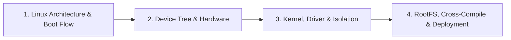

# 03 — Linux Basic

> **Phạm vi:** Kiến trúc Embedded Linux từ boot chain và Device Tree đến kernel/driver, RootFS, cross-compile và reliable deployment.

[← Root README](../README.md)

## Nội dung

| # | Chương | Trọng tâm |
|---:|---|---|
| 1 | [Chủ đề 1 — Linux Architecture & Boot Flow](README-01-linux-architecture-boot-flow.md) | SoC architecture, boot stages, handoff contracts, boot log và recovery. |
| 2 | [Chủ đề 2 — Device Tree & Hardware](README-02-device-tree-hardware.md) | DTS/DTB, bindings, resource graph, bus resources và driver probe. |
| 3 | [Chủ đề 3 — Kernel, Driver & Isolation](README-03-kernel-driver-isolation.md) | Kernel/user boundary, Linux device model, sysfs/devfs, contexts và fault boundaries. |
| 4 | [Chủ đề 4 — RootFS, Cross-Compile & Deployment](README-04-rootfs-cross-compile-deployment.md) | RootFS, ABI/sysroot, toolchain, Buildroot/Yocto, A/B update và rollback. |

## Lộ trình đọc

## Cách sử dụng bộ tài liệu

Các chapter được viết như tài liệu lý thuyết độc lập nhưng có thứ tự học khuyến nghị như sơ đồ trên. Mỗi chapter có mục lục rút gọn, liên kết Previous/Next/Back to Track, sơ đồ ASCII và Mermaid ở những phần phù hợp với semantic của nội dung.

---

[← Root README](../README.md)
