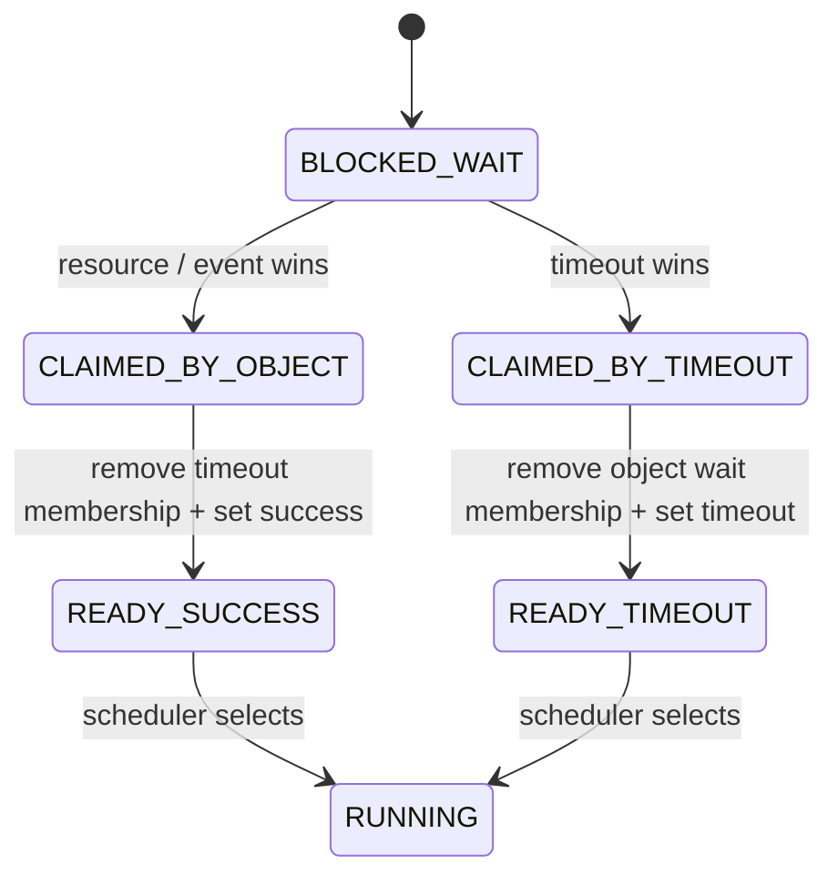

# Chủ đề 4 — Task State và Synchronization
## Blocking, Timeout, Semaphore, Mutex, Priority Inversion và Wake-up Races

> Tài liệu này đi sâu vào state machine của task và các cơ chế synchronization trong RTOS. Trọng tâm là hiểu một task thực sự “block” như thế nào, timeout được biểu diễn ra sao, vì sao wake-up là một transaction cạnh tranh giữa nhiều nguồn, và mutex khác semaphore ở ownership/priority semantics như thế nào.

---

## Mục lục

- [Sơ đồ tổng quan](#sơ-đồ-tổng-quan)
- [1. Task state là gì?](#1-task-state-là-gì)
- [2. READY và RUNNING](#2-ready-và-running)
- [3. BLOCKED](#3-blocked)
- [4. SUSPENDED](#4-suspended)
- [5. State transition là atomic kernel transaction](#5-state-transition-là-atomic-kernel-transaction)
- [6. Busy-wait và blocking](#6-busy-wait-và-blocking)
- [7. Delay](#7-delay)
- [8. Delayed task list](#8-delayed-task-list)
- [9. Tick wrap-around](#9-tick-wrap-around)
- [10. Timeout model](#10-timeout-model)
- [11. Hai nguồn wake cho finite wait](#11-hai-nguồn-wake-cho-finite-wait)
- [12. Single-winner wake-up rule](#12-single-winner-wake-up-rule)
- [13. Wake reason](#13-wake-reason)
- [14. Synchronization là gì?](#14-synchronization-là-gì)
- [15. Race condition](#15-race-condition)
- [16. Atomicity và critical section](#16-atomicity-và-critical-section)
- [17. Semaphore](#17-semaphore)
- [18. Direct handoff trong semaphore](#18-direct-handoff-trong-semaphore)
- [19. Mutex](#19-mutex)
- [20. Semaphore và mutex khác nhau bản chất](#20-semaphore-và-mutex-khác-nhau-bản-chất)
- [21. Recursive mutex](#21-recursive-mutex)
- [22. Waiter ordering](#22-waiter-ordering)
- [23. Priority inversion](#23-priority-inversion)
- [24. Priority inheritance](#24-priority-inheritance)
- [25. Base priority và effective priority](#25-base-priority-và-effective-priority)
- [26. Transitive priority inheritance](#26-transitive-priority-inheritance)
- [27. Priority ceiling](#27-priority-ceiling)
- [28. Deadlock](#28-deadlock)
- [29. Lock ordering](#29-lock-ordering)
- [30. Starvation và fairness](#30-starvation-và-fairness)
- [31. ISR-safe synchronization](#31-isr-safe-synchronization)
- [32. Wake high-priority task từ ISR](#32-wake-high-priority-task-từ-isr)
- [33. Suspend/resume](#33-suspendresume)
- [34. Kernel invariant cho blocking](#34-kernel-invariant-cho-blocking)
- [35. Semaphore invariant](#35-semaphore-invariant)
- [36. Mutex invariant](#36-mutex-invariant)
- [37. Timeout và object deletion](#37-timeout-và-object-deletion)
- [38. Lost wake-up](#38-lost-wake-up)
- [39. Spurious wake-up](#39-spurious-wake-up)
- [40. Thundering herd](#40-thundering-herd)
- [41. Blocking time và schedulability](#41-blocking-time-và-schedulability)
- [42. Các nguyên tắc cốt lõi](#42-các-nguyên-tắc-cốt-lõi)
- [Tài liệu tham khảo chuyên sâu](#tài-liệu-tham-khảo-chuyên-sâu)

---

## Sơ đồ tổng quan

Task-state machine cơ bản:

```text
                     preempt/yield
                +---------------------+
                |                     v
           +----+----+           +----+----+
           | RUNNING |<----------|  READY  |
           +----+----+ dispatch  +----+----+
                |                     ^
     wait/delay |                     | wake/timeout
                v                     |
           +----+---------------------+----+
           |          BLOCKED              |
           +-------------------------------+

SUSPENDED is controlled explicitly and is normally outside ordinary
resource-wait readiness until a resume operation restores eligibility.
```

Một wait có timeout có hai nguồn đánh thức cạnh tranh:

```text
                 +----------------+
Task blocked --->| wait condition |
                 +--------+-------+
                          |
              +-----------+-----------+
              |                       |
        resource arrives          timeout expires
              |                       |
              +-----------+-----------+
                          |
                 atomic single winner
                          |
                          v
                  READY + wake reason
```

Synchronization đúng phải bảo đảm chỉ một path thắng và cleanup mọi membership còn lại.

---

## 1. Task state là gì?

Task state biểu diễn quan hệ hiện tại giữa task và scheduler/resource system.

Các state cơ bản:

- **READY**: đủ điều kiện chạy nhưng chưa chắc đang dùng CPU;
- **RUNNING**: đang thực thi trên CPU;
- **BLOCKED**: không thể tiếp tục cho tới khi event/resource/timeout xảy ra;
- **SUSPENDED**: bị loại khỏi scheduling bởi control action, không phải đang chờ resource bình thường.

State là một phần của invariant cùng với list membership.

---

## 2. READY và RUNNING

Trong uniprocessor chỉ có tối đa một task RUNNING tại một thời điểm.

READY task nằm trong ready structure. Scheduler chọn một task thành RUNNING theo policy.

Một số kernel representation coi current RUNNING task vẫn nằm trong ready queue; số khác remove nó. Cả hai hợp lệ nếu invariant nhất quán.

---

## 3. BLOCKED

BLOCKED nghĩa là task **không cạnh tranh CPU** vì điều kiện để tiến tiếp chưa thỏa.

Task có thể block vì:

- delay;
- semaphore;
- mutex;
- queue send/receive;
- notification/event;
- I/O completion.

Efficient blocking khác busy-wait ở chỗ task được remove khỏi ready set, để CPU chạy task khác hoặc idle.

---

## 4. SUSPENDED

SUSPENDED thường là administrative state: task bị dừng bởi explicit control, không tự wake vì timeout/resource trừ khi policy định nghĩa.

Điểm quan trọng là suspend không nên bị nhầm với block. BLOCKED có wake condition; SUSPENDED thường cần resume command.

---

## 5. State transition là atomic kernel transaction

READY → BLOCKED thường đụng nhiều structure:

```text
remove ready
set wait reason/object
insert waiter list
insert timeout list nếu finite
set state
request reschedule
```

Nếu chỉ đổi `state = BLOCKED` mà quên ready list, scheduler vẫn có thể chạy task blocked.

Do đó state transition helpers phải là nơi tập trung invariant.

---

## 6. Busy-wait và blocking

### Busy-wait

Task liên tục kiểm tra condition nhưng vẫn READY/RUNNING, tiêu CPU và có thể ngăn task thấp chạy.

### Blocking

Task nhường CPU và chỉ được wake khi condition trở thành true hoặc timeout.

Blocking làm utilization tốt hơn nhưng thêm kernel complexity: wait list, timeout list, wake race và reschedule.

---

## 7. Delay

Delay là block dựa thuần vào thời gian. Task có wake deadline.

### Relative delay

“Ngủ N tick từ bây giờ”. Nếu dùng lặp cho periodic task, execution time của task tích lũy vào phase và gây drift.

### Delay-until

Deadline tiếp theo dựa trên previous release time:

```text
next_release = previous_release + period
```

Cách này giữ phase periodic tốt hơn.

---

## 8. Delayed task list

Một implementation đơn giản giữ task sorted theo wake tick. Tick handler chỉ cần kiểm tra head; mọi task có deadline đã tới được wake.

Insert O(n), expiry head O(1) cho mỗi task.

Alternative: timing wheel/delta list tùy scale.

---

## 9. Tick wrap-around

Tick counter unsigned hữu hạn sẽ wrap từ maximum về 0.

So sánh deadline phải dựa modular arithmetic và giới hạn maximum finite timeout nhỏ hơn nửa range để thứ tự tương đối không mơ hồ.

Ý tưởng phổ biến là diễn giải `(now - deadline)` như signed delta trong range hợp lệ.

---

## 10. Timeout model

Blocking API thường có ba mode:

- **no-wait**: thử ngay, thất bại nếu resource unavailable;
- **finite timeout**: block tối đa T;
- **wait forever**: block cho tới resource/event.

Ba mode có semantics khác nhau về list membership.

Finite wait thường cần task xuất hiện đồng thời ở object wait list và timeout structure.

---

## 11. Hai nguồn wake cho finite wait

Một task chờ semaphore với timeout có thể được wake bởi:

1. semaphore trở nên available;
2. timeout deadline đến.

Hai sự kiện có thể xảy ra rất gần nhau từ các context khác nhau. Đây là **wake-up race**.

---

## 12. Single-winner wake-up rule



Kernel phải đảm bảo chỉ một nguồn “thắng” việc chuyển task từ BLOCKED → READY.

Winner phải:

- remove task khỏi object wait list;
- remove timeout node nếu còn;
- set wait result;
- set READY;
- enqueue ready;
- request reschedule nếu cần.

Loser nhận ra task không còn blocked/owned và không wake lần hai.

Đây là một trong những invariant quan trọng nhất của synchronization kernel.

---

## 13. Wake reason

Task cần biết vì sao API trở về:

- acquired/success;
- timeout;
- cancelled;
- object deleted;
- interrupted (nếu model có).

Wake reason không nên suy đoán từ state global sau khi wake vì resource có thể đã thay đổi tiếp.

---

## 14. Synchronization là gì?

Synchronization điều phối thứ tự execution giữa concurrent contexts để bảo vệ invariant hoặc truyền tín hiệu tiến trình.

Hai nhu cầu khác nhau:

1. **signaling** — báo rằng một event/resource count đã xảy ra;
2. **mutual exclusion** — đảm bảo chỉ owner hợp lệ truy cập critical resource tại một thời điểm.

Semaphore phù hợp signaling/counting; mutex phù hợp mutual exclusion có ownership.

---

## 15. Race condition

Race condition xảy ra khi outcome phụ thuộc timing/interleaving giữa concurrent accesses mà program không kiểm soát đúng.

Ví dụ increment không atomic:

```text
load x
add 1
store x
```

Hai task xen kẽ có thể làm mất update.

Race không được giải quyết chỉ bằng `volatile`.

---

## 16. Atomicity và critical section

Atomicity là property “operation được quan sát như một đơn vị không chia nhỏ” theo concurrency model.

Critical section là mechanism tạm ngăn interleaving để bảo vệ invariant.

Trong RTOS uniprocessor, mechanism có thể là:

- disable/mask interrupt;
- scheduler lock;
- mutex.

Ba cơ chế có phạm vi khác nhau. Scheduler lock không ngăn ISR; interrupt mask làm tăng interrupt latency.

---

## 17. Semaphore

Semaphore là counter synchronization object.

### Counting semaphore

Counter `0..max`. Take giảm count nếu >0, nếu không task có thể block. Give thường tăng count hoặc wake waiter.

### Binary semaphore

Counter giới hạn 0/1, phù hợp event signaling.

Semaphore không nhất thiết có owner: task A có thể take và ISR/task B give theo design.

---

## 18. Direct handoff trong semaphore

Khi waiter tồn tại và give xảy ra, thay vì tăng count rồi để waiter cạnh tranh sau, kernel có thể handoff trực tiếp resource token cho waiter.

Semantics:

```text
if waiters exist:
    wake selected waiter with success
else:
    increment count (bounded by max)
```

Điều này tránh count tạm thời sai và giảm race.

---

## 19. Mutex

Mutex đại diện exclusive ownership.

State tối thiểu:

- owner task;
- locked/unlocked;
- waiters;
- optional recursion count;
- priority inheritance metadata.

Khác semaphore, unlock mutex bởi non-owner thường là lỗi contract.

---

## 20. Semaphore và mutex khác nhau bản chất

| Thuộc tính | Semaphore | Mutex |
|---|---|---|
| Mục đích | signaling/counting | mutual exclusion |
| Owner | thường không | có |
| ISR give | có thể | thường không |
| Priority inheritance | không tự nhiên | thường cần |
| Token count | 0..N | logical lock |

Dùng binary semaphore thay mutex làm mất ownership và PI semantics.

---

## 21. Recursive mutex

Recursive mutex cho owner lock nhiều lần và chỉ release khi recursion count về 0.

Ưu điểm: hỗ trợ call graph lồng nhau.

Nhược điểm: có thể che design coupling và làm lock lifetime khó nhìn. Kernel nhỏ có thể không hỗ trợ để giữ semantics đơn giản.

---

## 22. Waiter ordering

Khi nhiều task chờ một object, wake policy có thể là:

- FIFO;
- highest priority;
- highest priority + FIFO giữa peer.

RTOS fixed-priority thường chọn highest effective priority để giảm inversion/latency.

FIFO cùng priority đảm bảo fairness tương đối.

---

## 23. Priority inversion

Tình huống kinh điển:

- L priority thấp giữ mutex;
- H priority cao cần mutex và block;
- M priority trung bình không cần mutex vẫn preempt L;

H bị gián tiếp trì hoãn bởi M dù H > M. Đây là priority inversion.

---

## 24. Priority inheritance

Khi H block trên mutex do L giữ, L tạm được nâng effective priority lên mức đủ cao để chạy và release mutex sớm.

Sau unlock, priority của L được tính lại từ:

- base priority;
- các mutex khác L vẫn giữ;
- priority của waiter trên các mutex đó.

Không thể luôn “restore thẳng về base” nếu task giữ nhiều mutex.

---

## 25. Base priority và effective priority

- base = cấu hình gốc;
- effective = priority scheduler dùng hiện tại.

Ready queue membership phải phản ánh **effective priority**. Nếu task READY được boost nhưng không chuyển sang ready queue mới, scheduler semantics sai.

---

## 26. Transitive priority inheritance

Nếu H chờ mutex A do M giữ, còn M lại chờ mutex B do L giữ, priority boost có thể truyền H → M → L.

Full transitive PI phức tạp vì cần theo dõi dependency graph. Kernel nhỏ có thể giới hạn nested mutex hoặc document policy.

---

## 27. Priority ceiling

Alternative protocol là priority ceiling: mutex có ceiling priority; task lock mutex được boost theo rule xác định. Protocol này có thể bound blocking tốt và tránh một số deadlock, nhưng cần cấu hình/resource analysis trước.

---

## 28. Deadlock

Deadlock xảy ra khi một tập task chờ tài nguyên theo cycle:

```text
T1 holds A, waits B
T2 holds B, waits A
```

Bốn điều kiện Coffman kinh điển gồm mutual exclusion, hold-and-wait, no preemption và circular wait.

Phá một điều kiện có thể ngăn deadlock.

---

## 29. Lock ordering

Một kỹ thuật đơn giản là áp thứ tự toàn cục cho mutex: task chỉ acquire theo thứ tự tăng. Khi mọi code tuân, circular wait bị loại bỏ.

Lock ordering phải là architectural contract, không chỉ convention miệng.

---

## 30. Starvation và fairness

Starvation khác deadlock: hệ thống vẫn progress nhưng một task có thể chờ vô hạn vì policy luôn ưu tiên task khác.

Highest-priority waiter policy có thể starve low-priority waiter nếu high-priority arrivals liên tục.

Realtime system đôi khi chấp nhận điều này nếu requirement ưu tiên cao thực sự cần; nếu không phải có fairness mechanism.

---

## 31. ISR-safe synchronization

ISR không thể block vì không có thread continuation giống task.

API ISR-safe phải:

- no-wait;
- bounded;
- không dùng mutex blocking;
- chỉ thao tác kernel state trong critical section phù hợp;
- có thể request deferred reschedule.

Binary/counting semaphore give-from-ISR là pattern phổ biến.

---

## 32. Wake high-priority task từ ISR

Khi ISR give semaphore làm H READY và H có priority cao hơn current task:

1. ISR update object/task state;
2. scheduler nhận biết preemption needed;
3. PendSV được set;
4. ISR kết thúc;
5. PendSV switch sang H.

Không cần context switch giữa ISR logic.

---

## 33. Suspend/resume

Suspend là control operation khác wait. Một policy cần trả lời task đang BLOCKED mà bị suspend thì sao.

Hai lựa chọn điển hình:

- reject suspend nếu blocked;
- cancel current wait rồi chuyển suspended.

Nếu cho phép “suspended but still on wait list”, semantics wake trở nên rất phức tạp.

---

## 34. Kernel invariant cho blocking

1. BLOCKED task không nằm ready list.
2. Finite waiter có đúng một wait node và một timeout node.
3. Wait-forever waiter không cần timeout membership.
4. Wake winner remove mọi membership còn lại.
5. READY task không còn wait object active.
6. Wait result được set trước khi task có thể chạy lại.
7. State/list changes atomic với concurrent ISR/kernel paths.

---

## 35. Semaphore invariant

- `0 <= count <= max`;
- nếu direct-handoff policy và waiter tồn tại, give không nhất thiết tăng count;
- waiter list chỉ chứa task blocked trên đúng object;
- một successful take tiêu đúng một token.

---

## 36. Mutex invariant

- unlocked → owner = none;
- locked → owner là task hợp lệ;
- non-owner không unlock;
- waiter ordering đúng policy;
- effective priority của owner phản ánh PI obligations;
- khi owner release, ownership transfer/wake diễn ra atomic.

---

## 37. Timeout và object deletion

Nếu synchronization object có thể delete khi task đang chờ, kernel cần wake reason `OBJECT_DELETED` hoặc cấm delete khi waiters tồn tại.

Object lifetime phải dài hơn mọi waiter reference nếu không có explicit cancellation protocol.

---

## 38. Lost wake-up

Lost wake-up xảy ra khi event signaling xảy ra giữa “check condition” và “thực sự đăng ký waiter”, khiến task ngủ dù condition đã xảy ra.

Blocking operation phải atomically:

```text
check resource
+ register waiter if unavailable
+ release kernel lock
```

Không được có cửa sổ race giữa check và enqueue.

---

## 39. Spurious wake-up

Một số synchronization models cho phép task wake mà condition chưa chắc đúng, buộc caller re-check predicate. Kernel nhỏ có thể thiết kế semantics không spurious để API dễ dùng hơn, nhưng internal wake/cancel/timeout vẫn cần result rõ.

---

## 40. Thundering herd

Nếu broadcast wake hàng loạt tasks chờ cùng condition nhưng chỉ một task có thể acquire resource, nhiều task chạy rồi block lại, gây overhead.

Wake-one hoặc direct handoff thường tốt hơn cho mutex/semaphore resource đơn.

---

## 41. Blocking time và schedulability

High-priority task có thể bị block bởi lower-priority task giữ resource. Realtime analysis cần bound maximum blocking time, không chỉ WCET của task.

Mutex protocol là một phần của schedulability, không chỉ correctness mutual exclusion.

---

## 42. Các nguyên tắc cốt lõi

1. Task state phải luôn đi cùng list membership đúng.
2. Efficient blocking remove task khỏi ready set thay vì busy-wait.
3. Finite wait tạo hai potential wake sources: resource và timeout.
4. Single-winner rule ngăn double wake và list corruption.
5. Blocking check + waiter registration phải atomic để tránh lost wake-up.
6. Semaphore là signaling/counting object; mutex là ownership object.
7. Binary semaphore không thay thế đầy đủ mutex.
8. Mutex cần owner và thường cần priority-inversion protocol.
9. Effective priority có thể khác base priority và ảnh hưởng ready queue placement.
10. Priority inheritance phải được tính lại khi task giữ nhiều mutex.
11. ISR không được block; wake từ ISR nên defer context switch qua PendSV.
12. Deadlock, starvation và priority inversion là ba failure mode khác nhau.
13. Timeout, cancel, suspend và object deletion phải có wake semantics rõ.
14. Synchronization correctness là bài toán state machine + ownership + atomic transition, không chỉ một counter/flag.

---

## Tài liệu tham khảo chuyên sâu

- [FreeRTOS Documentation — Mutexes](https://freertos.org/Documentation/02-Kernel/02-Kernel-features/02-Queues-mutexes-and-semaphores/04-Mutexes)
- [FreeRTOS Documentation — Binary Semaphores](https://www.freertos.org/Documentation/02-Kernel/02-Kernel-features/02-Queues-mutexes-and-semaphores/02-Binary-semaphores)
- [Zephyr Documentation — Threads](https://docs.zephyrproject.org/latest/kernel/services/threads/index.html)
- [Zephyr Documentation — Synchronization](https://docs.zephyrproject.org/latest/kernel/services/synchronization/index.html)
