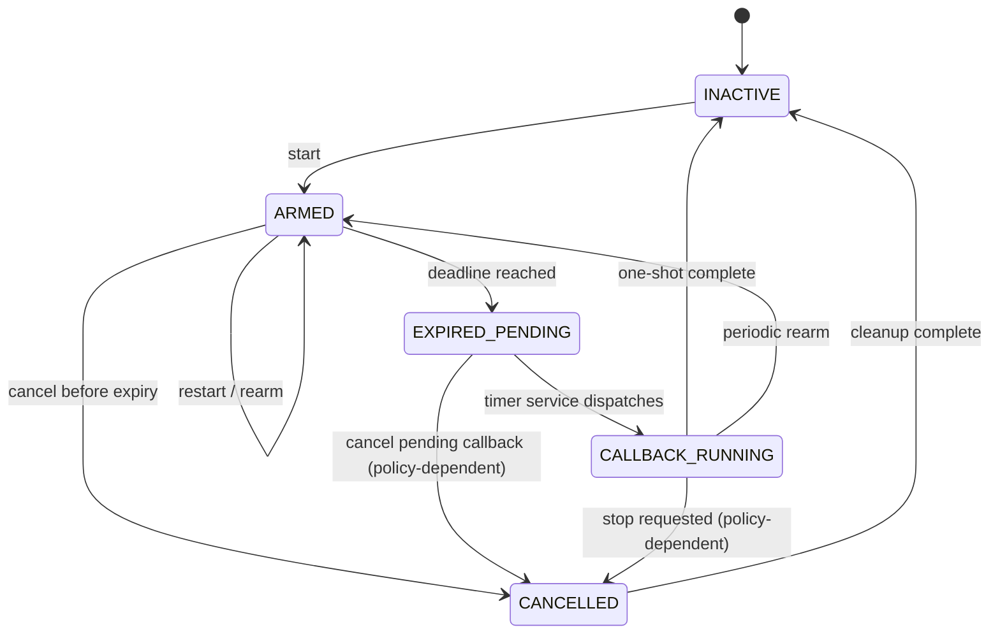

# Chủ đề 5 — Communication, Software Timer và Benchmark
## Message Passing, Queue Semantics, Timer Service và Kernel Performance

> Tài liệu này trình bày ba mảng cuối của một RTOS nhỏ: communication giữa task, software timer và phương pháp đo performance kernel. Trọng tâm là ownership/lifetime của message, blocking queue semantics, timer race/drift, và cách định nghĩa benchmark sao cho số đo có ý nghĩa kỹ thuật.

---

## Mục lục

- [Sơ đồ tổng quan](#sơ-đồ-tổng-quan)
- [1. Communication trong RTOS](#1-communication-trong-rtos)
- [2. Shared memory](#2-shared-memory)
- [3. Message passing](#3-message-passing)
- [4. Queue](#4-queue)
- [5. Mailbox](#5-mailbox)
- [6. Direct task notification](#6-direct-task-notification)
- [7. Event flags](#7-event-flags)
- [8. Message là event hay data?](#8-message-là-event-hay-data)
- [9. Message ownership](#9-message-ownership)
- [10. Copy-by-value](#10-copy-by-value)
- [11. Pointer message](#11-pointer-message)
- [12. Zero-copy](#12-zero-copy)
- [13. Ring buffer](#13-ring-buffer)
- [14. Queue send](#14-queue-send)
- [15. Queue receive](#15-queue-receive)
- [16. Blocking sender](#16-blocking-sender)
- [17. Blocking receiver](#17-blocking-receiver)
- [18. Queue waiter ordering](#18-queue-waiter-ordering)
- [19. Queue from ISR](#19-queue-from-isr)
- [20. Message pool](#20-message-pool)
- [21. Software timer là gì?](#21-software-timer-là-gì)
- [22. Software timer và task delay](#22-software-timer-và-task-delay)
- [23. One-shot và periodic timer](#23-one-shot-và-periodic-timer)
- [24. Timer state machine](#24-timer-state-machine)
- [25. Expiry time và wrap-around](#25-expiry-time-và-wrap-around)
- [26. Sorted timer list](#26-sorted-timer-list)
- [27. Delta timer list](#27-delta-timer-list)
- [28. Timing wheel](#28-timing-wheel)
- [29. Timer service task](#29-timer-service-task)
- [30. Timer command queue](#30-timer-command-queue)
- [31. Callback contract](#31-callback-contract)
- [32. Timer cancel race](#32-timer-cancel-race)
- [33. Periodic timer drift](#33-periodic-timer-drift)
- [34. Timer overrun](#34-timer-overrun)
- [35. Benchmark là gì?](#35-benchmark-là-gì)
- [36. Benchmark khác profiling](#36-benchmark-khác-profiling)
- [37. Context-switch latency](#37-context-switch-latency)
- [38. Event/message latency](#38-eventmessage-latency)
- [39. Interrupt-to-task latency](#39-interrupt-to-task-latency)
- [40. Timer expiry latency](#40-timer-expiry-latency)
- [41. Queue throughput](#41-queue-throughput)
- [42. Jitter](#42-jitter)
- [43. Percentile](#43-percentile)
- [44. Maximum observed và WCET](#44-maximum-observed-và-wcet)
- [45. Timestamp backend](#45-timestamp-backend)
- [46. DWT cycle counter trên Cortex-M3](#46-dwt-cycle-counter-trên-cortex-m3)
- [47. Timestamp overhead](#47-timestamp-overhead)
- [48. Observer effect](#48-observer-effect)
- [49. Interrupt masking trong benchmark](#49-interrupt-masking-trong-benchmark)
- [50. Warm-up và cache note trên Cortex-M3](#50-warm-up-và-cache-note-trên-cortex-m3)
- [51. Reproducibility](#51-reproducibility)
- [52. Histogram và tail analysis](#52-histogram-và-tail-analysis)
- [53. Trace buffer](#53-trace-buffer)
- [54. Benchmark workload design](#54-benchmark-workload-design)
- [55. Communication invariants](#55-communication-invariants)
- [56. Timer invariants](#56-timer-invariants)
- [57. Benchmark invariants](#57-benchmark-invariants)
- [58. Mối liên hệ ba mảng communication — timer — benchmark](#58-mối-liên-hệ-ba-mảng-communication-timer-benchmark)
- [59. Các nguyên tắc cốt lõi](#59-các-nguyên-tắc-cốt-lõi)
- [Tài liệu tham khảo chuyên sâu](#tài-liệu-tham-khảo-chuyên-sâu)

---

## Sơ đồ tổng quan

Communication, timer và benchmark gặp nhau ở cùng một latency path:

```text
Producer task/ISR
      |
      | enqueue / signal
      v
+-------------+
| queue/event |
+------+------+ 
       |
       | wake receiver
       v
scheduler decision
       |
       v
context switch
       |
       v
consumer task handles message

<--------- latency measurement window --------->
```

Software timer thường không “chạy task” trực tiếp; nó chuyển deadline thành một event/callback ở context được kernel quy định:

```text
hardware tick/time source
        |
        v
kernel time accounting
        |
        v
expired timer structure
        |
        +--> timer service/callback context
        |
        +--> message/event -> target task
```

Benchmark có ý nghĩa khi định nghĩa rõ **timestamp A, timestamp B, execution context, interrupt state và observer overhead**.

---

## 1. Communication trong RTOS

Task độc lập về stack/execution nhưng vẫn phải trao đổi dữ liệu và signal. Có hai nhóm chính:

- **shared memory**: nhiều task truy cập cùng object;
- **message passing**: task trao đổi qua kernel-managed communication object.

Message passing giảm shared mutable state nhưng thêm copy/queue/ownership overhead.

---

## 2. Shared memory

Shared memory có latency thấp và không cần copy, nhưng correctness phụ thuộc synchronization.

Một shared object cần trả lời:

- ai được đọc/ghi;
- lock nào bảo vệ;
- lifetime;
- consistency khi ISR truy cập;
- memory ordering nếu architecture/compiler relevant.

Shared memory không xấu; nó chỉ đòi hỏi ownership/synchronization explicit.

---

## 3. Message passing

Message passing biến data exchange thành discrete operation:

```text
sender → communication object → receiver
```

Lợi ích:

- temporal decoupling;
- data ownership rõ hơn;
- task có thể block khi không có data;
- trace dễ;
- giảm direct aliasing.

---

## 4. Queue

Queue chứa nhiều item theo ordering policy, thường FIFO.

Một queue có:

- capacity;
- item size/representation;
- head/tail/count;
- sender waiters;
- receiver waiters;
- timeout semantics.

Queue là cả **buffer** lẫn **synchronization object**.

---

## 5. Mailbox

Mailbox thường được dùng cho queue có semantics “message tới một task/endpoint”. Tên gọi khác nhau theo RTOS; bản chất cần xem API contract hơn là thuật ngữ.

---

## 6. Direct task notification

Notification là communication tối giản gắn trực tiếp với TCB, có thể là bit/value/counter. Không cần object queue riêng nên footprint/latency thấp, nhưng ít linh hoạt hơn queue nhiều item.

Đây là ví dụ optimization khi communication pattern đơn giản và one-to-one.

---

## 7. Event flags

Event flags biểu diễn set bit conditions, phù hợp “đợi một/một số condition”. Chúng không phải data queue và thường không giữ occurrence count trừ khi semantics riêng.

Nếu cùng bit được set nhiều lần trước khi task clear, nhiều occurrences có thể coalesce thành một state.

---

## 8. Message là event hay data?

Có thể là cả hai:

- event identity không payload;
- payload data sample;
- command;
- response;
- ownership token.

Thiết kế tốt phân biệt semantics để chọn queue depth và overwrite/drop policy đúng.

---

## 9. Message ownership

Ownership trả lời ai chịu trách nhiệm về lifetime và quyền sửa message.

Ba phase:

```text
producer owns
   ↓ transfer/copy
queue/kernel owns representation
   ↓ receive
consumer owns
```

Nếu queue copy-by-value, sender giữ object gốc; queue sở hữu bản copy. Nếu queue pointer, ownership transfer phải explicit.

---

## 10. Copy-by-value

Queue copy fixed-size item vào internal storage.

Ưu điểm:

- lifetime độc lập sender;
- no dangling pointer;
- đơn giản cho small message.

Chi phí:

```text
copy cost ∝ item_size
queue RAM = capacity × item_size
```

Message size lớn làm critical section/copy latency tăng.

---

## 11. Pointer message

Queue chỉ copy pointer. Payload nằm nơi khác.

Ưu điểm: queue item nhỏ, zero/low-copy.

Rủi ro:

- pointer tới stack local hết lifetime;
- producer sửa buffer trước consumer xong;
- double free;
- unclear multiple receiver ownership.

Pointer message cần memory pool/refcount/ownership protocol nghiêm ngặt.

---

## 12. Zero-copy

Zero-copy cố tránh payload copy bằng transfer ownership của buffer.

Một protocol điển hình:

```text
pool alloc → producer fills → queue pointer → consumer uses → pool free
```

“Zero-copy” không có nghĩa zero overhead; vẫn có pointer queue, cache/memory barriers tùy system và ownership management.

---

## 13. Ring buffer

Static queue thường dùng circular buffer.

State có thể lưu:

- head index;
- tail index;
- count;
- capacity.

Invariant:

```text
0 <= count <= capacity
head, tail ∈ [0, capacity)
```

Có nhiều convention để phân biệt full/empty: count riêng hoặc reserve một slot. Convention phải nhất quán.

---

## 14. Queue send

Nếu queue có space:

1. copy/store item;
2. advance tail;
3. update count;
4. nếu receiver waiter tồn tại, wake theo policy.

Nếu full:

- no-wait → fail;
- finite/forever → sender block nếu API cho phép.

---

## 15. Queue receive

Nếu item tồn tại:

1. copy/load head item;
2. advance head;
3. decrement count;
4. wake sender waiter nếu queue trước đó full/space available.

Nếu empty, receiver có thể block.

Queue operation và wake-up phải atomic ở kernel-invariant level.

---

## 16. Blocking sender

Có nhiều semantics implementation:

### Retry-after-wake

Sender blocked chỉ chờ “space may be available”; khi wake, API kiểm tra lại và copy item.

### Staging copy

Pending sender data được giữ ở kernel/TCB storage trong lúc block.

### Direct handoff

Nếu receiver đang chờ, sender có thể copy trực tiếp tới receiver buffer mà không đưa item vào ring.

Mỗi design có lifetime và memory trade-off riêng.

---

## 17. Blocking receiver

Receiver blocked thường cung cấp destination buffer/TCB state mà API sẽ hoàn thiện khi wake, hoặc wake rồi retry receive.

Cần đảm bảo destination pointer lifetime còn hợp lệ trong toàn thời gian block; vì function stack của task vẫn tồn tại khi task blocked nên pointer tới local buffer trong cùng blocked call có thể hợp lệ, khác event pointer rời function.

---

## 18. Queue waiter ordering

Sender/receiver wait list có thể theo priority + FIFO. Khi resource condition thay đổi, chỉ wake số waiter phù hợp để tránh thundering herd.

Wake high-priority receiver có thể trigger preemption.

---

## 19. Queue from ISR

ISR-safe send thường:

- không block;
- copy bounded item;
- dùng critical section compatible với interrupt priority;
- wake receiver;
- request PendSV nếu cần.

ISR receive có thể tồn tại nhưng ít phổ biến hơn; mọi API ISR phải có timing bound rõ.

---

## 20. Message pool

Fixed-block pool cung cấp buffer cho pointer/zero-copy message.

Invariant:

- free block thuộc free list đúng một lần;
- allocated block không thuộc free list;
- free pointer phải thuộc pool và aligned đúng block boundary;
- double free bị ngăn/phát hiện.

Pool exhaustion là backpressure signal của communication system.

---

## 21. Software timer là gì?

Software timer là kernel object biểu diễn callback/event cần xảy ra sau một thời gian logic. Nhiều software timers được multiplex trên một hoặc vài hardware time sources.

Software timer không phải hardware timer register riêng cho mỗi timer object.

---

## 22. Software timer và task delay

Cả hai dùng time base nhưng semantics khác:

- task delay thay state task → BLOCKED rồi wake READY;
- software timer giữ timer object và khi expiry thực hiện callback/post event.

Có thể dùng chung timeout infrastructure nhưng object/lifecycle khác nhau.

---

## 23. One-shot và periodic timer

### One-shot

Expire một lần rồi inactive.

### Periodic

Sau expiry tự schedule lần kế. Cần định nghĩa period reference và missed-expiry policy.

---

## 24. Timer state machine



Một timer có thể có state:

- INACTIVE;
- ARMED;
- EXPIRED_PENDING;
- CALLBACK_RUNNING;
- CANCELLED/STOP_REQUESTED tùy design.

State machine cần thiết vì start/stop/callback có thể chạy ở context khác nhau.

---

## 25. Expiry time và wrap-around

Timer lưu absolute expiry tick hoặc relative delta. Absolute time comparison phải wrap-safe như task timeout.

Maximum period/timeout phải nằm trong range mà modular ordering không mơ hồ.

---

## 26. Sorted timer list

Timer sorted theo absolute expiry. Tick/service chỉ kiểm tra earliest timer.

Insert O(n), expiry efficient khi số timer vừa phải.

---

## 27. Delta timer list

Mỗi node lưu delta tới timer trước. Tick decrement head delta; khi về 0, expire head(s).

Ưu điểm: per-tick constant-ish.

Nhược điểm: insert/remove phải điều chỉnh neighbor delta cẩn thận.

---

## 28. Timing wheel

Timing wheel map expiry vào buckets theo tick range, phù hợp nhiều timers. Có thể đạt operation gần O(1) trung bình nhưng resolution/horizon và cascade làm design phức tạp hơn.

---

## 29. Timer service task

Không nên chạy application callback dài trong SysTick ISR. Thay vào đó tick/timeout manager đánh dấu timer expired rồi gửi command/event tới **timer service task**.

Lợi ích:

- callback chạy Thread mode;
- có thể dùng nhiều API task-context;
- interrupt latency thấp;
- serialization callback rõ.

---

## 30. Timer command queue

Start/stop/reset timer từ nhiều tasks có thể được serialize qua timer command queue. Timer service trở thành single owner của timer list.

Đây là actor-like pattern trong RTOS: thay vì khóa timer list ở nhiều context, gửi command tới một owner task.

Trade-off là command latency.

---

## 31. Callback contract

Timer callback nên:

- bounded;
- không block lâu;
- không giả định timing chính xác bằng expiry tick;
- tránh recursive timer operations nếu service không hỗ trợ;
- tôn trọng object lifetime.

Callback quá dài làm trễ mọi timer callback khác cùng service task.

---

## 32. Timer cancel race

Race kinh điển:

- timer vừa hết hạn và callback đã queued;
- task khác gọi stop/cancel.

“Stop thành công” nghĩa gì?

Có các semantics:

1. ngăn future expiry nhưng callback pending vẫn chạy;
2. cố remove pending callback nếu chưa bắt đầu;
3. synchronous cancel đợi callback hoàn tất.

Kernel phải định nghĩa một semantics, không thể bỏ mơ hồ.

---

## 33. Periodic timer drift

Nếu schedule:

```text
next = now + period
```

mỗi lần callback trễ sẽ dời phase về sau.

Nếu schedule:

```text
next = previous_expiry + period
```

phase được giữ tốt hơn. Nhưng nếu system trễ quá nhiều, cần policy:

- catch up nhiều expiry;
- skip missed periods;
- coalesce thành một callback với missed count.

---

## 34. Timer overrun

Nếu callback execution > period hoặc service không kịp xử lý, timer backlog tăng.

Overrun phải có diagnostics: missed count, lateness, queue depth. Periodic timer không thể “tạo thêm CPU time”.

---

## 35. Benchmark là gì?

Benchmark là phép đo performance dưới workload và measurement definition cụ thể.

Một số đo kernel chỉ có ý nghĩa khi ghi rõ:

- CPU clock;
- compiler/optimization;
- interrupt configuration;
- workload;
- sample count;
- start/end measurement points;
- timestamp method.

---

## 36. Benchmark khác profiling

- **Benchmark**: đo một scenario được kiểm soát để so sánh/định lượng.
- **Profiling**: quan sát workload thực để biết thời gian phân bố ở đâu.

Benchmark có thể rất chính xác nhưng không đại diện workload sản phẩm nếu scenario quá nhân tạo.

---

## 37. Context-switch latency

Có nhiều định nghĩa:

- PendSV entry → next task entry;
- yield request → next task resumes;
- GPIO toggle task A → GPIO toggle task B.

Không thể so hai report nếu measurement boundaries khác nhau.

---

## 38. Event/message latency

Message latency có thể đo:

```text
T_receiver_observes − T_sender_posts
```

Nó bao gồm queue operation, scheduling và context switch tùy priority/current state.

Variables ảnh hưởng:

- receiver priority;
- queue depth;
- message size;
- interrupt interference;
- current critical section.

---

## 39. Interrupt-to-task latency

Đo từ hardware/ISR event tới task được wake bắt đầu chạy. Đây là end-to-end metric rất quan trọng với real-time I/O.

Nó bao gồm:

- interrupt latency;
- ISR execution;
- kernel wake;
- PendSV delay;
- context switch.

---

## 40. Timer expiry latency

Đo chênh giữa logical deadline và thời điểm callback/task reaction thực sự chạy:

```text
lateness = actual_start − scheduled_expiry
```

Nếu callback chạy qua timer service task, metric này bao gồm service queue delay.

---

## 41. Queue throughput

Throughput là số messages/second trong workload xác định.

Throughput cao không chứng minh latency thấp. Batch/copy optimization có thể tăng throughput nhưng tăng tail latency.

---

## 42. Jitter

Jitter mô tả variability. Với realtime, distribution quan trọng hơn một average duy nhất.

Có thể quan sát:

- min;
- max observed;
- mean;
- standard deviation;
- percentile;
- histogram.

---

## 43. Percentile

p99 nghĩa là 99% sample không vượt giá trị đó trong dataset đo. Nó không phải hard bound.

Percentile hữu ích cho tail behavior nhưng cần sample count đủ lớn; p99 từ 20 samples gần như không có ý nghĩa thống kê mạnh.

---

## 44. Maximum observed và WCET

Maximum observed chỉ là max trong test set. WCET là bound lý thuyết/verified theo model mạnh hơn.

Không nên ghi “WCET = 12 µs” chỉ vì benchmark 10,000 lần chưa thấy lớn hơn 12 µs.

---

## 45. Timestamp backend

### CPU cycle counter

Resolution theo CPU cycle, overhead thấp, rất phù hợp microbenchmark nếu core hỗ trợ.

### General-purpose timer

Independent peripheral counter, resolution theo timer clock.

### GPIO + logic analyzer

Đo bên ngoài firmware, rất tốt để xác minh end-to-end timing và tránh một phần observer overhead nội bộ.

---

## 46. DWT cycle counter trên Cortex-M3

Cortex-M3 có Data Watchpoint and Trace unit trong nhiều implementation với cycle counter. Khi enabled, `CYCCNT` tăng theo core cycles.

Ưu điểm: đọc nhanh, resolution cao.

Cần lưu ý wrap-around và counter availability/configuration trên target.

---

## 47. Timestamp overhead

Đọc timestamp cũng tốn cycles. Nếu interval rất ngắn, overhead có thể chiếm tỷ lệ lớn.

Có thể đo baseline của hai lần read liên tiếp và report/compensate cẩn thận.

Không nên blindly trừ nếu pipeline/context làm overhead không constant hoàn toàn.

---

## 48. Observer effect

Instrumentation thay đổi system:

- UART log cực chậm;
- GPIO write thêm bus cycles;
- trace buffer write thêm memory access;
- disabled interrupts quanh measurement thay đổi workload.

Benchmark design phải cân bằng observability và perturbation.

---

## 49. Interrupt masking trong benchmark

Nếu disable interrupt để số đo “đẹp”, benchmark có thể không phản ánh runtime thật. Nếu để interrupt, distribution có outlier do interference.

Cả hai scenario có thể hữu ích nhưng phải label rõ:

- isolated microbenchmark;
- loaded/system benchmark.

---

## 50. Warm-up và cache note trên Cortex-M3

Cortex-M3 core thường không có data/instruction cache kiểu Cortex-A, nhưng Flash accelerator/prefetch, branch path, bus state và cold startup vẫn có thể tạo variation. Vì vậy vẫn nên hiểu target memory system thay vì áp dụng máy móc khái niệm “cache warm-up”.

---

## 51. Reproducibility

Benchmark report tốt cần:

- MCU revision;
- CPU/system clock;
- Flash wait states;
- compiler version;
- flags/optimization;
- RTOS configuration;
- interrupt load;
- sample count;
- measurement definition;
- source revision.

Nếu thiếu các thông tin này, con số khó so sánh hoặc tái tạo.

---

## 52. Histogram và tail analysis

Histogram cho thấy distribution: một cluster hẹp hay nhiều mode do interrupt interference.

Ví dụ hai mode có thể cho thấy:

- no-interrupt path;
- one-ISR-interference path.

Average sẽ che cấu trúc này.

---

## 53. Trace buffer

Thay vì lưu mọi sample vào UART, kernel có thể ghi timestamp/ID vào RAM trace buffer rồi dump sau measurement.

Điều này giảm observer effect nhưng vẫn phải tính write overhead và buffer capacity.

---

## 54. Benchmark workload design

Một benchmark cần workload controlled:

- message size fixed;
- queue depth fixed;
- priorities known;
- no unrelated logging;
- interrupt load specified;
- start state reset.

Nếu workload thay giữa run, so sánh kết quả mất ý nghĩa.

---

## 55. Communication invariants

1. Queue count không vượt capacity.
2. Full/empty semantics nhất quán với head/tail convention.
3. Blocked sender/receiver không còn READY.
4. Queue wake-up dùng single-winner timeout logic.
5. Pointer message lifetime vượt toàn thời gian consumer sử dụng.
6. Message pool block có exactly one ownership state.
7. ISR API không block.

---

## 56. Timer invariants

1. Armed timer thuộc đúng timer structure một lần.
2. Inactive timer không nằm active list.
3. Expiry comparison wrap-safe.
4. Callback không chạy trong SysTick nếu architecture chọn service task.
5. Cancel/start/restart có race semantics định nghĩa.
6. Periodic reschedule policy rõ về drift/missed periods.
7. Timer object lifetime dài hơn mọi pending callback/command.

---

## 57. Benchmark invariants

1. Start/end point được định nghĩa trước khi đo.
2. Clock source và conversion sang time rõ.
3. Timestamp wrap được xử lý.
4. Measurement overhead được đánh giá.
5. Không có UART formatting trong timing window trừ khi đó chính là workload cần đo.
6. Report distribution, không chỉ average.
7. Maximum observed không gọi là proven WCET.
8. Conditions đủ chi tiết để reproducible.

---

## 58. Mối liên hệ ba mảng communication — timer — benchmark

Ba mảng tưởng riêng nhưng thực tế liên kết chặt:

```text
Queue/message wakes task
      ↓
scheduler + context switch
      ↓
latency có thể đo

Timer expiry
      ↓
timer service / event
      ↓
scheduler + callback
      ↓
lateness có thể đo
```

Communication và timer tạo workload; benchmark cho biết kernel thực hiện workload đó với đặc tính timing nào.

---

## 59. Các nguyên tắc cốt lõi

1. Queue vừa là storage vừa là synchronization object.
2. Copy-by-value đơn giản ownership nhưng cost tăng theo item size.
3. Pointer/zero-copy message cần lifetime và ownership protocol rõ.
4. Queue blocking phải dùng cùng single-winner timeout semantics với semaphore.
5. ISR communication API không được block.
6. Software timer multiplex nhiều logical deadlines trên một hardware time base.
7. Timer service task giúp giữ callback khỏi SysTick ISR.
8. Cancel race và periodic drift phải có semantics explicit.
9. Timer overrun là overload condition cần diagnostic.
10. Benchmark chỉ có ý nghĩa khi measurement boundaries được định nghĩa.
11. Context-switch latency, message latency và interrupt-to-task latency là các metric khác nhau.
12. Timestamp có overhead và instrumentation tạo observer effect.
13. Percentile/max observed mô tả measurement dataset, không tự chứng minh hard realtime bound.
14. Reproducibility metadata là một phần của benchmark result.
15. Distribution và tail behavior thường quan trọng hơn average đơn lẻ.

---

## Tài liệu tham khảo chuyên sâu

- [Zephyr Documentation — Kernel Timing](https://docs.zephyrproject.org/latest/kernel/services/timing/clocks.html)
- [Zephyr Documentation — Tracing](https://docs.zephyrproject.org/latest/services/tracing/index.html)
- [FreeRTOS Kernel source](https://github.com/FreeRTOS/FreeRTOS-Kernel)
- [Arm Cortex-M3 Technical Reference Manual](https://developer.arm.com/documentation/ddi0337/latest/)
