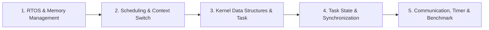

# 04 — Self-Develop RTOS

> **Phạm vi:** Đi từ real-time/memory đến scheduler, Cortex-M context switch, TCB, synchronization, IPC, timer và benchmark.

[← Root README](../README.md)

## Nội dung

| # | Chương | Trọng tâm |
|---:|---|---|
| 1 | [Chủ đề 1 — RTOS & Memory Management](README-01-rtos-introduction-memory-management.md) | Real-time model, memory layout, allocators, fragmentation và object lifetime. |
| 2 | [Chủ đề 2 — Scheduling & Context Switch](README-02-scheduling-context-switch.md) | Scheduler policy, SysTick/SVC/PendSV và Cortex-M3 exception context. |
| 3 | [Chủ đề 3 — Kernel Data Structures & Task](README-03-kernel-data-structures-task.md) | Intrusive list, TCB, ready/wait/delay structures và kernel invariants. |
| 4 | [Chủ đề 4 — Task State & Synchronization](README-04-task-state-synchronization.md) | Blocking, timeout, semaphore, mutex, priority inversion và wake-up races. |
| 5 | [Chủ đề 5 — Communication, Timer & Benchmark](README-05-communication-timer-benchmark.md) | Message ownership, queues, software timer semantics và kernel performance measurement. |

## Lộ trình đọc

## Cách sử dụng bộ tài liệu

Các chapter được viết như tài liệu lý thuyết độc lập nhưng có thứ tự học khuyến nghị như sơ đồ trên. Mỗi chapter có mục lục rút gọn, liên kết Previous/Next/Back to Track, sơ đồ ASCII và Mermaid ở những phần phù hợp với semantic của nội dung.

---

[← Root README](../README.md)
